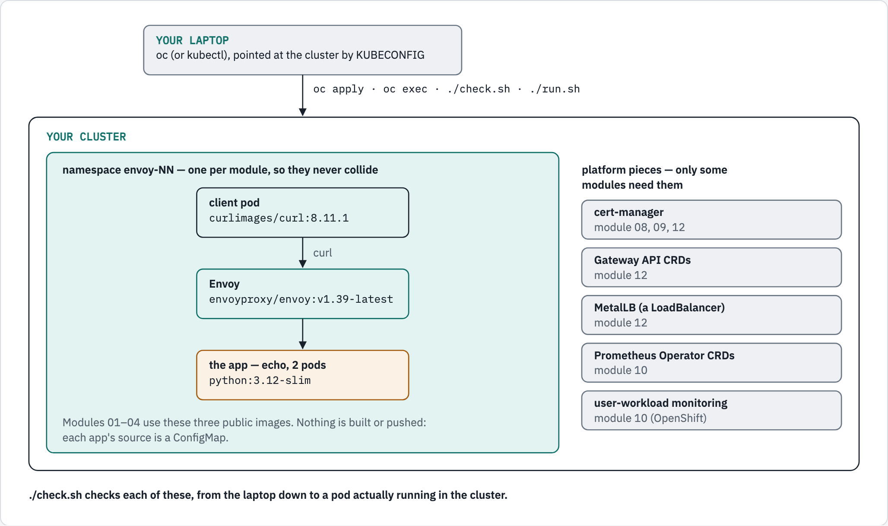

# 00 — prerequisites

Before any Envoy, make sure your laptop can reach a cluster and the cluster can
run what the tutorial needs. One script checks all of it.

## What you'll learn

- what the tutorial puts in your cluster, and what it needs from it
- how to confirm `oc` is talking to the cluster you think it is
- how to read `check.sh`: a clean pass, or the exact thing that is missing

## Before you start

- A Kubernetes or OpenShift cluster you can create namespaces in: CRC, kind,
  minikube, k3s, or anything real. Everything here was run on **OpenShift Local
  (CRC) 4.22.7**.
- `oc` on your PATH (`kubectl` works identically — the scripts pick whichever
  they find).
- Work from this folder: `cd 00-prerequisites`. About 5 minutes.

## What the tutorial puts in your cluster

<!-- markdownlint-disable MD033 -->
<picture>
  <source media="(prefers-color-scheme: dark)" srcset="../docs/diagrams/00-prerequisites/cluster-map.dark.png">
  <source media="(prefers-color-scheme: light)" srcset="../docs/diagrams/00-prerequisites/cluster-map.light.png">
  
</picture>
<!-- markdownlint-enable MD033 -->

Nothing is built and nothing is pushed. Every app is a stock image with its
source in a ConfigMap, so there is no registry in the loop.

## Walkthrough

### Step 1 — the client tool

```console
$ oc version --client
Client Version: 4.22.13
Kustomize Version: v5.7.1
```

**What just happened:** `oc` is installed. Any recent version works.

### Step 2 — which cluster are you talking to?

```console
$ oc whoami
kubeadmin
$ oc whoami --show-server
https://api.crc.testing:6443
```

**What just happened:** the user you are logged in as, and the API server `oc`
sends commands to. The scripts in every module use this same login — whatever
your `KUBECONFIG` (or `~/.kube/config`) points at.

If either command fails, log in first. On CRC:

```bash
eval $(crc oc-env)                  # puts CRC's oc on your PATH
crc console --credentials           # prints the oc login command, with the password
oc login -u kubeadmin https://api.crc.testing:6443
```

### Step 3 — are you allowed to create things?

Every module creates its own namespace, so this is the permission that matters:

```console
$ oc auth can-i create namespace
Warning: resource 'namespaces' is not namespace scoped

yes
```

**What just happened:** `yes` means you can run every module. The `Warning` line
is harmless: namespaces are cluster-wide, so there is no namespace to check
"in", and `oc` says so. `no` usually means
you are a project user rather than a cluster admin — ask for a cluster you
control, such as CRC.

### Step 4 — run the check

```console
$ ./check.sh

cluster
  ✓ reachable, server v1.35.6
  ✓ client: oc
  ✓ OpenShift: yes  (SCC rules apply — modules note where)

permissions
  ✓ can create namespace
  ✓ can create deployment
  ✓ can create service
  ✓ can create configmap

images the modules pull
  · python:3.12-slim        the echo app
  · envoyproxy/envoy:v1.39-latest  the proxy
  · curlimages/curl:8.11.1  the in-cluster client
  · alpine/openssl:3.3.2    module 03's test certificates
  · fullstorydev/grpcurl:v1.9.3-alpine  module 07's gRPC client
  (all public; nothing is built or pushed by this tutorial)
  (module 07's pods also pip-install grpcio at start: egress to pypi.org)

optional, per module
  ✓ cert-manager
  ✓ Gateway API CRDs
  ✓ MetalLB
  ✓ Prometheus Operator CRDs
  ✓ user-workload monitoring

a real write, end to end
  ✓ the in-cluster client pod runs — the modules will run

all checks passed
```

**What just happened**, section by section:

| Section | What it checked |
|---|---|
| cluster | the API server answers, which client is in use, and whether this is OpenShift |
| permissions | you can create the four kinds of object every module creates |
| images the modules pull | the public images the modules use — listed, not pulled yet — and the one module that also needs PyPI |
| optional, per module | platform pieces only some modules need; a missing one is not a failure |
| a real write, end to end | it created a namespace and started the same `client` pod every module uses, and waited for it to be Ready |

The last section is the one that proves the modules will run: an image pulled,
a pod admitted, a container started. It deletes its own namespace when done.

### Step 5 — if you are on OpenShift

`check.sh` says `OpenShift: yes`, and that matters. OpenShift's default
`restricted-v2` policy gives each namespace a range of user IDs and refuses pods
that insist on a UID outside it — which upstream Helm charts often do (module
12's Envoy Gateway chart hard-codes `65532`). The client
pod passing in step 4 means the common case is fine; where a module hits the
problem, it says so and shows the fix. Module 12 has the worked example.

## What some modules need

`check.sh` reports these as present, or as "only module N needs it":

| | Modules |
|---|---|
| cert-manager | 08, 09, 12 |
| Gateway API CRDs | 12 |
| MetalLB (or any LoadBalancer) | 12 |
| Prometheus Operator CRDs | 10 |
| user-workload monitoring (OpenShift) | 10 — it decides whether *your* namespaces' metrics are collected |

## Troubleshooting

| You see | Why | Fix |
|---|---|---|
| `cannot reach a cluster` | `oc` has no working login | step 2 |
| `can create namespace — expected [yes], got [no]` | not a cluster admin | use a cluster you control, such as CRC |
| `the client pod … never became ready` | the image could not be pulled, or a policy refused the pod | `oc get events -n envoy-tut-check` while `check.sh` runs; check egress to Docker Hub |
| an optional line says "not installed" | that platform piece is absent | only the modules named need it — carry on |

## How every module works

Each module's README is a walkthrough like this one: numbered steps you type in
order, with the output you should see. Each module also has a `run.sh` that
does the same steps in one go, once you know what they do:

```bash
./run.sh deploy     # create the namespace and everything in it
./run.sh verify     # check the running proxy behaves as the README says
./run.sh clean      # delete the namespace
```

Every module uses its own namespace (`envoy-01` … `envoy-04`, and `gwapi-demo`
for module 12), so modules never collide and you can start at any of them.

## Diagram sources

The figure is rendered from [`docs/diagrams/00-prerequisites/source.html`](../docs/diagrams/00-prerequisites/source.html)
(inline SVG, light and dark). Change the page and re-render the PNGs together,
with the `/visual` skill's `render.py`.
