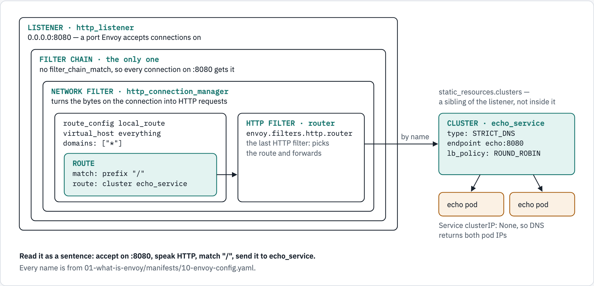
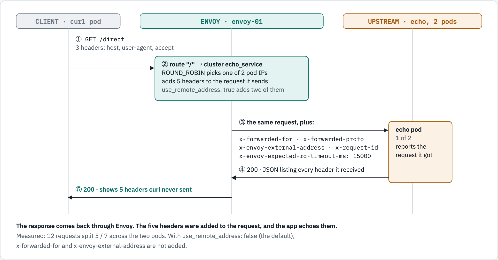

# 01 — what Envoy is

Envoy is a **proxy**: a program that accepts a network connection, decides what
to do with it, and opens its own connection somewhere else. That is the whole
idea. Everything else is configuration.

This module puts Envoy in front of an app that already works, then shows what
changed — because "what changed" is the clearest definition of what a proxy is.

## What you'll learn

- where a proxy sits, and why Envoy is almost always a **reverse** proxy
- the four nouns every Envoy config is made of: **listener, filter chain, route, cluster**
- how to see what Envoy changed about a request, and how to ask Envoy what it is running

## Before you start

- [`00-prerequisites`](../00-prerequisites/README.md) passes.
- Work from this folder: `cd 01-what-is-envoy`. Every command below is run from here.
- This module uses the namespace **`envoy-01`** and takes about 15 minutes.
- The commands use `oc`. On plain Kubernetes, `kubectl` takes the same arguments.

## Proxy, reverse proxy, sidecar

Same program, three deployment positions. The words describe *where it sits*,
not what it does.

| Term | Sits in front of | Knows about |
|---|---|---|
| forward proxy | the **client** | where the client wants to go |
| **reverse proxy** | the **server** | which servers exist |
| sidecar | one pod, both ways | that one app |

Envoy is used as a reverse proxy here, and in almost every Kubernetes context.

## The four nouns

Open `manifests/10-envoy-config.yaml` alongside this. Every Envoy config is
these four, nested:

<!-- markdownlint-disable MD033 -->

<!-- markdownlint-enable MD033 -->

Read it as a sentence: *accept on this port, speak HTTP, match this path, send
it to that cluster.*

## One request through Envoy

Traffic flows down: the client at the top, Envoy in the middle, the app at the
bottom. The reply comes back up the same way — **through** Envoy.

<!-- markdownlint-disable MD033 -->

<!-- markdownlint-enable MD033 -->

## Walkthrough

### Step 1 — a namespace, and a pod to run curl from

Envoy and the app will be ClusterIP Services, so names like `http://envoy:8080`
only resolve **inside** the cluster. Rather than expose anything, you start one
small pod inside the namespace and run every `curl` from it.

```console
$ oc create namespace envoy-01
namespace/envoy-01 created
$ oc apply -n envoy-01 -f ../_shared/client.yaml
pod/client created
$ oc wait -n envoy-01 --for=condition=Ready pod/client --timeout=120s
pod/client condition met
```

**What just happened:** [`_shared/client.yaml`](../_shared/client.yaml) is a pod
running the `curl` image and sleeping forever. From now on,
`oc exec -n envoy-01 client -- curl …` means "run this curl inside the cluster".

### Step 2 — deploy the app, without Envoy

The app is an **echo** server: it replies with the request it received — the
path, and every header. That makes it a mirror for what a proxy changes.

```console
$ oc apply -n envoy-01 -f ../_shared/echo-app.yaml
configmap/echo-src created
service/echo created
deployment.apps/echo created
$ oc rollout status -n envoy-01 deploy/echo --timeout=180s
Waiting for deployment "echo" rollout to finish: 0 of 2 updated replicas are available...
Waiting for deployment "echo" rollout to finish: 1 of 2 updated replicas are available...
deployment "echo" successfully rolled out
```

**What just happened:** two replicas of the echo app, behind a Service named
`echo`. The Service has `clusterIP: None` — remember that; step 7 depends on it.

### Step 3 — call the app directly

```console
$ oc exec -n envoy-01 client -- curl -s http://echo:8080/direct
{
  "served_by": "echo-f8fc6d5c9-59sx7",
  "method": "GET",
  "path": "/direct",
  "headers": {
    "host": "echo:8080",
    "user-agent": "curl/8.11.1",
    "accept": "*/*"
  }
}
```

**What just happened:** curl sent three headers — `host`, `user-agent`,
`accept` — and the app saw exactly those three. Keep this output in mind.

### Step 4 — read the Envoy config

The config is a ConfigMap. These are the lines that make up the four nouns:

```console
$ grep -nE 'name: http_listener|port_value: 8080|http_connection_manager$|use_remote_address|prefix: "/"|cluster: echo_service|type: STRICT_DNS|lb_policy|address: echo,' manifests/10-envoy-config.yaml
28:      - name: http_listener
30:          socket_address: { address: 0.0.0.0, port_value: 8080 }
37:          - name: envoy.filters.network.http_connection_manager
54:              use_remote_address: true
68:                  - match: { prefix: "/" }
69:                    route: { cluster: echo_service }
84:        type: STRICT_DNS
85:        lb_policy: ROUND_ROBIN
93:                  socket_address: { address: echo, port_value: 8080 }
```

**What just happened:** from top to bottom — the **listener** on port 8080, the
**filter** `http_connection_manager` that turns bytes into HTTP requests, the
**route** that sends every path (`prefix: "/"`) to the **cluster**
`echo_service`, and the cluster, which finds its endpoints by looking up the DNS
name `echo`.

### Step 5 — start Envoy

```console
$ oc apply -n envoy-01 -f manifests/10-envoy-config.yaml
configmap/envoy-config created
$ oc apply -n envoy-01 -f manifests/20-envoy.yaml
service/envoy created
deployment.apps/envoy created
$ oc rollout status -n envoy-01 deploy/envoy --timeout=180s
Waiting for deployment "envoy" rollout to finish: 0 of 1 updated replicas are available...
deployment "envoy" successfully rolled out
```

**What just happened:** one Envoy pod, reading the ConfigMap as
`/etc/envoy/envoy.yaml`, behind a Service named `envoy` with two ports: `8080`
for traffic and `9901` for Envoy's admin interface.

### Step 6 — call the same app, through Envoy

```console
$ oc exec -n envoy-01 client -- curl -s http://envoy:8080/direct
{
  "served_by": "echo-f8fc6d5c9-59sx7",
  "method": "GET",
  "path": "/direct",
  "headers": {
    "host": "envoy:8080",
    "user-agent": "curl/8.11.1",
    "accept": "*/*",
    "x-forwarded-for": "10.217.0.139",
    "x-forwarded-proto": "http",
    "x-envoy-external-address": "10.217.0.139",
    "x-request-id": "4011b412-1faf-4f40-bf53-1ad8085e3b47",
    "x-envoy-expected-rq-timeout-ms": "15000"
  }
}
```

**What just happened:** same request, same app — and **five headers appeared
that curl never sent**. The app did not set them; it only reports what arrived.
That difference *is* the proxy:

| Header | What it tells the app |
|---|---|
| `x-forwarded-for` | the original client address, which the app would otherwise never see |
| `x-forwarded-proto` | whether the *client* spoke http or https, even if this hop is plaintext |
| `x-envoy-external-address` | the trusted client address Envoy settled on |
| `x-request-id` | one id, propagated across hops — the basis of tracing |
| `x-envoy-expected-rq-timeout-ms` | the deadline Envoy is enforcing — 15 s unless a route says otherwise |

`host` is `envoy:8080` rather than `echo:8080` only because that is the name curl
used this time — Envoy passes the client's `Host` through unchanged. (Module 04
shows how to rewrite it.)

### Step 7 — Envoy is already load balancing

Twelve requests, and which of the two echo pods answered each:

```console
$ for i in 1 2 3 4 5 6 7 8 9 10 11 12; do oc exec -n envoy-01 client -- curl -s http://envoy:8080/ | grep served_by; done | sort | uniq -c
   6   "served_by": "echo-f8fc6d5c9-59sx7",
   6   "served_by": "echo-f8fc6d5c9-96fwg",
```

**What just happened:** both pods answered. Two settings make that possible, and
one of them is not in the Envoy config at all:

```yaml
type: STRICT_DNS        # in the cluster: re-resolve the name, one endpoint per address
lb_policy: ROUND_ROBIN  # in the cluster: rotate between them
clusterIP: None         # in the SERVICE: so DNS returns pod IPs, not one virtual IP
```

Without `clusterIP: None`, DNS returns a single virtual IP, Envoy sees one
endpoint, and `ROUND_ROBIN` has nothing to choose between.
[Module 05](../05-clusters-and-load-balancing/README.md) measures exactly that,
and why the split changes from run to run — 6/6, 5/7 and 7/5 in three runs
while writing this: each of Envoy's worker threads keeps its own rotation.

### Step 8 — ask Envoy what it is doing

Port `9901` is Envoy's **admin interface**. It is not on the request path, and it
is the first place to look when something is wrong.

Is the config loaded?

```console
$ oc exec -n envoy-01 client -- curl -s http://envoy:9901/ready
LIVE
```

Which endpoints does the cluster have, and are they healthy?

```console
$ oc exec -n envoy-01 client -- curl -s http://envoy:9901/clusters | grep health_flags
echo_service::10.217.0.141:8080::health_flags::healthy
echo_service::10.217.0.140:8080::health_flags::healthy
```

How many requests has each side seen?

```console
$ oc exec -n envoy-01 client -- curl -s http://envoy:9901/stats | grep -E '^(http.ingress_http.downstream_rq_total|cluster.echo_service.upstream_rq_total):'
cluster.echo_service.upstream_rq_total: 13
http.ingress_http.downstream_rq_total: 13
```

**What just happened:** `/clusters` lists the two pod IPs the cluster found
through DNS. `downstream` counts requests *arriving* at Envoy; `upstream` counts
requests Envoy *sent on*. The two are equal here because every request was
proxied — module 04 has routes where they are not.

`/config_dump` returns the **entire running config** as JSON. It answers "is the
config I applied the config it is running?" — the question behind most Envoy
debugging.

### Step 9 — the access log

Envoy writes one line per request to its log, in the format set by
`access_log` in the config: method, path, the upstream pod that answered, the
status, and the time taken.

It writes them **in batches**, not instantly. Measured: after six requests, one
line was in the log at 2 seconds and all six by 8 seconds. So wait ten seconds
first:

```console
$ sleep 10; oc logs -n envoy-01 deploy/envoy | grep -- '->' | tail -4
GET / -> 10.217.0.140:8080 200 0ms
GET / -> 10.217.0.140:8080 200 0ms
GET / -> 10.217.0.141:8080 200 1ms
GET / -> 10.217.0.141:8080 200 0ms
```

**What just happened:** the `->` address on each line is the pod that served the
request — the same rotation step 7 showed, from Envoy's side. If you see fewer
lines than you expect, the batch has not been written yet; run it again.

### Step 10 — check yourself

`run.sh` repeats everything above as assertions against the running proxy:

```console
$ ./run.sh verify

1. the backend is reachable directly (no Envoy involved)
  ✓ echo answers on its own
  ✓ no proxy fingerprint

2. the same request through Envoy
  ✓ still reaches the backend
  ✓ x-forwarded-for added
  ✓ x-request-id added
  ✓ x-envoy-expected-rq-timeout

3. the four nouns, from Envoy's own admin interface
  ✓ listener http_listener is in the running config
  ✓ cluster echo_service is in the running config

4. Envoy is load balancing, not just forwarding
  ✓ reached 2 distinct backend pods over 12 requests

all checks passed
```

**Try this:** in `manifests/10-envoy-config.yaml`, change
`use_remote_address: true` to `false`. Apply it, then **delete the Envoy pod** so
a new one starts with the new file — the file is mounted with `subPath`, so the
running pod never sees the change:

```bash
oc apply -n envoy-01 -f manifests/10-envoy-config.yaml
oc delete pod -n envoy-01 -l app=envoy
oc rollout status -n envoy-01 deploy/envoy
oc exec -n envoy-01 client -- curl -s http://envoy:8080/direct
```

`x-forwarded-for` and `x-envoy-external-address` disappear. Measured both ways on
this exact config:

| `use_remote_address` | headers Envoy adds |
|---|---|
| `false` (the default) | `x-forwarded-proto`, `x-request-id`, `x-envoy-expected-rq-timeout-ms` |
| `true` | …plus `x-forwarded-for`, `x-envoy-external-address` |

`true` is right for an **edge** proxy, which is what this is. Behind another
proxy it should stay `false`, or the address Envoy appends is the hop in front of
it rather than the client. Set it back to `true` when you are done.

## The fields this module used

| Field | Where | What it does |
|---|---|---|
| `address.socket_address.port_value` | listener | the port Envoy accepts connections on |
| `filter_chains` | listener | what to do with a connection; one chain with no match takes every connection |
| `stat_prefix` | http_connection_manager | prefixes this listener's stats — `http.ingress_http.…` in step 8 |
| `use_remote_address` | http_connection_manager | trust the peer address and add `x-forwarded-for`; **defaults to false** |
| `access_log` | http_connection_manager | one line per request, in the format you give it |
| `route_config.virtual_hosts` | http_connection_manager | `domains: ["*"]` matches any `Host`; `routes` are tried in order |
| `http_filters: router` | http_connection_manager | the last HTTP filter: picks the route and forwards the request |
| `type: STRICT_DNS` | cluster | find endpoints by resolving a DNS name, one per address |
| `lb_policy: ROUND_ROBIN` | cluster | rotate between endpoints |
| `connect_timeout` | cluster | how long to wait for a TCP connection to an endpoint |

Module 02 goes through these and more, field by field, with their defaults.

## Troubleshooting

| You see | Why | Fix |
|---|---|---|
| `namespaces "envoy-01" already exists` | you ran step 1 before | carry on — or `./run.sh clean` and start again |
| `pods "client" not found` | step 1 was skipped | run step 1 |
| `no healthy upstream` | Envoy started before the app was ready: `STRICT_DNS` resolves on a timer, so it has no endpoints yet | wait a few seconds and retry; step 8's `/clusters` shows when they arrive |
| `Could not resolve host: echo` | the echo Service or its pods are not ready yet | `oc rollout status -n envoy-01 deploy/echo` |
| config change has no effect | the ConfigMap is mounted with `subPath`, which never updates a running pod | `oc delete pod -n envoy-01 -l app=envoy` |

## Clean up

```console
$ oc delete namespace envoy-01 --wait=false
namespace "envoy-01" deleted
```

## The shortcut

Once you have been through the steps, `./run.sh deploy` does steps 1–5 (and
waits for the cluster to have endpoints), `./run.sh verify` is step 10, and
`./run.sh clean` removes the namespace.

## What this module skipped

TLS, timeouts, retries, health checks, multiple routes, anything dynamic. Each
gets its own module. The config here is the smallest thing that is still real.

## References

- [Envoy — Life of a Request](https://www.envoyproxy.io/docs/envoy/latest/intro/life_of_a_request)
- [Listener configuration](https://www.envoyproxy.io/docs/envoy/latest/configuration/listeners/listeners)
- [HTTP connection manager](https://www.envoyproxy.io/docs/envoy/latest/configuration/http/http_conn_man/http_conn_man)
- [`use_remote_address` and XFF](https://www.envoyproxy.io/docs/envoy/latest/configuration/http/http_conn_man/headers#x-forwarded-for)
- [The admin interface](https://www.envoyproxy.io/docs/envoy/latest/operations/admin)
- [Access log format](https://www.envoyproxy.io/docs/envoy/latest/configuration/observability/access_log/usage)

## Diagram sources

The figures are rendered from [`docs/diagrams/01-what-is-envoy/source.html`](../docs/diagrams/01-what-is-envoy/source.html)
(inline SVG, light and dark). Change the page and re-render the PNGs together,
with the `/visual` skill's `render.py`.
