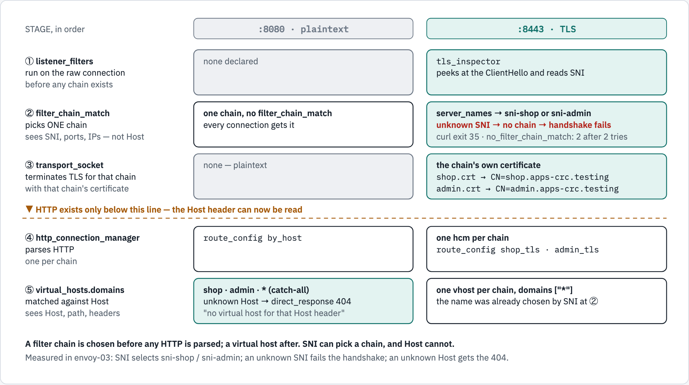

# 03 — listeners and filter chains

A **listener** is a port. A **filter chain** is one possible way to handle a
connection arriving on it. `filter_chain_match` decides which chain applies.

The distinction this module exists to teach:

> A filter chain is chosen **before a single byte of HTTP has been parsed**.
> A virtual host is chosen **after**.

That is why SNI selects a chain and the `Host` header cannot.

## Two ways to say "route by name"

<!-- markdownlint-disable MD033 -->
<picture>
  <source media="(prefers-color-scheme: dark)" srcset="../docs/diagrams/03-listeners-and-filter-chains/chain-vs-vhost.dark.png">
  <source media="(prefers-color-scheme: light)" srcset="../docs/diagrams/03-listeners-and-filter-chains/chain-vs-vhost.light.png">
  
</picture>
<!-- markdownlint-enable MD033 -->

*Both listeners in this module, stage by stage. Everything above the dashed
line happens before HTTP exists.*

```text
  stage                        :8080 plaintext                 :8443 TLS
  ① listener_filters           none                            tls_inspector reads SNI
  ② filter_chain_match         one chain, no match block       server_names → sni-shop | sni-admin
     sees SNI, not Host                                        unknown SNI → no chain → handshake fails
  ③ transport_socket           none                            the chain's own cert (shop.crt | admin.crt)
  ─── HTTP exists only below this line — the Host header can be read ───────────────────────
  ④ http_connection_manager    route_config by_host            one per chain: shop_tls | admin_tls
  ⑤ virtual_hosts.domains      shop | admin | * → 404          one vhost per chain, domains ["*"]
     sees Host, path, headers
```

| | `filter_chain_match` | `virtual_hosts.domains` |
|---|---|---|
| runs | before TLS termination | after HTTP parsing |
| can see | SNI, source/destination IP, port, ALPN | `Host`, path, headers, method |
| cannot see | anything HTTP | anything pre-TLS |
| picks | a whole chain, including its certificate | a route |
| on no match | connection closed — for TLS the handshake fails (curl exit 35, `no_filter_chain_match` counted) | the `["*"]` vhost, or 404 |

Reaching for `filter_chain_match` to select on a hostname is the classic
mistake. It works for **TLS** traffic, because SNI carries the name — and fails
silently for plaintext HTTP, because at that point the name does not exist yet.

## Run it

```bash
./run.sh deploy
./run.sh verify
```

On OpenShift the module also creates passthrough Routes, so the hostnames work
for real:

- `https://shop.apps-crc.testing`
- `https://admin.apps-crc.testing`

## Selection by Host — plaintext, port 8080

One chain, three virtual hosts:

```console
$ curl -i -H "Host: shop.apps-crc.testing"  http://envoy:8080/  | grep x-matched
x-matched-vhost: shop
$ curl -i -H "Host: admin.apps-crc.testing" http://envoy:8080/  | grep x-matched
x-matched-vhost: admin
$ curl -i -H "Host: nobody.apps-crc.testing" http://envoy:8080/
HTTP/1.1 404 Not Found
no virtual host for that Host header
```

The catch-all is deliberate. Without a `domains: ["*"]` vhost, an unmatched Host
gets Envoy's own 404 with no explanation — a `direct_response` says what
happened.

## Selection by SNI — TLS, port 8443

Two chains, each with its **own certificate**, chosen by the name in the
ClientHello:

```console
$ curl -ik https://shop.apps-crc.testing/  | grep x-matched
x-matched-chain: sni-shop
$ curl -ik https://admin.apps-crc.testing/ | grep x-matched
x-matched-chain: sni-admin
```

No `Host` header was set and no `--resolve` was used. The only thing
distinguishing those two requests is the SNI. And each chain presents its own
certificate:

```console
$ echo Q | openssl s_client -connect shop.apps-crc.testing:443 \
             -servername shop.apps-crc.testing 2>/dev/null | grep subject=
subject=CN=shop.apps-crc.testing

$ echo Q | openssl s_client -connect admin.apps-crc.testing:443 \
             -servername admin.apps-crc.testing 2>/dev/null | grep subject=
subject=CN=admin.apps-crc.testing
```

## `tls_inspector`, and what happens without it

```yaml
listener_filters:
- name: envoy.filters.listener.tls_inspector
```

Envoy cannot match on `server_names` unless something has read the ClientHello,
and that is this filter's job. **Measured**, by deleting those two lines,
recreating the pod, and asking again:

| | shop | admin |
|---|---|---|
| with `tls_inspector` | `x-matched-chain: sni-shop` | `x-matched-chain: sni-admin` |
| without it | no chain matched | no chain matched |

Worth knowing: `/config_dump` still mentions `tls_inspector` even when it is not
declared, so **the config dump is not a reliable way to check this**. Test the
behaviour, not the config.

## Why the Routes are passthrough

```yaml
tls: { termination: passthrough }
```

A passthrough Route is a pure TCP pipe, and the router takes no part in its TLS
negotiation. The ClientHello — and with it the SNI — arrives at Envoy exactly as
the client sent it, which is what makes the chain selection above work end to
end.

With `edge` or `reencrypt`, the router terminates TLS and opens its own
connection to Envoy. Envoy would then see whatever SNI the *router* chose, and
every request would land on the same chain.

## The order that trips people up

Envoy picks the **most specific** matching chain, not the first one written.
The documented precedence, in order:

1. destination port
2. destination IP
3. `server_names` (SNI)
4. transport protocol
5. application protocol (ALPN)
6. source type, source IP, source port

A chain with **no** `filter_chain_match` matches everything and is the fallback.
Reordering chains in the file changes nothing — if two chains could both match,
Envoy rejects the config rather than guessing.

## References

- [Listener filters](https://www.envoyproxy.io/docs/envoy/latest/configuration/listeners/listener_filters/listener_filters)
- [TLS Inspector](https://www.envoyproxy.io/docs/envoy/latest/configuration/listeners/listener_filters/tls_inspector)
- [`FilterChainMatch` and its precedence](https://www.envoyproxy.io/docs/envoy/latest/api-v3/config/listener/v3/listener_components.proto#config-listener-v3-filterchainmatch)
- [OpenShift — passthrough Routes](https://docs.redhat.com/en/documentation/openshift_container_platform/4.22/html/ingress_and_load_balancing/configuring-routes)

## Diagram sources

The figures are rendered from [`docs/diagrams/03-listeners-and-filter-chains/source.html`](../docs/diagrams/03-listeners-and-filter-chains/source.html)
(inline SVG, light and dark). The picture, its text twin and the page change
together; re-render with the `/visual` skill's `render.py`.
