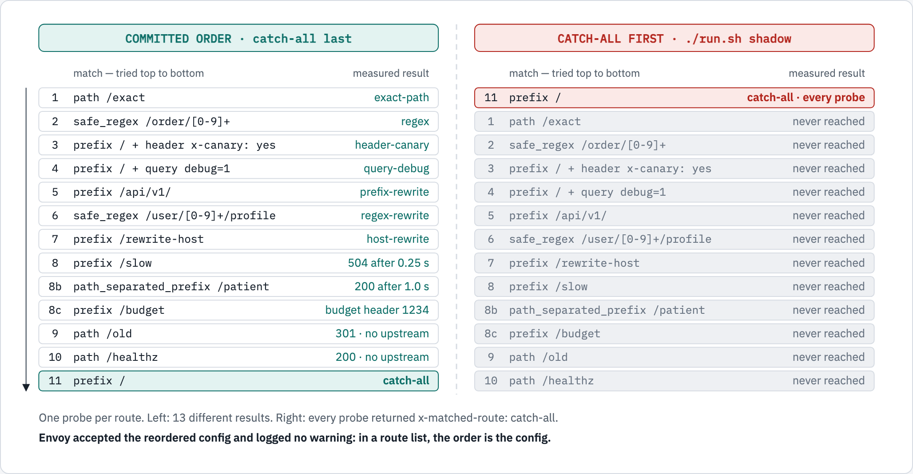
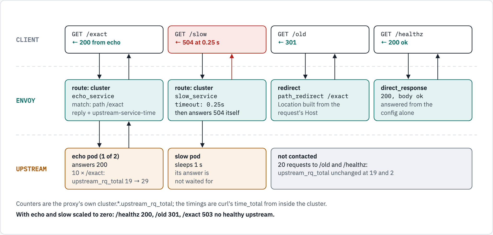

# 04 — routing

Module 03 chose a **virtual host** by the `Host` header. This module is about
what happens next: inside one virtual host, a list of **routes** decides where a
request goes — to a cluster, back to the client as a redirect, or nowhere at all
because Envoy answers it itself.

The rule this module exists to teach:

> Routes are tried **in the order written**, and the **first match wins**.

That is the opposite of module 03, where Envoy picks the *most specific* filter
chain regardless of order. Here the order is the config.

## First match wins — and what a catch-all in the wrong place does

<!-- markdownlint-disable MD033 -->
<picture>
  <source media="(prefers-color-scheme: dark)" srcset="../docs/diagrams/04-routing/first-match-wins.dark.png">
  <source media="(prefers-color-scheme: light)" srcset="../docs/diagrams/04-routing/first-match-wins.light.png">
  
</picture>
<!-- markdownlint-enable MD033 -->

*Both columns are measured on the running proxy — the right one with
`./run.sh shadow`. Envoy accepts the reordered config and logs no warning.*

## Run it

```bash
./run.sh deploy
./run.sh verify    # 35 checks against the running proxy
./run.sh shadow    # moves the catch-all first, measures, restores
./run.sh clean
```

`verify` reads each decision from the proxy itself: every route adds an
`x-matched-route` response header, so the assertion is about the route Envoy
chose, not the route the file intended.

## The options, one table

Everything below is on a single route in `manifests/10-envoy-config.yaml`. A
route is `match` (which requests) plus exactly one action (what to do with them).

**`match` — pick exactly one path matcher, then optionally narrow it:**

| Field | What it matches | Measured here |
|---|---|---|
| `path` | the whole path, exactly — query string excluded | `/exact?x=1` matches `path: /exact`; `/exact/` and `/EXACT` do not |
| `prefix` | the path starts with this **string** — not segment-aware | `prefix: /slow` also matches `/slowpoke` |
| `path_separated_prefix` | the prefix, but only at a `/` boundary | `/patient` and `/patient/x` match; `/patients` does not |
| `safe_regex` | an RE2 pattern against the **whole** path | `/order/[0-9]+` matches `/order/42`, not `/order/42/items` or `/x/order/42` |
| `headers` | a request header, with a `string_match` | header **name** is case-insensitive, **value** is exact: `YES` ≠ `yes` |
| `query_parameters` | a query parameter, with a `string_match` | parameter **name** is case-sensitive: `?DEBUG=1` ≠ `?debug=1` |

Path matching is case-sensitive by default; the API reference documents
`case_sensitive: false` on the match to change that.

**Actions — exactly one per route:**

| Field | What Envoy does | When you want it |
|---|---|---|
| `route.cluster` | proxies to that cluster | almost always |
| `route.prefix_rewrite` | replaces the matched prefix before proxying | the app is mounted at `/`, the public URL is `/api/v1/` |
| `route.regex_rewrite` | rewrites the path with a capture group | restructuring a path, not just trimming it |
| `route.host_rewrite_literal` | replaces `Host` sent upstream | an upstream that routes on its own hostname |
| `route.timeout` | the whole-request deadline — **default 15s** | anything that must fail fast, or legitimately runs long |
| `redirect` | answers `3xx` itself; no cluster is contacted | moved URLs, http → https |
| `direct_response` | answers with a fixed status and body; no cluster | health checks, explicit 404s, maintenance pages |

`response_headers_to_add` is on every route here only so `verify` can see which
one fired. It is a real option — adding headers to responses — not a routing one.

## First match wins, measured

The same request can match more than one route. Which one wins depends only on
position:

| Request | Could match | Wins | Why |
|---|---|---|---|
| `/exact` + `x-canary: yes` | route 1 (path), route 3 (header) | `exact-path` | route 1 is earlier |
| `/api/v1/x` + `x-canary: yes` | route 3 (header), route 5 (prefix) | `header-canary` | route 3 is earlier |

Same header, opposite outcome, and the only difference is where the other route
sits in the list.

That is why the catch-all `prefix: "/"` has to be last. `./run.sh shadow` builds
the committed config with the catch-all cut and pasted to the top, recreates the
pod, and asks every route again:

```console
$ ./run.sh shadow

moving the catch-all to the top of the route list
  ✓ upstream echo_service has endpoints
  ✓ upstream slow_service has endpoints

every route above it is now dead
  ✓ /exact
  ✓ /order/42
  ✓ / with x-canary: yes
  ✓ /anything?debug=1
  ✓ /api/v1/thing
  ✓ /user/42/profile
  ✓ /rewrite-host
  ✓ /slow (no longer 504s)
  ✓ /patient
  ✓ /budget
  ✓ /old (no longer 301s)
  ✓ /healthz (now proxied)

restoring the committed route order
  ✓ upstream echo_service has endpoints
  ✓ upstream slow_service has endpoints
  ✓ after restoring, /exact matches its own route again

all checks passed
```

Every one of those is `x-matched-route: catch-all`. The timeout stopped firing,
the redirect stopped redirecting, and the health check started depending on the
upstream it was meant to outlive. The only warning Envoy logged in that run was
the unrelated one it always logs about downstream connection limits.

## Rewrites, seen from the upstream

The echo app returns the path and headers **it received**, so a rewrite is
visible instead of taken on trust:

| Request | Upstream received | Also added by Envoy |
|---|---|---|
| `/api/v1/thing` | `"path": "/thing"` | `x-envoy-original-path: /api/v1/thing` |
| `/user/42/profile` | `"path": "/profile/42"` | `x-envoy-original-path: /user/42/profile` |
| `/rewrite-host` | `"host": "upstream.internal"` | `x-envoy-original-host: envoy.envoy-04.svc:8080` |

Note `prefix: "/api/v1/"` has a trailing slash, so `/api/v1` on its own does not
match it — measured, it falls through to the catch-all.

One YAML detail in the regex rewrite: the substitution is single-quoted,
`'/profile/\1'`. In double quotes YAML consumes the backslash.

## Timeouts

`slow` sleeps 1 second before answering. Two routes point at it with different
budgets, measured back to back from inside the cluster:

```console
$ for i in 1 2 3; do
    curl -s -o /dev/null -w "slow    %{http_code} %{time_total}s\n" http://envoy:8080/slow
    curl -s -o /dev/null -w "patient %{http_code} %{time_total}s\n" http://envoy:8080/patient
  done
slow    504 0.258915s
patient 200 1.002825s
slow    504 0.252766s
patient 200 1.004283s
slow    504 0.264601s
patient 200 1.003059s
```

The 504 comes from Envoy, not the app:

```console
$ curl -i http://envoy:8080/slow
HTTP/1.1 504 Gateway Timeout
x-matched-route: timeout-250ms
content-length: 24
content-type: text/plain
date: Fri, 25 Sep 2026 22:26:18 GMT
server: envoy

upstream request timeout
```

Compare a proxied response: it carries `x-envoy-upstream-service-time`, the
upstream's own processing time. This one has none, because no upstream answered.

Envoy also **tells the upstream its deadline**, in
`x-envoy-expected-rq-timeout-ms`. `/budget` sets `timeout: 1.234s`, and the
upstream receives `"x-envoy-expected-rq-timeout-ms": "1234"`. Routes with no
`timeout` line — `/exact`, `/api/v1/thing` — forward `15000`: the default 15s
route timeout, in force even though the config never mentions it.

A measuring note: the test upstream is a *threaded* server on purpose. With a
single thread, a request Envoy has already abandoned still occupies the server
for its full second, and the next request queues behind it — an earlier version
measured `/patient` at 2.5s that way. That is the app, not Envoy.

## Routes Envoy answers alone

<!-- markdownlint-disable MD033 -->
<picture>
  <source media="(prefers-color-scheme: dark)" srcset="../docs/diagrams/04-routing/who-answers.dark.png">
  <source media="(prefers-color-scheme: light)" srcset="../docs/diagrams/04-routing/who-answers.light.png">
  
</picture>
<!-- markdownlint-enable MD033 -->

*Who answers depends on the route's action, not its match. Counters are the
proxy's own `upstream_rq_total`; timings are curl's `time_total`.*

`redirect` and `direct_response` name no cluster. Checked with the proxy's own
counters: 20 requests to `/healthz` and `/old` left `upstream_rq_total` at 19 for
`echo_service` and 2 for `slow_service`; 10 requests to `/exact` then moved
`echo_service` to 29.

And the reason it matters — with **both upstreams scaled to zero**:

```console
$ oc scale deploy/echo deploy/slow -n envoy-04 --replicas=0
$ U=http://envoy.envoy-04.svc:8080
$ for p in /healthz /old /exact; do printf "%-9s " $p; curl -s -o /tmp/b -w "%{http_code} " $U$p; head -c 60 /tmp/b; echo; done
/healthz  200 ok

/old      301
/exact    503 no healthy upstream
```

A health check written as a `direct_response` reports on Envoy itself. One
written as a route to a cluster reports on the cluster — which is a different
question, and sometimes the one you want.

```console
$ curl -i http://envoy.envoy-04.svc:8080/old
HTTP/1.1 301 Moved Permanently
location: http://envoy.envoy-04.svc:8080/exact
date: Fri, 25 Sep 2026 22:26:18 GMT
server: envoy
content-length: 0

$ curl -i -H "Host: shop.example" http://envoy.envoy-04.svc:8080/old
HTTP/1.1 301 Moved Permanently
location: http://shop.example/exact
date: Fri, 25 Sep 2026 22:26:18 GMT
server: envoy
content-length: 0
```

`path_redirect: "/exact"` replaces only the **path**. The `Location` Envoy emits
is a full URI, rebuilt from the request's scheme and its `Host` header — change
the `Host` and the redirect points somewhere else. The bare `/exact` written in
the config never appears on the wire.

## What this module skipped

Retries and `per_try_timeout` (module 11 — they change the value in
`x-envoy-expected-rq-timeout-ms`), weighted clusters and traffic splitting, and
routes delivered at runtime over RDS instead of written in the file.

## References

- [Route matching — `RouteMatch`](https://www.envoyproxy.io/docs/envoy/latest/api-v3/config/route/v3/route_components.proto#config-route-v3-routematch)
- [Route actions — `RouteAction`](https://www.envoyproxy.io/docs/envoy/latest/api-v3/config/route/v3/route_components.proto#config-route-v3-routeaction)
- [`RedirectAction`](https://www.envoyproxy.io/docs/envoy/latest/api-v3/config/route/v3/route_components.proto#config-route-v3-redirectaction)
- [`DirectResponseAction`](https://www.envoyproxy.io/docs/envoy/latest/api-v3/config/route/v3/route_components.proto#config-route-v3-directresponseaction)
- [HTTP routing overview](https://www.envoyproxy.io/docs/envoy/latest/intro/arch_overview/http/http_routing)
- [Router filter headers, including `x-envoy-expected-rq-timeout-ms`](https://www.envoyproxy.io/docs/envoy/latest/configuration/http/http_filters/router_filter)
- [RE2 syntax](https://github.com/google/re2/wiki/Syntax)

## Diagram sources

The figures are rendered from [`docs/diagrams/04-routing/source.html`](../docs/diagrams/04-routing/source.html)
(inline SVG, light and dark). Change the page and re-render the PNGs together,
with the `/visual` skill's `render.py`.
