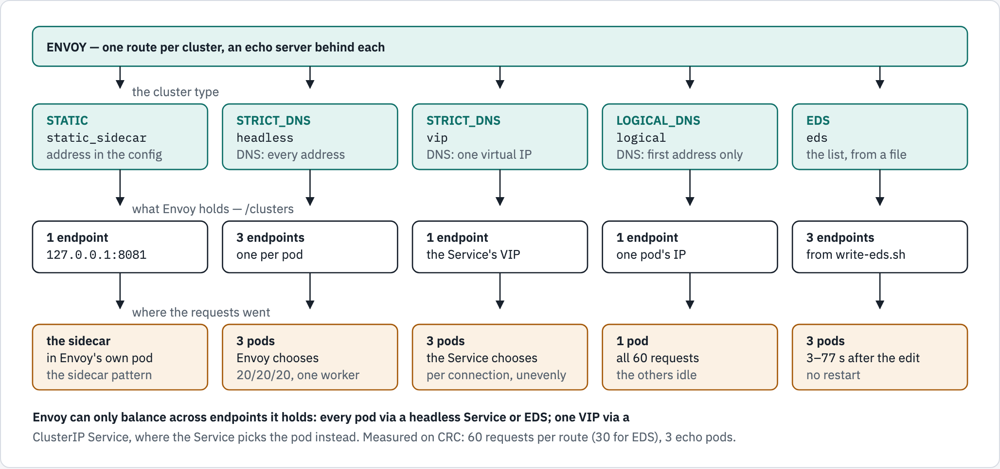
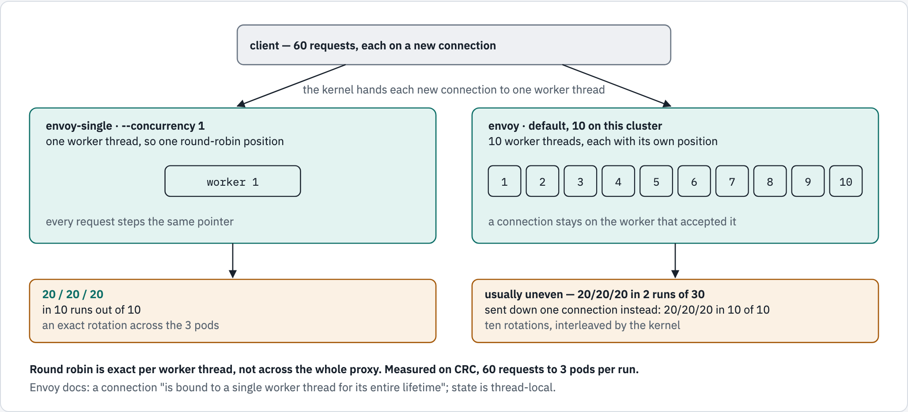
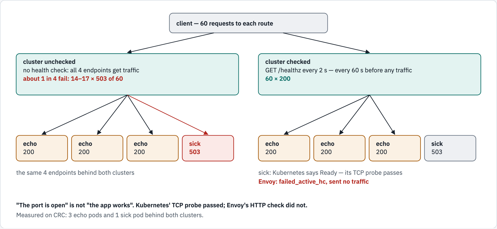

# 05 — clusters and load balancing

A **cluster** is Envoy's name for "a group of upstream endpoints". Module 01 used
one without looking inside. This module answers the two questions every cluster
has to answer:

1. **Which endpoints are there?** — the cluster's `type`
2. **Which one gets this request?** — the cluster's `lb_policy`

— and a third that decides whether the answer can be trusted: **is that endpoint
actually working?**

## What you'll learn

- the four ways Envoy finds endpoints — `STATIC`, `STRICT_DNS`, `LOGICAL_DNS`,
  `EDS` — and why a **headless** Service is what makes load balancing possible
- what the load-balancing policies actually do, measured over 60 requests — and
  why round robin is only exact per worker thread
- how an Envoy **health check** removes a pod that Kubernetes still calls Ready

## Before you start

- [`00-prerequisites`](../00-prerequisites/README.md) passes;
  [01](../01-what-is-envoy/README.md) and [02](../02-the-config-file/README.md)
  are worth doing first.
- Work from this folder: `cd 05-clusters-and-load-balancing`.
- This module uses the namespace **`envoy-05`** and takes about 30 minutes.

## How Envoy finds endpoints

<!-- markdownlint-disable MD033 -->
<picture>
  <source media="(prefers-color-scheme: dark)" srcset="../docs/diagrams/05-clusters-and-load-balancing/discovery.dark.png">
  <source media="(prefers-color-scheme: light)" srcset="../docs/diagrams/05-clusters-and-load-balancing/discovery.light.png">
  
</picture>
<!-- markdownlint-enable MD033 -->

*Every number is from a run on CRC; the walkthrough re-measures each one.*

## Walkthrough

Every cluster in this module points at the same echo pods, and the echo app
names the pod that answered. So the only thing that differs between two routes
is the cluster setting being taught.

### Step 1 — a namespace, a client, and the backends

Three echo pods, a second **ClusterIP** Service in front of them (`echo-vip`),
and a **sick** app that fails every request.

```console
$ oc create namespace envoy-05
namespace/envoy-05 created
$ oc apply -n envoy-05 -f ../_shared/client.yaml
pod/client created
$ oc apply -n envoy-05 -f ../_shared/echo-app.yaml
configmap/echo-src created
service/echo created
deployment.apps/echo created
$ oc scale -n envoy-05 deploy/echo --replicas=3
deployment.apps/echo scaled
$ oc apply -n envoy-05 -f manifests/30-echo-vip.yaml -f manifests/40-sick-app.yaml
service/echo-vip created
configmap/sick-src created
service/sick created
deployment.apps/sick created
$ oc wait -n envoy-05 --for=condition=Ready pod/client --timeout=120s
pod/client condition met
$ oc rollout status -n envoy-05 deploy/echo --timeout=180s
Waiting for deployment "echo" rollout to finish: 0 of 3 updated replicas are available...
Waiting for deployment "echo" rollout to finish: 1 of 3 updated replicas are available...
Waiting for deployment "echo" rollout to finish: 2 of 3 updated replicas are available...
deployment "echo" successfully rolled out
$ oc rollout status -n envoy-05 deploy/sick --timeout=180s
deployment "sick" successfully rolled out
```

The pods, with their IPs — you will see these addresses again inside Envoy:

```console
$ oc get pods -n envoy-05 -l 'app in (echo,sick)' -o 'custom-columns=NAME:.metadata.name,IP:.status.podIP,READY:.status.containerStatuses[0].ready'
NAME                    IP             READY
echo-f8fc6d5c9-kcbkj    10.217.0.134   true
echo-f8fc6d5c9-kmkhw    10.217.0.133   true
echo-f8fc6d5c9-nb857    10.217.0.132   true
sick-5557c59b48-wjk4s   10.217.0.135   true
$ oc get svc -n envoy-05 echo echo-vip sick -o custom-columns=NAME:.metadata.name,CLUSTER-IP:.spec.clusterIP
NAME       CLUSTER-IP
echo       None
echo-vip   10.217.5.230
sick       None
```

**What just happened:** `echo` and `sick` are **headless** (`CLUSTER-IP: None`) —
DNS for them returns one IP per pod. `echo-vip` is an ordinary Service — DNS
returns its single virtual IP. And the sick pod is `READY: true`: its readiness
probe only checks that the TCP port is open. Remember that for step 11.

### Step 2 — read the clusters

```console
$ grep -nE '^      - name: |^        type: |^        lb_policy: ' manifests/10-envoy-config.yaml
26:      - name: http_listener
71:      - name: static_sidecar
72:        type: STATIC
82:      - name: headless
83:        type: STRICT_DNS
84:        lb_policy: ROUND_ROBIN
94:      - name: vip
95:        type: STRICT_DNS
96:        lb_policy: ROUND_ROBIN
106:      - name: logical
107:        type: LOGICAL_DNS
120:      - name: eds
121:        type: EDS
134:      - name: least_request
135:        type: STRICT_DNS
136:        lb_policy: LEAST_REQUEST
144:      - name: random
145:        type: STRICT_DNS
146:        lb_policy: RANDOM
154:      - name: ring_hash
155:        type: STRICT_DNS
156:        lb_policy: RING_HASH
168:      - name: unchecked
169:        type: STRICT_DNS
170:        lb_policy: ROUND_ROBIN
183:      - name: checked
184:        type: STRICT_DNS
185:        lb_policy: ROUND_ROBIN
```

**What just happened:** ten clusters — the first line, `http_listener`, is the
listener. Part A varies the `type`, part B the `lb_policy`, part C adds a health
check. Every one except `static_sidecar` and `eds` resolves `echo`, `echo-vip`
or `sick`.

### Step 3 — start two Envoys

Both read the same config. `envoy-single` adds one flag, `--concurrency 1`: a
single worker thread instead of one per CPU. Steps 8–9 use the difference.

```console
$ oc apply -n envoy-05 -f manifests/10-envoy-config.yaml -f manifests/15-eds.yaml -f manifests/20-envoy.yaml
configmap/envoy-config created
configmap/eds created
service/envoy created
service/envoy-single created
deployment.apps/envoy created
deployment.apps/envoy-single created
$ oc rollout status -n envoy-05 deploy/envoy --timeout=180s
Waiting for deployment "envoy" rollout to finish: 0 of 1 updated replicas are available...
deployment "envoy" successfully rolled out
$ oc rollout status -n envoy-05 deploy/envoy-single --timeout=180s
Waiting for deployment "envoy-single" rollout to finish: 0 of 1 updated replicas are available...
deployment "envoy-single" successfully rolled out
```

Each Envoy pod has a second container, `sidecar`: another echo server, listening
on `127.0.0.1:8081` inside the same pod.

## Part A — how Envoy finds endpoints

### Step 4 — what each cluster holds

`/clusters` lists every endpoint of every cluster, with its health:

```console
$ oc exec -n envoy-05 client -- curl -s http://envoy:9901/clusters | grep -E '^(static_sidecar|headless|vip|logical|eds)::.*::health_flags' | sort
headless::10.217.0.132:8080::health_flags::healthy
headless::10.217.0.133:8080::health_flags::healthy
headless::10.217.0.134:8080::health_flags::healthy
logical::10.217.0.133:8080::health_flags::healthy
static_sidecar::127.0.0.1:8081::health_flags::healthy
vip::10.217.5.230:8080::health_flags::healthy
```

**What just happened**, cluster by cluster — compare the addresses with step 1:

| Cluster | `type` | Holds | Why |
|---|---|---|---|
| `static_sidecar` | `STATIC` | `127.0.0.1:8081` | the address is written in the config |
| `headless` | `STRICT_DNS` | all three echo pod IPs | DNS for a headless Service returns every pod |
| `vip` | `STRICT_DNS` | one address — `echo-vip`'s virtual IP | DNS for a ClusterIP Service returns one IP |
| `logical` | `LOGICAL_DNS` | one echo pod IP | it uses only the first address DNS returns |
| `eds` | `EDS` | nothing yet | its endpoints come from a file, which is empty — step 7 |

### Step 5 — `STATIC`: a fixed address

```console
$ oc exec -n envoy-05 client -- curl -s http://envoy:8080/static | grep served_by
  "served_by": "envoy-788c4f45bd-x6n9d",
```

**What just happened:** the answer came from the `sidecar` container **inside the
Envoy pod** — its name is the Envoy pod's name. `STATIC` is for addresses that
never change, and in Kubernetes almost the only one is `127.0.0.1`: the sidecar
pattern.

### Step 6 — headless, ClusterIP, and `LOGICAL_DNS`, measured

First, how many endpoints does `envoy-single` hold in each cluster?

```console
$ oc exec -n envoy-05 client -- curl -s http://envoy-single:9901/clusters | grep -E '^(headless|vip|logical)::.*::health_flags' | cut -d: -f1 | sort | uniq -c
   3 headless
   1 logical
   1 vip
```

Then sixty requests to each route, counted by the pod that answered. The loop
runs **inside** the client pod, so it is one `oc exec` rather than sixty:

```console
$ oc exec -n envoy-05 client -- sh -c 'for i in $(seq 1 60); do curl -s http://envoy-single:8080/headless | grep -o "echo-[a-z0-9]*-[a-z0-9]*"; done' | sort | uniq -c
  20 echo-f8fc6d5c9-kcbkj
  20 echo-f8fc6d5c9-kmkhw
  20 echo-f8fc6d5c9-nb857
$ oc exec -n envoy-05 client -- sh -c 'for i in $(seq 1 60); do curl -s http://envoy-single:8080/vip | grep -o "echo-[a-z0-9]*-[a-z0-9]*"; done' | sort | uniq -c
  14 echo-f8fc6d5c9-kcbkj
  19 echo-f8fc6d5c9-kmkhw
  27 echo-f8fc6d5c9-nb857
$ oc exec -n envoy-05 client -- sh -c 'for i in $(seq 1 60); do curl -s http://envoy-single:8080/logical | grep -o "echo-[a-z0-9]*-[a-z0-9]*"; done' | sort | uniq -c
  60 echo-f8fc6d5c9-kmkhw
```

**What just happened:**

- **`headless`** — an exact **20 / 20 / 20**. Envoy holds all three pods and
  rotates between them.
- **`vip`** — uneven. Envoy holds *one* endpoint, the virtual IP, so its
  `lb_policy` has nothing to choose between. The pod is chosen by the **Service**
  itself — kube-proxy on most clusters, OVN-Kubernetes on OpenShift — once per
  connection. Envoy's counters for that cluster show one connection
  per request:

```console
$ oc exec -n envoy-05 client -- curl -s 'http://envoy-single:9901/stats?filter=^cluster\.vip\.upstream_(cx|rq)_total$'
cluster.vip.upstream_cx_total: 60
cluster.vip.upstream_rq_total: 60
```

  The echo app speaks HTTP/1.0 and closes every connection, so here every request
  is a fresh connection and a fresh choice by the Service. An app that keeps
  connections open — HTTP/1.1 keep-alive, HTTP/2, gRPC — sends many requests down
  one connection, all to whichever pod the Service picked for it.

- **`logical`** — all 60 to one pod. `LOGICAL_DNS` is meant for a single large
  service behind DNS (an external API), not for pods. It uses whichever address
  DNS lists first at each re-resolution (every 5 s). OpenShift's DNS lists them
  in a fixed order, so here the pod never changes; a DNS server that shuffles
  them — kind's does — moves `logical` from pod to pod.

**The lesson:** for Envoy to balance across pods, it has to *hold* the pods. That
means a headless Service (`clusterIP: None`) — which is why the shared echo
Service in every module is headless.

### Step 7 — `EDS`: endpoints delivered while Envoy runs

`EDS` separates the endpoint list from the cluster. A control plane normally
sends it over the network; here Envoy reads it from a file, mounted from the
`eds` ConfigMap, and reloads it when the file changes. Right now it is empty:

```console
$ oc exec -n envoy-05 client -- curl -s -w ' %{http_code}\n' http://envoy:8080/eds
no healthy upstream 503
```

[`write-eds.sh`](write-eds.sh) plays the control plane: it lists the echo pods'
IPs and writes them into the ConfigMap. Envoy is **not** restarted.

```console
$ ./write-eds.sh
wrote 3 endpoint(s) to configmap/eds:
  10.217.0.132:8080
  10.217.0.133:8080
  10.217.0.134:8080
$ oc get configmap eds -n envoy-05 -o jsonpath='{.data.eds\.yaml}'
resources:
- "@type": type.googleapis.com/envoy.config.endpoint.v3.ClusterLoadAssignment
  cluster_name: eds
  endpoints:
  - lb_endpoints:
    - endpoint: { address: { socket_address: { address: 10.217.0.132, port_value: 8080 } } }
    - endpoint: { address: { socket_address: { address: 10.217.0.133, port_value: 8080 } } }
    - endpoint: { address: { socket_address: { address: 10.217.0.134, port_value: 8080 } } }
```

Kubernetes takes a while to deliver a ConfigMap edit to a running pod. Wait
until Envoy has the endpoints, and see how long it took:

```console
$ start=$SECONDS; got=no; for i in $(seq 1 60); do if oc exec -n envoy-05 client -- curl -s http://envoy:9901/clusters | grep -q '^eds::.*health_flags'; then got=yes; break; fi; sleep 2; done; echo "endpoints loaded: $got, after about $((SECONDS - start)) s"; [ "$got" = yes ]
endpoints loaded: yes, after about 69 s
$ oc exec -n envoy-05 client -- curl -s http://envoy:9901/clusters | grep '^eds::.*health_flags'
eds::10.217.0.132:8080::health_flags::healthy
eds::10.217.0.133:8080::health_flags::healthy
eds::10.217.0.134:8080::health_flags::healthy
$ oc exec -n envoy-05 client -- sh -c 'for i in $(seq 1 30); do curl -s http://envoy:8080/eds | grep -o "echo-[a-z0-9]*-[a-z0-9]*"; done' | sort | uniq -c
  12 echo-f8fc6d5c9-kcbkj
  10 echo-f8fc6d5c9-kmkhw
   8 echo-f8fc6d5c9-nb857
```

**What just happened:** `503 no healthy upstream`, then — with no restart — three
endpoints and traffic to all three pods. The delay is Kubernetes', not Envoy's:
the kubelet refreshes a directory-mounted ConfigMap on its own schedule, so the
delay varies — from 3 s to 77 s, and differently for each pod, in the runs made
while writing this. Then it swaps a symlink inside `/etc/eds`, and Envoy's
`watched_directory` reacts to that move (within a fifth of a second, measured
while writing this):

```console
$ oc exec -n envoy-05 deploy/envoy -c envoy -- ls -la /etc/eds
total 0
drwxrwsrwx. 3 root 1001430000 76 Sep 26 05:15 .
drwxr-xr-x. 1 root root       29 Sep 26 05:13 ..
drwxr-sr-x. 2 root 1001430000 22 Sep 26 05:15 ..2026_09_26_05_15_03.3855061392
lrwxrwxrwx. 1 root 1001430000 32 Sep 26 05:15 ..data -> ..2026_09_26_05_15_03.3855061392
lrwxrwxrwx. 1 root 1001430000 15 Sep 26 05:13 eds.yaml -> ..data/eds.yaml
```

That is also why this ConfigMap is mounted as a **directory**: with `subPath` —
as the main config is — a running pod never sees an edit at all.

`write-eds.sh` is a toy, but the file it writes is the real thing: a
`ClusterLoadAssignment`, exactly what Envoy Gateway or Istio send a proxy. A
control plane is a program that watches Kubernetes and keeps this list current.

## Part B — how Envoy chooses between endpoints

### Step 8 — three policies, 60 requests each

The same three pods; only `lb_policy` differs. `headless` is `ROUND_ROBIN`.

```console
$ oc exec -n envoy-05 client -- sh -c 'for i in $(seq 1 60); do curl -s http://envoy-single:8080/headless | grep -o "echo-[a-z0-9]*-[a-z0-9]*"; done' | sort | uniq -c
  20 echo-f8fc6d5c9-kcbkj
  20 echo-f8fc6d5c9-kmkhw
  20 echo-f8fc6d5c9-nb857
$ oc exec -n envoy-05 client -- sh -c 'for i in $(seq 1 60); do curl -s http://envoy-single:8080/least-request | grep -o "echo-[a-z0-9]*-[a-z0-9]*"; done' | sort | uniq -c
  25 echo-f8fc6d5c9-kcbkj
  21 echo-f8fc6d5c9-kmkhw
  14 echo-f8fc6d5c9-nb857
$ oc exec -n envoy-05 client -- sh -c 'for i in $(seq 1 60); do curl -s http://envoy-single:8080/random | grep -o "echo-[a-z0-9]*-[a-z0-9]*"; done' | sort | uniq -c
  24 echo-f8fc6d5c9-kcbkj
  14 echo-f8fc6d5c9-kmkhw
  22 echo-f8fc6d5c9-nb857
```

**What just happened:** round robin rotated exactly. `LEAST_REQUEST` picks two
endpoints at random and sends to the one with fewer requests in flight — with
one request at a time, they are always tied, so it behaves like `RANDOM`, which
is uneven by nature. `LEAST_REQUEST` earns its keep when requests take different
lengths of time; it is also
[Envoy Gateway's default](https://gateway.envoyproxy.io/docs/tasks/traffic/load-balancing/).

### Step 9 — round robin is exact per worker thread

The same 60 requests to `/headless`, on the two Envoys:

```console
$ oc exec -n envoy-05 client -- curl -s http://envoy-single:9901/server_info | grep '"concurrency"'
  "concurrency": 1,
$ oc exec -n envoy-05 client -- curl -s http://envoy:9901/server_info | grep '"concurrency"'
  "concurrency": 10,
$ oc exec -n envoy-05 client -- sh -c 'for i in $(seq 1 60); do curl -s http://envoy-single:8080/headless | grep -o "echo-[a-z0-9]*-[a-z0-9]*"; done' | sort | uniq -c
  20 echo-f8fc6d5c9-kcbkj
  20 echo-f8fc6d5c9-kmkhw
  20 echo-f8fc6d5c9-nb857
$ oc exec -n envoy-05 client -- sh -c 'for i in $(seq 1 60); do curl -s http://envoy:8080/headless | grep -o "echo-[a-z0-9]*-[a-z0-9]*"; done' | sort | uniq -c
  19 echo-f8fc6d5c9-kcbkj
  21 echo-f8fc6d5c9-kmkhw
  20 echo-f8fc6d5c9-nb857
```

Now the same 60 requests to the ten-worker `envoy` down **one** connection —
curl reuses it for every URL it is given:

```console
$ oc exec -n envoy-05 client -- sh -c 'curl -s $(for i in $(seq 1 60); do printf "http://envoy:8080/headless "; done) | grep -o "echo-[a-z0-9]*-[a-z0-9]*"' | sort | uniq -c
  20 echo-f8fc6d5c9-kcbkj
  20 echo-f8fc6d5c9-kmkhw
  20 echo-f8fc6d5c9-nb857
```

<!-- markdownlint-disable MD033 -->
<picture>
  <source media="(prefers-color-scheme: dark)" srcset="../docs/diagrams/05-clusters-and-load-balancing/round-robin-workers.dark.png">
  <source media="(prefers-color-scheme: light)" srcset="../docs/diagrams/05-clusters-and-load-balancing/round-robin-workers.light.png">
  
</picture>
<!-- markdownlint-enable MD033 -->

**What just happened:** by default Envoy runs one worker thread per CPU it can
see. Each new connection is accepted by one worker and stays there, and each
worker keeps its own round-robin position, starting at a random place. One
worker gives one exact rotation; ten give ten rotations, interleaved by whichever
worker the kernel handed each connection to — usually uneven, but chance can
still land on 20/20/20. Measured while writing this: `envoy-single` gave
20/20/20 in 10 runs out of 10, `envoy` in 2 runs out of 30. The last command
takes chance away: one connection means one worker, so even the ten-worker
`envoy` rotates exactly — 10 runs out of 10.

Neither is wrong. Across many requests the default is even enough — and
`--concurrency 1` would cap the proxy at one CPU.

### Step 10 — `RING_HASH`: the same user, the same pod

The `/ring-hash` route hashes the `x-user` header, so each user sticks to a pod:

```console
$ for u in alice bob carol dave; do printf '%-6s' "$u"; oc exec -n envoy-05 client -- sh -c "for i in 1 2 3 4 5 6 7 8 9 10; do curl -s -H 'x-user: $u' http://envoy:8080/ring-hash | grep -o 'echo-[a-z0-9]*-[a-z0-9]*'; done" | sort | uniq -c | tr -s ' ' | tr '\n' ' '; echo; done
alice  10 echo-f8fc6d5c9-kmkhw 
bob    10 echo-f8fc6d5c9-kcbkj 
carol  10 echo-f8fc6d5c9-kcbkj 
dave   10 echo-f8fc6d5c9-kmkhw 
```

**What just happened:** ten requests per user, one pod per user. Use it when a
pod keeps something per user — a cache, a session — and it helps if the same
user comes back to it. Without an `x-user` header there is nothing to hash, and
requests spread across the pods.

## Part C — is that endpoint actually working?

### Step 11 — a pod Kubernetes trusts, and Envoy does not

`unchecked` and `checked` hold the same four endpoints: the three echo pods and
the sick pod. Only `checked` has an Envoy health check — `GET /healthz` every 2 s.

```console
$ oc exec -n envoy-05 client -- curl -s -w ' %{http_code}\n' http://sick:8080/healthz
503 from sick-5557c59b48-wjk4s
 503
$ oc exec -n envoy-05 client -- curl -s http://envoy:9901/clusters | grep -E '^(unchecked|checked)::.*::health_flags' | sort
checked::10.217.0.132:8080::health_flags::healthy
checked::10.217.0.133:8080::health_flags::healthy
checked::10.217.0.134:8080::health_flags::healthy
checked::10.217.0.135:8080::health_flags::/failed_active_hc
unchecked::10.217.0.132:8080::health_flags::healthy
unchecked::10.217.0.133:8080::health_flags::healthy
unchecked::10.217.0.134:8080::health_flags::healthy
unchecked::10.217.0.135:8080::health_flags::healthy
$ oc exec -n envoy-05 client -- sh -c 'for i in $(seq 1 60); do curl -s -o /dev/null -w "%{http_code}\n" http://envoy:8080/unchecked; done' | sort | uniq -c
  45 200
  15 503
$ oc exec -n envoy-05 client -- sh -c 'for i in $(seq 1 60); do curl -s -o /dev/null -w "%{http_code}\n" http://envoy:8080/checked; done' | sort | uniq -c
  60 200
```

<!-- markdownlint-disable MD033 -->
<picture>
  <source media="(prefers-color-scheme: dark)" srcset="../docs/diagrams/05-clusters-and-load-balancing/health-checks.dark.png">
  <source media="(prefers-color-scheme: light)" srcset="../docs/diagrams/05-clusters-and-load-balancing/health-checks.light.png">
  
</picture>
<!-- markdownlint-enable MD033 -->

**What just happened:** the sick pod answers `503` — yet step 1 showed it
`READY: true`, because its readiness probe only checks the TCP port. In
`unchecked` it is a healthy endpoint and takes about a quarter of the traffic —
every one of those requests fails. In `checked`, Envoy's own HTTP check marked it
`failed_active_hc`, and every request succeeded.

"The port is open" is not "the app works". A readiness probe that checks the real
thing fixes it at the Kubernetes level; an Envoy health check fixes it at the
proxy, for endpoints Kubernetes does not manage too.

One default to know: a cluster that has **never** carried traffic is checked only
every **60 s**, not every `interval` — the API calls it `no_traffic_interval`.
Once traffic flows, Envoy switches to the 2 s interval from the next check on,
which can still be up to 60 s away.

### Step 12 — check yourself

```console
$ ./run.sh verify

1. how Envoy finds endpoints
  ✓ STATIC: the sidecar on localhost
  ✓ STRICT_DNS, headless Service: one endpoint per pod
  ✓ STRICT_DNS, ClusterIP Service: one endpoint, the virtual IP
  ✓ LOGICAL_DNS: one endpoint, one of the pod IPs
  ✓ the sidecar answers from inside the Envoy pod

2. EDS: endpoints delivered from a file, no restart
  ✓ Envoy loaded exactly the endpoints write-eds.sh wrote

3. how Envoy chooses between endpoints
  ✓ ROUND_ROBIN on one worker thread: an exact 20/20/20
  ✓ LOGICAL_DNS: all 60 requests to one pod
  ✓ RING_HASH: one user, 10 requests, one pod

4. health checks
  ✓ Envoy's health check flags the sick pod
  ✓ with the health check, 60 of 60 succeed
  ✓ without it, the sick pod still answers some of 60

all checks passed
```

## The options

**Cluster `type` — how endpoints are found**

| `type` | Endpoints come from | Use it for |
|---|---|---|
| `STATIC` | addresses written in the config | a sidecar on `127.0.0.1`; anything truly fixed |
| `STRICT_DNS` | every address DNS returns, re-resolved every `dns_refresh_rate` (5 s) | pods behind a **headless** Service |
| `LOGICAL_DNS` | the first address DNS returns | one large external service behind DNS |
| `EDS` | a separate endpoint list, from a control plane or a file | anything dynamic — what Envoy Gateway and Istio use |

**`lb_policy` — how one endpoint is chosen** (default `ROUND_ROBIN`)

| `lb_policy` | Chooses | Measured here |
|---|---|---|
| `ROUND_ROBIN` | each endpoint in turn, per worker thread | exact 20/20/20 on one worker; usually uneven across ten |
| `LEAST_REQUEST` | the less busy of two random endpoints | like `RANDOM` when requests do not overlap |
| `RANDOM` | at random | uneven |
| `RING_HASH` | by a hash of the request (`hash_policy` on the route) | one user, one pod |

Envoy has others — `MAGLEV` (another consistent hash) and `CLUSTER_PROVIDED` —
not used here.

**`health_checks` — is the endpoint working?**

| Field | Here | What it does |
|---|---|---|
| `http_health_check.path` | `/healthz` | the request Envoy sends; any status but 200 counts as a failure |
| `interval` | `2s` | how often, once the cluster carries traffic |
| `no_traffic_interval` | default **60 s** (API) | how often, before the cluster has ever carried traffic |
| `timeout` | `1s` | how long to wait for an answer |
| `unhealthy_threshold` | `2` | timeouts or refused connections in a row to mark an endpoint unhealthy — a status other than 200 marks it unhealthy at once, whatever this is set to |
| `healthy_threshold` | `1` | successes to mark it healthy again — the API notes that at startup one is always enough |

## Troubleshooting

| You see | Why | Fix |
|---|---|---|
| Envoy crash-loops: `node 'id' and 'cluster' are required` | an `EDS` cluster — any dynamic resource — needs the proxy to identify itself | keep the `node:` block at the top of the config |
| step 7's loop ends with `endpoints loaded: no` | the kubelet has not delivered the ConfigMap edit yet | run the loop again — the kubelet's sync period is about a minute |
| an EDS edit never arrives | the ConfigMap is mounted with `subPath` | mount it as a directory, as `20-envoy.yaml` does |
| the split through `vip` is uneven, or all on one pod | Envoy holds one endpoint; the Service chooses, per connection | use a headless Service |
| step 6's `headless` splits evenly over **two** pods, not three | Envoy held two of the three endpoints: `STRICT_DNS` re-resolves every 5 s and cluster DNS caches each answer for 5 s, so a pod that turned Ready moments earlier can be missing for up to about 10 s (measured: 30/30 for 7.5 s after a scale-up). Seen once while writing this | check the endpoint count at the start of step 6; wait 10 s and run it again |
| a bad pod keeps getting traffic | no Envoy health check, and a readiness probe that only checks the port | add `health_checks`, or make the readiness probe test the app |

## Clean up

```console
$ oc delete namespace envoy-05 --wait=false
namespace "envoy-05" deleted
```

## The shortcut

`./run.sh deploy` does steps 1 and 3; `./run.sh verify` is step 12 (it also runs
`write-eds.sh`); `./run.sh clean` removes the namespace.

## What this module skipped

Passive health checking — **outlier detection**, ejecting an endpoint after it
returns errors — is in module 11, still to come, with retries and circuit
breaking. Weighted endpoints, locality and priority levels are not covered.

## References

- [Cluster — `type`, `lb_policy`, `dns_refresh_rate`](https://www.envoyproxy.io/docs/envoy/latest/api-v3/config/cluster/v3/cluster.proto)
- [Service discovery types](https://www.envoyproxy.io/docs/envoy/latest/intro/arch_overview/upstream/service_discovery)
- [Load balancers](https://www.envoyproxy.io/docs/envoy/latest/intro/arch_overview/upstream/load_balancing/load_balancers)
- [Threading model — a connection is bound to one worker thread](https://www.envoyproxy.io/docs/envoy/latest/intro/arch_overview/intro/threading_model)
- [Health checking — `no_traffic_interval`, thresholds](https://www.envoyproxy.io/docs/envoy/latest/api-v3/config/core/v3/health_check.proto)
- [`PathConfigSource` — EDS from a file, `watched_directory`](https://www.envoyproxy.io/docs/envoy/latest/api-v3/config/core/v3/config_source.proto)
- [Kubernetes — headless Services](https://kubernetes.io/docs/concepts/services-networking/service/#headless-services)

## Diagram sources

The figures are rendered from [`docs/diagrams/05-clusters-and-load-balancing/source.html`](../docs/diagrams/05-clusters-and-load-balancing/source.html)
(inline SVG, light and dark). Change the page and re-render the PNGs together,
with the `/visual` skill's `render.py`.
