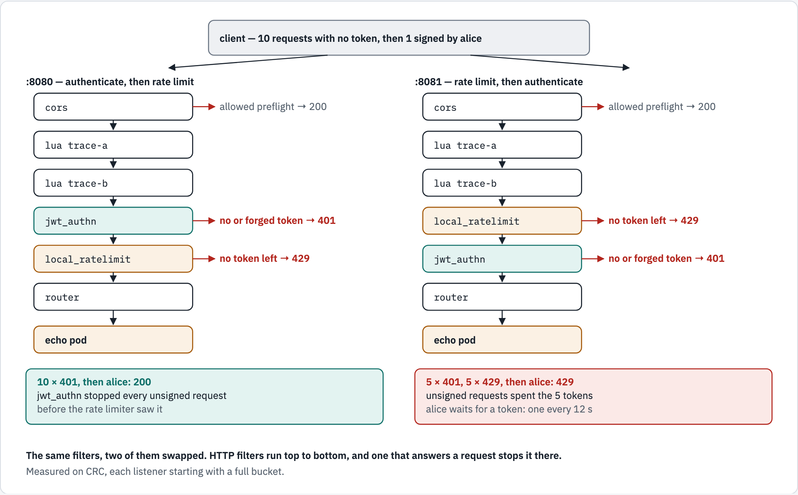

# 06 — HTTP filters, and why their order matters

Module 01 said the HTTP connection manager "turns bytes into requests". What it
does next is run each request through a list of **HTTP filters**, top to bottom.
Every feature this module adds — CORS, JWT authentication, rate limiting, Lua —
is one entry in that list, and the last entry is always the **router**, which
sends the request upstream.

The rule this module exists to teach:

> A filter that answers a request itself — a `401`, a `429`, a CORS preflight —
> **stops it there**. Nothing below it runs. So the order of the list is part of
> the config's meaning.

## What you'll learn

- how to add filters — `cors`, `jwt_authn`, `local_ratelimit`, `lua` — and read
  their effect on a request
- how a JSON Web Token is built, and what `jwt_authn` does with a missing, forged
  or valid one
- how swapping two filters decides whether strangers can use up a real user's
  rate limit — measured

## Before you start

- [`00-prerequisites`](../00-prerequisites/README.md) passes, and `openssl` and
  `python3` are on your laptop (step 3 uses both).
- Work from this folder: `cd 06-http-filters`.
- This module uses the namespace **`envoy-06`** and takes about 25 minutes.

## The same filters, two of them swapped

<!-- markdownlint-disable MD033 -->
<picture>
  <source media="(prefers-color-scheme: dark)" srcset="../docs/diagrams/06-http-filters/filter-order.dark.png">
  <source media="(prefers-color-scheme: light)" srcset="../docs/diagrams/06-http-filters/filter-order.light.png">
  
</picture>
<!-- markdownlint-enable MD033 -->

*Two listeners in one Envoy. Step 8 measures both columns.*

## Walkthrough

### Step 1 — a namespace, a client, and the app

```console
$ oc create namespace envoy-06
namespace/envoy-06 created
$ oc apply -n envoy-06 -f ../_shared/client.yaml
pod/client created
$ oc apply -n envoy-06 -f ../_shared/echo-app.yaml
configmap/echo-src created
service/echo created
deployment.apps/echo created
$ oc wait -n envoy-06 --for=condition=Ready pod/client --timeout=120s
pod/client condition met
$ oc rollout status -n envoy-06 deploy/echo --timeout=180s
Waiting for deployment "echo" rollout to finish: 0 of 2 updated replicas are available...
Waiting for deployment "echo" rollout to finish: 1 of 2 updated replicas are available...
deployment "echo" successfully rolled out
```

### Step 2 — read the two filter lists

```console
$ grep -nE '^      - name: (auth_then_limit|limit_then_auth)$|^              - name: ' manifests/10-envoy-config.yaml
25:      - name: auth_then_limit
54:              - name: envoy.filters.http.cors
59:              - name: trace-a
67:              - name: trace-b
79:              - name: envoy.filters.http.jwt_authn
98:              - name: envoy.filters.http.local_ratelimit
107:              - name: envoy.filters.http.router
113:      - name: limit_then_auth
139:              - name: envoy.filters.http.cors
142:              - name: trace-a
150:              - name: trace-b
160:              - name: envoy.filters.http.local_ratelimit
169:              - name: envoy.filters.http.jwt_authn
182:              - name: envoy.filters.http.router
```

**What just happened:** each listener's filters, in the order they run. Both
start `cors`, `trace-a`, `trace-b` and end with the `router`. In between,
`auth_then_limit` (port 8080) has `jwt_authn` then `local_ratelimit`;
`limit_then_auth` (port 8081) has them the other way round. Open the file — each
filter's comment says why it sits where it does.

### Step 3 — make a token

A **JSON Web Token** is three base64url parts joined by dots —
`header.payload.signature`. [`make-jwt.sh`](make-jwt.sh) builds one with
`openssl`, signed with the key Envoy's `jwt_authn` filter trusts:

```console
$ ./make-jwt.sh alice | tr '.' '\n'
eyJhbGciOiJIUzI1NiIsInR5cCI6IkpXVCIsImtpZCI6InR1dG9yaWFsIn0
eyJpc3MiOiJlbnZveS10dXRvcmlhbCIsInN1YiI6ImFsaWNlIiwiZXhwIjoxNzkwNDAxODk3fQ
2UA837F4EYJO2QzNuo613DrbBeFI-EpyZ9vaWR1a4Lk
```

The middle part is the **claims** — who the token is for, who issued it, when it
expires. It is only encoded, not encrypted, so anyone can read it:

```console
$ ./make-jwt.sh alice | python3 -c 'import base64,sys; p=sys.stdin.read().split(".")[1]; print(base64.urlsafe_b64decode(p + "=" * (-len(p) % 4)).decode())'
{"iss":"envoy-tutorial","sub":"alice","exp":1790401897}
```

**What just happened:** `sub` is the user, `iss` the issuer Envoy expects, `exp`
the expiry time in Unix seconds — an hour from now. The **signature** is what
makes the token trustworthy: change one character of the claims and it no longer
matches. The key here is a tutorial-only shared secret; real identity providers
sign with a private key and publish only the public half.

### Step 4 — start Envoy

```console
$ oc apply -n envoy-06 -f manifests/10-envoy-config.yaml -f manifests/20-envoy.yaml
configmap/envoy-config created
service/envoy created
deployment.apps/envoy created
$ oc rollout status -n envoy-06 deploy/envoy --timeout=180s
Waiting for deployment "envoy" rollout to finish: 0 of 1 updated replicas are available...
deployment "envoy" successfully rolled out
```

### Step 5 — `jwt_authn`: missing, forged and valid tokens

No token:

```console
$ oc exec -n envoy-06 client -- curl -s -w ' %{http_code}\n' http://envoy:8080/
Jwt is missing 401
```

A token signed with the **wrong** key — `./make-jwt.sh alice forged`:

```console
$ oc exec -n envoy-06 client -- curl -s -w ' %{http_code}\n' -H "Authorization: Bearer $(./make-jwt.sh alice forged)" http://envoy:8080/
Jwt verification fails 401
```

A valid token — the app's reply, filtered to the lines that matter:

```console
$ oc exec -n envoy-06 client -- curl -s -H "Authorization: Bearer $(./make-jwt.sh alice)" http://envoy:8080/ | grep -E '"served_by"|"x-user"|"x-filter-trace"|"authorization"'
  "served_by": "echo-f8fc6d5c9-xgg87",
    "x-filter-trace": "trace-a,trace-b",
    "x-user": "alice",
```

**What just happened:**

- no token → `401 Jwt is missing`; a forged one → `401 Jwt verification fails`.
  Neither reached the app.
- the valid one reached it, and the app received **`x-user: alice`** — the
  token's `sub` claim, copied into a header by `claim_to_headers`. The app does
  not have to understand JWTs to know who is calling.
- there is **no `authorization` line**: `jwt_authn` removes the token before
  forwarding (set `forward: true` to keep it).

Note the `$(./make-jwt.sh alice)` inside the command: your laptop's shell runs
the script first and pastes the token in, before `oc exec` sends the command.

### Step 6 — the order the request went through

In step 5's output, `x-filter-trace` was `trace-a,trace-b`. Two Lua filters
wrote it: `trace-a` sets it, `trace-b` appends to whatever it finds. The value
the app received is the path the request took, in order — the filter list,
made visible.

### Step 7 — CORS: a browser's preflight

Before a web page on another origin sends a request with an `Authorization`
header, the browser asks permission first: an `OPTIONS` **preflight**, which
carries **no** token.

From an origin the policy allows:

```console
$ oc exec -n envoy-06 client -- curl -s -i -X OPTIONS -H 'Origin: https://shop.example' -H 'Access-Control-Request-Method: POST' -H 'Access-Control-Request-Headers: authorization' http://envoy:8080/ | grep -iE '^HTTP|^access-control'
HTTP/1.1 200 OK
access-control-allow-origin: https://shop.example
access-control-allow-methods: GET, POST
access-control-allow-headers: authorization, content-type
access-control-max-age: 600
```

From one it does not:

```console
$ oc exec -n envoy-06 client -- curl -s -i -X OPTIONS -H 'Origin: https://evil.example' -H 'Access-Control-Request-Method: POST' http://envoy:8080/ | grep -iE '^HTTP|^access-control|^www-authenticate'
HTTP/1.1 401 Unauthorized
www-authenticate: Bearer realm="http://envoy:8080/"
```

**What just happened:** for `shop.example` the `cors` filter answered the
preflight itself — `200` and the `access-control-*` headers — and the request
stopped there, so `jwt_authn` never saw it. That is why `cors` is **first**: put
`jwt_authn` above it and every preflight would get a `401`, because preflights
never carry a token.

For `evil.example` the `cors` filter did **not** answer: the origin is not in the
policy, so the request went on down the list, and `jwt_authn` rejected it for
having no token. No `access-control-allow-origin` header came back, so a browser
blocks the page from making the real request.

### Step 8 — the order of `jwt_authn` and `local_ratelimit`

Both listeners hold **5** tokens and answer `429 Too Many Requests` when the
bucket is empty. The bucket refills continuously — 5 tokens per 60 s is one
token every 12 s — so each command below sends ten requests with no token and
then one signed by alice in a single `oc exec`, too quickly for a token to come
back in between. Restart Envoy first, so both buckets start full:

```console
$ oc delete pod -n envoy-06 -l app=envoy --wait=true
pod "envoy-55f9dbb64b-b4lh9" deleted from envoy-06 namespace
$ oc rollout status -n envoy-06 deploy/envoy --timeout=180s
deployment "envoy" successfully rolled out
```

Ten requests with no token, then one signed by alice — first to port 8080,
where `jwt_authn` comes before the rate limiter:

```console
$ oc exec -n envoy-06 client -- sh -c "for i in 1 2 3 4 5 6 7 8 9 10; do curl -s -o /dev/null -w '%{http_code} ' http://envoy:8080/; done; echo; curl -s -o /dev/null -w '%{http_code}\n' -H 'Authorization: Bearer $(./make-jwt.sh alice)' http://envoy:8080/"
401 401 401 401 401 401 401 401 401 401 
200
```

The same to port 8081, where the rate limiter comes first:

```console
$ oc exec -n envoy-06 client -- sh -c "for i in 1 2 3 4 5 6 7 8 9 10; do curl -s -o /dev/null -w '%{http_code} ' http://envoy:8081/; done; echo; curl -s -w ' %{http_code}\n' -H 'Authorization: Bearer $(./make-jwt.sh alice)' http://envoy:8081/"
401 401 401 401 401 429 429 429 429 429 
local_rate_limited 429
```

The script is in double quotes this time, so your laptop's shell still fills in
`$(./make-jwt.sh alice)` before `oc exec` runs, as in step 5.

And what each rate limiter saw:

```console
$ oc exec -n envoy-06 client -- curl -s 'http://envoy:9901/stats?filter=http_local_rate_limit\.(enabled|ok|rate_limited)$'
auth_then_limit.http_local_rate_limit.enabled: 1
auth_then_limit.http_local_rate_limit.ok: 1
auth_then_limit.http_local_rate_limit.rate_limited: 0
limit_then_auth.http_local_rate_limit.enabled: 11
limit_then_auth.http_local_rate_limit.ok: 5
limit_then_auth.http_local_rate_limit.rate_limited: 6
```

**What just happened:**

- **8080** — ten `401`s, then alice got `200`. `jwt_authn` stopped every unsigned
  request **before** the rate limiter, which only ever saw alice
  (`auth_then_limit…enabled: 1`).
- **8081** — five `401`s, then five `429`s, and alice got **`429`**
  (`local_rate_limited`). The rate limiter came first, so it counted the
  unsigned requests too: they spent all five tokens, and the real user is locked
  out until the next token arrives. Measured on CRC: 3 s after the ten requests
  alice still got `429`; 13 s after, `200`.

Same filters, same settings; only the order differs. With the limiter first,
anyone can use up a real user's quota without a token at all.

### Step 9 — check yourself

```console
$ ./run.sh verify

1. jwt_authn
  ✓ no token -> 401
  ✓ no token -> 'Jwt is missing'
  ✓ forged token -> 'Jwt verification fails'
  ✓ valid token reaches the app
  ✓ the sub claim arrives as x-user
  ✓ the token itself is not forwarded

2. filters run in the order written
  ✓ trace-a ran before trace-b

3. cors answers the preflight before jwt_authn can reject it
  ✓ allowed origin: 200 with no token
  ✓ allowed origin: CORS headers
  ✓ disallowed origin: not answered by cors, so jwt_authn says 401

4. the order of jwt_authn and local_ratelimit
  ✓ upstream echo_service has endpoints
  ✓ auth first (:8080): 10 unsigned, then alice gets through
  ✓ limit first (:8081): 10 unsigned, then alice is rate limited

all checks passed
```

**Try this — a rate limiter that limits nothing.** In
`manifests/10-envoy-config.yaml`, delete lines 165–168 — `filter_enabled:`,
`filter_enforced:` and the `default_value:` under each — from the
`limit_then_auth` rate limiter (port 8081; leave port 8080's alone). Apply it,
restart Envoy, send the same ten unsigned requests to port 8081, and read the
limiter's counters:

```bash
oc apply -n envoy-06 -f manifests/10-envoy-config.yaml
oc delete pod -n envoy-06 -l app=envoy
oc rollout status -n envoy-06 deploy/envoy
oc exec -n envoy-06 client -- sh -c 'for i in 1 2 3 4 5 6 7 8 9 10; do curl -s -o /dev/null -w "%{http_code} " http://envoy:8081/; done; echo'
oc exec -n envoy-06 client -- curl -s 'http://envoy:9901/stats?filter=limit_then_auth\.http_local_rate_limit\.(enabled|ok|rate_limited)$'
```

Measured on CRC: ten `401`s and no `429` at all, and the limiter's
`enabled`, `ok` and `rate_limited` counters all stayed at `0`. Without those two
fields the filter is configured but **switched off** — both default to 0% of
requests. When you are done, put the lines back
(`git checkout manifests/10-envoy-config.yaml`) and run the first three
commands again.

## The filters

| Filter | What it does here | Answers the request itself when |
|---|---|---|
| `envoy.filters.http.cors` | applies the CORS policy set on the virtual host (`typed_per_filter_config`) | a preflight comes from an allowed origin → `200` + `access-control-*` |
| `envoy.filters.http.lua` | runs a Lua function on each request — here, stamping `x-filter-trace` | never, here (it can: `request_handle:respond(...)`) |
| `envoy.filters.http.jwt_authn` | checks the `Authorization: Bearer` token against `local_jwks`; copies `sub` to `x-user` | no token, or a bad one → `401` |
| `envoy.filters.http.local_ratelimit` | a token bucket: 5 tokens, refilled continuously at 5 per 60 s — one every 12 s | the bucket is empty → `429` |
| `envoy.filters.http.router` | sends the request to the route's cluster | — it is always last |

**Fields worth knowing**

| Field | Default | Why it matters |
|---|---|---|
| `local_ratelimit.filter_enabled` / `filter_enforced` | **0% of requests** | without them the limiter does nothing — measured in the "Try this" |
| `local_ratelimit.token_bucket` | none | `max_tokens`, `tokens_per_fill`, `fill_interval`; Envoy accepts the filter without it, and then every request passes |
| `jwt_authn` token location | `Authorization: Bearer …` or `?access_token=` | where the filter looks when `from_headers` / `from_params` are not set (API reference) |
| `jwt_authn` provider `forward` | `false` | the token is removed before the request reaches the app |
| `jwt_authn` provider `claim_to_headers` | none | copy claims such as `sub` into headers the app can read |

## Troubleshooting

| You see | Why | Fix |
|---|---|---|
| `401 Jwt is missing` with a token | the header must be exactly `Authorization: Bearer <token>` | check the quoting — the `$(…)` must be inside double quotes |
| `401 Jwt verification fails` | the token was signed with a different key from the one in `local_jwks` | mint it with this module's `make-jwt.sh` |
| `401 Jwt is expired` | the token's `exp` has passed — `make-jwt.sh` tokens last an hour | make a new one |
| `401 Jwt issuer is not configured` | the token's `iss` is not `envoy-tutorial` | mint it with this module's `make-jwt.sh` |
| every preflight gets `401` | `jwt_authn` is above `cors` in the list | put `cors` first |
| step 8's numbers differ | earlier requests had already spent tokens, or 12 s passed and a token came back | restart Envoy first, as step 8 does — the bucket starts full — and run each step-8 command whole |
| no `429` ever | `filter_enabled` / `filter_enforced` missing | set both — see the "Try this" |

## Clean up

```console
$ oc delete namespace envoy-06 --wait=false
namespace "envoy-06" deleted
```

## The shortcut

`./run.sh deploy` does steps 1 and 4; `./run.sh verify` is step 9 (it restarts
Envoy before the ordering checks); `./run.sh clean` removes the namespace.

## What this module skipped

The global (network) rate limiter, which shares one limit across many Envoys
through a separate rate-limit service; `ext_authz`, which asks an external
service to authorize each request; and the gRPC filters (`grpc_web`,
`grpc_json_transcoder`), which belong with the gRPC modules.

## References

- [HTTP filters — the filter chain](https://www.envoyproxy.io/docs/envoy/latest/intro/arch_overview/http/http_filters)
- [CORS filter](https://www.envoyproxy.io/docs/envoy/latest/configuration/http/http_filters/cors_filter)
- [JWT authentication filter](https://www.envoyproxy.io/docs/envoy/latest/configuration/http/http_filters/jwt_authn_filter)
- [Local rate limit filter](https://www.envoyproxy.io/docs/envoy/latest/configuration/http/http_filters/local_rate_limit_filter)
- [Lua filter](https://www.envoyproxy.io/docs/envoy/latest/configuration/http/http_filters/lua_filter)
- [RFC 7519 — JSON Web Token](https://www.rfc-editor.org/rfc/rfc7519)
- [MDN — CORS preflight requests](https://developer.mozilla.org/en-US/docs/Glossary/Preflight_request)

## Diagram sources

The figure is rendered from [`docs/diagrams/06-http-filters/source.html`](../docs/diagrams/06-http-filters/source.html)
(inline SVG, light and dark). Change the page and re-render the PNGs together,
with the `/visual` skill's `render.py`.
