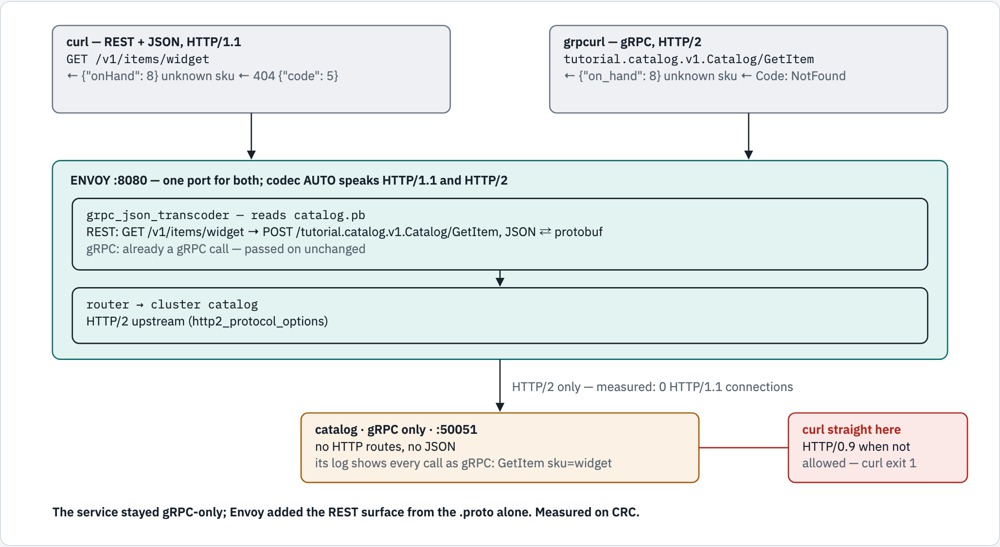
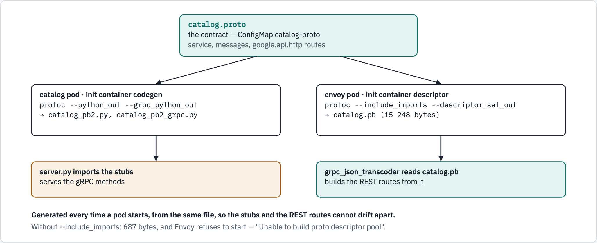

# 07 — modernising a gRPC service: REST and JSON in front

You have a service that speaks **only gRPC**. Browsers, `curl`, and most partner
systems speak **REST and JSON**. Rewriting the service is one answer. This module
shows the other: leave the service alone and let **Envoy** translate, using
nothing but the service's own `.proto` file.

## What you'll learn

- what a `.proto` contract contains, and how `google.api.http` options map REST
  paths onto gRPC methods
- how Envoy's `grpc_json_transcoder` turns `GET /v1/items/widget` into a gRPC call
  and the protobuf reply back into JSON — errors included
- how one Envoy port serves REST clients **and** gRPC clients at the same time

## Before you start

- [`00-prerequisites`](../00-prerequisites/README.md) passes. This module also
  needs the cluster to reach **PyPI**: the pods install `grpcio` when they start.
- Modules [01](../01-what-is-envoy/README.md) and [06](../06-http-filters/README.md)
  are worth doing first — the transcoder is one more HTTP filter.
- Work from this folder: `cd 07-modernising-grpc`.
- This module uses the namespace **`envoy-07`** and takes about 25 minutes.

## Two clients, one port, one gRPC-only service

<!-- markdownlint-disable MD033 -->
<picture>
  <source media="(prefers-color-scheme: dark)" srcset="../docs/diagrams/07-modernising-grpc/request-paths.dark.png">
  <source media="(prefers-color-scheme: light)" srcset="../docs/diagrams/07-modernising-grpc/request-paths.light.png">
  
</picture>
<!-- markdownlint-enable MD033 -->

## Walkthrough

### Step 1 — read the contract

[`proto/catalog.proto`](proto/catalog.proto) defines the service. The lines that
matter:

```console
$ grep -nE '^service|  rpc |google.api.http|^message|^  (string|int32|repeated)' proto/catalog.proto
4:// google.api.http options below are read by ENVOY's grpc_json_transcoder to
12:service Catalog {
14:  rpc ListItems (ListItemsRequest) returns (ListItemsResponse) {
15:    option (google.api.http) = { get: "/v1/items" };
19:  rpc GetItem (GetItemRequest) returns (Item) {
20:    option (google.api.http) = { get: "/v1/items/{sku}" };
24:  rpc ReserveStock (ReserveStockRequest) returns (Item) {
25:    option (google.api.http) = { post: "/v1/items/{sku}:reserve" body: "*" };
29:message Item {
30:  string sku     = 1;
31:  string name    = 2;
32:  int32  on_hand = 3;
35:message ListItemsRequest {}
37:message ListItemsResponse {
38:  repeated Item items = 1;
41:message GetItemRequest {
42:  string sku = 1;
45:message ReserveStockRequest {
46:  string sku      = 1;
47:  int32  quantity = 2;
```

**What just happened:** a `service` with three `rpc` methods, and the `message`s
they take and return. Each method also carries a `google.api.http` option — a
REST route: `GET /v1/items/{sku}` for `GetItem`, for example. Those options are
for **Envoy**. The service ignores them; it only ever answers gRPC.

The service itself is [`app/server.py`](app/server.py): three methods over an
in-memory list of items. There is no HTTP route or JSON anywhere in it.

### Step 2 — a namespace, two clients, and the code as ConfigMaps

`client` runs `curl`, as in every module. `grpc-client` runs **`grpcurl`** —
`curl` for gRPC.

```console
$ oc create namespace envoy-07
namespace/envoy-07 created
$ oc apply -n envoy-07 -f ../_shared/client.yaml -f manifests/50-grpc-client.yaml
pod/client created
pod/grpc-client created
$ oc create configmap catalog-proto -n envoy-07 --from-file=proto/catalog.proto
configmap/catalog-proto created
$ oc create configmap catalog-app -n envoy-07 --from-file=app/server.py
configmap/catalog-app created
$ oc wait -n envoy-07 --for=condition=Ready pod/client pod/grpc-client --timeout=120s
pod/client condition met
pod/grpc-client condition met
```

**What just happened:** the `.proto` and the Python source became ConfigMaps,
straight from the files you just read. Nothing is built into an image — the pods
mount these and generate the rest when they start.

### Step 3 — start the gRPC service

```console
$ oc apply -n envoy-07 -f manifests/20-catalog.yaml
service/catalog created
deployment.apps/catalog created
$ oc rollout status -n envoy-07 deploy/catalog --timeout=300s
Waiting for deployment "catalog" rollout to finish: 0 of 1 updated replicas are available...
deployment "catalog" successfully rolled out
$ oc logs -n envoy-07 deploy/catalog -c codegen | tail -2
catalog_pb2.py
catalog_pb2_grpc.py
$ oc logs -n envoy-07 deploy/catalog -c catalog
catalog (gRPC only) listening on :50051 as catalog-7bc84497-lgdwq
```

**What just happened:** before the service started, an init container called
`codegen` installed the gRPC tools and ran `protoc` on `catalog.proto`, producing
`catalog_pb2.py` (the messages) and `catalog_pb2_grpc.py` (the service stubs)
that `server.py` imports. Generated at every start, from the same file, they can
never drift from the contract.

### Step 4 — it really does speak only gRPC

Plain HTTP, straight at the service:

<!-- walkthrough: expect-exit 1 -->
```console
$ oc exec -n envoy-07 client -- curl -sS http://catalog:50051/v1/items
curl: (1) Received HTTP/0.9 when not allowed
command terminated with exit code 1
```

gRPC, straight at the service — ask it what it offers:

```console
$ oc exec -n envoy-07 grpc-client -- grpcurl -plaintext catalog:50051 list
grpc.reflection.v1alpha.ServerReflection
tutorial.catalog.v1.Catalog
$ oc exec -n envoy-07 grpc-client -- grpcurl -plaintext catalog:50051 describe tutorial.catalog.v1.Catalog
tutorial.catalog.v1.Catalog is a service:
service Catalog {
  rpc GetItem ( .tutorial.catalog.v1.GetItemRequest ) returns ( .tutorial.catalog.v1.Item ) {
    option (.google.api.http) = { get: "/v1/items/{sku}" };
  }
  rpc ListItems ( .tutorial.catalog.v1.ListItemsRequest ) returns ( .tutorial.catalog.v1.ListItemsResponse ) {
    option (.google.api.http) = { get: "/v1/items" };
  }
  rpc ReserveStock ( .tutorial.catalog.v1.ReserveStockRequest ) returns ( .tutorial.catalog.v1.Item ) {
    option (.google.api.http) = { post: "/v1/items/{sku}:reserve", body: "*" };
  }
}
```

**What just happened:** `curl` got something it could not read as HTTP/1.1 —
gRPC runs over **HTTP/2**, and this server speaks nothing else. `grpcurl` asked
the server over gRPC **reflection** which services it has, then described one —
including the `google.api.http` routes, carried in the contract but unused by the
service.

### Step 5 — start Envoy

```console
$ oc apply -n envoy-07 -f manifests/30-envoy-config.yaml -f manifests/40-envoy.yaml
configmap/envoy-config created
service/envoy created
deployment.apps/envoy created
$ oc rollout status -n envoy-07 deploy/envoy --timeout=300s
Waiting for deployment "envoy" rollout to finish: 0 of 1 updated replicas are available...
deployment "envoy" successfully rolled out
$ oc logs -n envoy-07 deploy/envoy -c descriptor | tail -2
total 16
-rw-r--r--. 1 1001530000 1001530000 15248 Sep 26 04:17 catalog.pb
```

<!-- markdownlint-disable MD033 -->
<picture>
  <source media="(prefers-color-scheme: dark)" srcset="../docs/diagrams/07-modernising-grpc/one-proto.dark.png">
  <source media="(prefers-color-scheme: light)" srcset="../docs/diagrams/07-modernising-grpc/one-proto.light.png">
  
</picture>
<!-- markdownlint-enable MD033 -->

**What just happened:** the Envoy pod ran `protoc` on the **same** `catalog.proto`
— this time to produce `catalog.pb`, a **descriptor set**: the compiled contract,
which `grpc_json_transcoder` reads to learn the methods, messages and REST routes.
`--include_imports` puts the imported `google/api/annotations.proto` in too.
Measured without it: a 687-byte file, and Envoy refused to start —
*"transcoding_filter: Unable to build proto descriptor pool"*.

### Step 6 — REST and JSON, through Envoy

```console
$ oc exec -n envoy-07 client -- curl -s http://envoy:8080/v1/items
{
 "items": [
  {
   "sku": "widget",
   "name": "Widget",
   "onHand": 10
  },
  {
   "sku": "gadget",
   "name": "Gadget",
   "onHand": 3
  }
 ]
}
$ oc exec -n envoy-07 client -- curl -s -i http://envoy:8080/v1/items/widget
HTTP/1.1 200 OK
content-type: application/json
grpc-accept-encoding: identity, deflate, gzip
x-envoy-upstream-service-time: 0
grpc-status: 0
grpc-message: 
content-length: 55
date: Sat, 26 Sep 2026 04:17:17 GMT
server: envoy

{
 "sku": "widget",
 "name": "Widget",
 "onHand": 10
}
```

**What just happened:** a plain `GET` returned JSON, from a service that has
never heard of either. Two details:

- the field is **`onHand`**, not `on_hand`. Protobuf's JSON mapping writes field
  names in lowerCamelCase.
- the response still carries gRPC's own headers — `grpc-status: 0` means the
  call succeeded — because the transcoder passes them through.

Change something — reserve two widgets:

```console
$ oc exec -n envoy-07 client -- curl -s -X POST -H 'content-type: application/json' -d '{"quantity": 2}' http://envoy:8080/v1/items/widget:reserve
{
 "sku": "widget",
 "name": "Widget",
 "onHand": 8
}
```

The route was `post: "/v1/items/{sku}:reserve" body: "*"`: `{sku}` came from the
path, `quantity` from the JSON body, and together they made one
`ReserveStockRequest`.

### Step 7 — gRPC errors become HTTP errors

Three ways to fail — an unknown item, too many, and a nonsense quantity:

```console
$ oc exec -n envoy-07 client -- curl -s -w ' %{http_code}\n' http://envoy:8080/v1/items/nope
{
 "code": 5,
 "message": "no item with sku 'nope'",
 "details": []
}
 404
$ oc exec -n envoy-07 client -- curl -s -w ' %{http_code}\n' -X POST -H 'content-type: application/json' -d '{"quantity": 100}' http://envoy:8080/v1/items/gadget:reserve
{
 "code": 9,
 "message": "only 3 gadget left",
 "details": []
}
 400
$ oc exec -n envoy-07 client -- curl -s -w ' %{http_code}\n' -X POST -H 'content-type: application/json' -d '{"quantity": 0}' http://envoy:8080/v1/items/gadget:reserve
{
 "code": 3,
 "message": "quantity must be positive",
 "details": []
}
 400
```

**What just happened:** the service raised gRPC errors; the client got HTTP ones,
with the gRPC status and message as JSON. That JSON body is
`convert_grpc_status: true`'s work. Measured with it switched off: the client
still got a `404`, but with an empty body, `content-type: application/grpc`, and
the error only in `grpc-status` / `grpc-message` headers — nothing a REST client
would think to read.

| The service raised | `code` | The client got |
|---|---|---|
| `NOT_FOUND` | 5 | `404` |
| `FAILED_PRECONDITION` | 9 | `400` |
| `INVALID_ARGUMENT` | 3 | `400` |

### Step 8 — native gRPC, through the same Envoy port

```console
$ oc exec -n envoy-07 grpc-client -- grpcurl -plaintext envoy:8080 list
grpc.reflection.v1alpha.ServerReflection
tutorial.catalog.v1.Catalog
$ oc exec -n envoy-07 grpc-client -- grpcurl -plaintext -d '{"sku":"widget"}' envoy:8080 tutorial.catalog.v1.Catalog/GetItem
{
  "sku": "widget",
  "name": "Widget",
  "on_hand": 8
}
```

And a gRPC error, which stays a gRPC error (`grpcurl` exits with a non-zero code):

<!-- walkthrough: expect-exit 69 -->
```console
$ oc exec -n envoy-07 grpc-client -- grpcurl -plaintext -d '{"sku":"nope"}' envoy:8080 tutorial.catalog.v1.Catalog/GetItem
ERROR:
  Code: NotFound
  Message: no item with sku 'nope'
command terminated with exit code 69
```

**What just happened:** the same port that served REST also served gRPC. The
transcoder only rewrites requests that are *not* already gRPC; a native gRPC call
passes straight through to the router. Note `on_hand` here: `grpcurl` prints the
proto field names, where the transcoder's JSON used `onHand`. And the widget
count is two lower — the `:reserve` in step 6 changed the same service.

### Step 9 — what the service saw

```console
$ oc logs -n envoy-07 deploy/catalog -c catalog --tail=8
catalog-7bc84497-lgdwq ListItems
catalog-7bc84497-lgdwq GetItem sku=widget
catalog-7bc84497-lgdwq ReserveStock sku=widget quantity=2
catalog-7bc84497-lgdwq GetItem sku=nope
catalog-7bc84497-lgdwq ReserveStock sku=gadget quantity=100
catalog-7bc84497-lgdwq ReserveStock sku=gadget quantity=0
catalog-7bc84497-lgdwq GetItem sku=widget
catalog-7bc84497-lgdwq GetItem sku=nope
```

**What just happened:** every call — whether it arrived as REST or as gRPC — shows
up in the service's log as a gRPC method: `GetItem`, `ReserveStock`. The service
never saw a URL path or a line of JSON.

Envoy's counters for the `catalog` cluster say the same, from the other side:

```console
$ oc exec -n envoy-07 client -- curl -s 'http://envoy:9901/stats?filter=^cluster\.catalog\.upstream_cx_http(1|2)_total$'
cluster.catalog.upstream_cx_http1_total: 0
cluster.catalog.upstream_cx_http2_total: 7
```

No HTTP/1.1 connection to the service at all. The cluster's
`http2_protocol_options` is what makes Envoy speak HTTP/2 upstream; without it,
Envoy would send HTTP/1.1 and the service would refuse every call.

### Step 10 — check yourself

```console
$ ./run.sh verify

1. the service speaks only gRPC
  ✓ plain HTTP/1.1 straight at it fails

2. REST + JSON through Envoy
  ✓ GET /v1/items lists widget
  ✓ JSON uses lowerCamelCase: onHand
  ✓ unknown sku -> HTTP 404
  ✓ ...with the gRPC code in the body (5 = NOT_FOUND)
  ✓ too many -> 400, code 9 = FAILED_PRECONDITION
  ✓ zero -> 400, code 3 = INVALID_ARGUMENT
  ✓ POST :reserve changed the service's state (widget -1)

3. native gRPC through the same Envoy port
  ✓ grpcurl lists the service
  ✓ GetItem over gRPC (proto field names: on_hand)
  ✓ a gRPC error stays a gRPC error

4. upstream, everything is HTTP/2
  ✓ no HTTP/1.1 connections to the service
  ✓ HTTP/2 connections to the service

all checks passed
```

## The options

**`grpc_json_transcoder`**

| Field | Here | What it does |
|---|---|---|
| `proto_descriptor` | `/etc/envoy/proto/catalog.pb` | the compiled contract — generated with `--include_imports` |
| `services` | `tutorial.catalog.v1.Catalog` | which services to expose as REST |
| `convert_grpc_status` | `true` | turn a gRPC error into the matching HTTP status and a JSON body |
| `print_options.add_whitespace` | `true` | indented JSON |
| `print_options.always_print_primitive_fields` | `true` | keep fields at their zero value — measured: switched off, a sold-out item's `"onHand": 0` disappears from the JSON |

**The pieces around it**

| Where | Setting | Why |
|---|---|---|
| the `.proto` | `option (google.api.http) = { get: "/v1/items/{sku}" }` | the REST route for a method; `{sku}` fills the request field of that name |
| the `.proto` | `body: "*"` | the JSON body fills the remaining request fields |
| the listener | `codec_type: AUTO` (the default) | one port for HTTP/1.1 (curl) and HTTP/2 (grpcurl) |
| the cluster | `http2_protocol_options` | gRPC is HTTP/2 — talk HTTP/2 to the service |
| the Service | `clusterIP: None` | Envoy holds every pod (module 05); for gRPC it matters more, since one HTTP/2 connection carries every call |

## Troubleshooting

| You see | Why | Fix |
|---|---|---|
| a pod stuck in `Init` | the init container could not reach PyPI | `oc logs -n envoy-07 <pod> -c codegen` (or `-c descriptor`); the cluster needs egress to pypi.org |
| Envoy crash-loops: `Unable to build proto descriptor pool` | the descriptor was built without `--include_imports` | keep the flag in `40-envoy.yaml` |
| every REST call gets `404` with no JSON | the path matches no `google.api.http` route, and there is no other route | check the method, path and `:verb` against the `.proto` |
| an error status with an empty body and `content-type: application/grpc` | `convert_grpc_status` is off | set it to `true` |
| `Received HTTP/0.9 when not allowed` | you called the gRPC service directly with HTTP/1.1 | go through Envoy on port 8080 |

## Clean up

```console
$ oc delete namespace envoy-07 --wait=false
namespace "envoy-07" deleted
```

## The shortcut

`./run.sh deploy` does steps 2, 3 and 5; `./run.sh verify` is step 10;
`./run.sh clean` removes the namespace.

## What this module skipped

**gRPC-Web** — the `grpc_web` filter that lets a browser make real gRPC calls —
and a larger service with a database behind it. Both are assembled in
[`envoy-grpc-modernization`](https://github.com/ephico2real2/envoy-grpc-modernization),
which puts this pattern in front of a MongoDB-backed inventory service with a
browser kiosk. TLS for gRPC is module 09, still to come.

## References

- [gRPC-JSON transcoder filter](https://www.envoyproxy.io/docs/envoy/latest/configuration/http/http_filters/grpc_json_transcoder_filter)
- [`google.api.http` — HTTP rules](https://cloud.google.com/endpoints/docs/grpc-service-config/reference/rpc/google.api#httprule)
- [Protocol Buffers — the JSON mapping](https://protobuf.dev/programming-guides/json/)
- [gRPC status codes](https://grpc.github.io/grpc/core/md_doc_statuscodes.html)
- [gRPC server reflection](https://grpc.io/docs/guides/reflection/)
- [grpcurl](https://github.com/fullstorydev/grpcurl)

## Diagram sources

The figures are rendered from [`docs/diagrams/07-modernising-grpc/source.html`](../docs/diagrams/07-modernising-grpc/source.html)
(inline SVG, light and dark). Change the page and re-render the PNGs together,
with the `/visual` skill's `render.py`.
