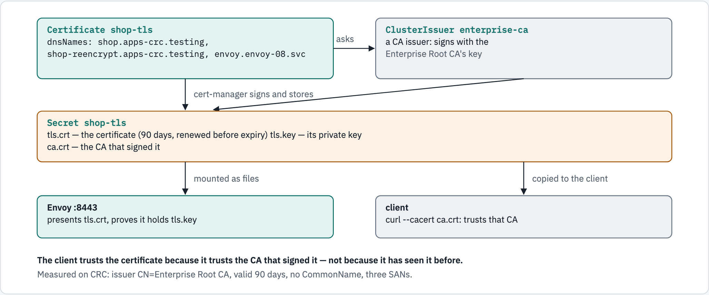

# 08 — TLS on Envoy, with a certificate from cert-manager

Every module so far spoke plain HTTP inside the cluster. This one puts **TLS** on
Envoy: a certificate issued by **cert-manager**, trusted by clients because they
trust the CA that signed it — and then the question that confuses everyone on
OpenShift: **who actually terminates TLS**, Envoy or the router in front of it?

## What you'll learn

- how cert-manager turns a `Certificate` resource into a Secret Envoy can serve
- what "trusted" means for a certificate, and the two errors you will meet — an
  untrusted CA, and a name that is not in the certificate
- how the three OpenShift Route types — `passthrough`, `edge`, `reencrypt` —
  change which certificate the client sees and what reaches Envoy

## Before you start

- [`00-prerequisites`](../00-prerequisites/README.md) reports **cert-manager**,
  and your cluster has a CA `ClusterIssuer`. This one uses **`enterprise-ca`**; on
  another cluster, change `issuerRef.name` in `manifests/10-certificate.yaml`.
- `openssl` on your laptop.
- Work from this folder: `cd 08-tls-on-envoy`.
- This module uses the namespace **`envoy-08`** and takes about 25 minutes.
  Steps 6–8 use OpenShift Routes; skip them on another platform.

## Where the certificate comes from

<!-- markdownlint-disable MD033 -->
<picture>
  <source media="(prefers-color-scheme: dark)" srcset="../docs/diagrams/08-tls-on-envoy/certificate-flow.dark.png">
  <source media="(prefers-color-scheme: light)" srcset="../docs/diagrams/08-tls-on-envoy/certificate-flow.light.png">
  
</picture>
<!-- markdownlint-enable MD033 -->

## Walkthrough

### Step 1 — a namespace, a client, and the app

```console
$ oc create namespace envoy-08
namespace/envoy-08 created
$ oc apply -n envoy-08 -f ../_shared/client.yaml
pod/client created
$ oc apply -n envoy-08 -f ../_shared/echo-app.yaml
configmap/echo-src created
service/echo created
deployment.apps/echo created
$ oc wait -n envoy-08 --for=condition=Ready pod/client --timeout=120s
pod/client condition met
$ oc rollout status -n envoy-08 deploy/echo --timeout=180s
Waiting for deployment "echo" rollout to finish: 0 of 2 updated replicas are available...
Waiting for deployment "echo" rollout to finish: 1 of 2 updated replicas are available...
deployment "echo" successfully rolled out
```

### Step 2 — ask cert-manager for a certificate

[`manifests/10-certificate.yaml`](manifests/10-certificate.yaml) is a request:
these names, signed by that issuer, stored in that Secret.

```console
$ oc apply -n envoy-08 -f manifests/10-certificate.yaml
certificate.cert-manager.io/shop-tls created
$ oc wait -n envoy-08 --for=condition=Ready certificate/shop-tls --timeout=120s
certificate.cert-manager.io/shop-tls condition met
$ oc get secret shop-tls -n envoy-08 -o jsonpath='{.data}' | python3 -c 'import json,sys; print(sorted(json.load(sys.stdin)))'
['ca.crt', 'tls.crt', 'tls.key']
```

Look inside the certificate it made:

```console
$ oc get secret shop-tls -n envoy-08 -o jsonpath='{.data.tls\.crt}' | base64 -d | openssl x509 -noout -subject -issuer -dates -text | grep -E 'subject=|issuer=|notBefore|notAfter|DNS:'
subject=
issuer=O=Enterprise POC, CN=Enterprise Root CA
notBefore=Sep 26 04:24:01 2026 GMT
notAfter=Dec 25 04:24:01 2026 GMT
                DNS:shop.apps-crc.testing, DNS:shop-reencrypt.apps-crc.testing, DNS:envoy.envoy-08.svc
$ oc get certificate shop-tls -n envoy-08 -o jsonpath='{.status.renewalTime}{"\n"}'
2026-11-25T04:24:01Z
```

**What just happened:** cert-manager made a private key, had the `enterprise-ca`
issuer sign a certificate for the three `dnsNames`, and stored the certificate
(`tls.crt`), its key (`tls.key`) and the CA that signed it (`ca.crt`) in the
Secret. Reading the certificate:

- `issuer` is the **Enterprise Root CA** — the key that vouches for it.
- the names are **Subject Alternative Names** (`DNS:…`). `subject=` is empty:
  cert-manager set no CommonName, and clients check the SANs.
- it is valid for **90 days**, cert-manager's default — and `renewalTime` is when
  cert-manager will replace it, a month before it expires.

### Step 3 — keep a copy of the CA

Clients need the CA to trust the certificate. It is in the same Secret:

```console
$ oc get secret shop-tls -n envoy-08 -o jsonpath='{.data.ca\.crt}' | base64 -d > ca.crt
$ openssl x509 -in ca.crt -noout -subject -enddate
subject=O=Enterprise POC, CN=Enterprise Root CA
notAfter=Sep 23 05:08:39 2031 GMT
```

### Step 4 — start Envoy

```console
$ oc apply -n envoy-08 -f manifests/20-envoy-config.yaml -f manifests/30-envoy.yaml
configmap/envoy-config created
service/envoy created
deployment.apps/envoy created
$ oc rollout status -n envoy-08 deploy/envoy --timeout=180s
Waiting for deployment "envoy" rollout to finish: 0 of 1 updated replicas are available...
deployment "envoy" successfully rolled out
```

**What just happened:** the `shop-tls` Secret is mounted into Envoy as files
(`/etc/tls/tls.crt`, `/etc/tls/tls.key`), and the `:8443` listener's
`transport_socket` presents them. A second listener, `:8080`, speaks plain HTTP —
step 6's `edge` Route needs it. Each listener adds an `x-envoy-listener` header,
so you can see which one answered.

### Step 5 — trust, from inside the cluster

Copy the CA into the client pod, then connect with it:

```console
$ oc exec -i -n envoy-08 client -- sh -c 'cat > /tmp/ca.crt' < ca.crt
$ oc exec -n envoy-08 client -- curl -sS --cacert /tmp/ca.crt -o /dev/null -w '%{http_code}\n' https://envoy.envoy-08.svc:8443/
200
```

Without the CA:

<!-- walkthrough: expect-exit 60 -->
```console
$ oc exec -n envoy-08 client -- curl -sS -o /dev/null https://envoy.envoy-08.svc:8443/
curl: (60) SSL certificate problem: unable to get local issuer certificate
More details here: https://curl.se/docs/sslcerts.html

curl failed to verify the legitimacy of the server and therefore could not
establish a secure connection to it. To learn more about this situation and
how to fix it, please visit the webpage mentioned above.
command terminated with exit code 60
```

With the CA, but a name that is not in the certificate — `envoy` alone, which DNS
resolves perfectly well:

<!-- walkthrough: expect-exit 60 -->
```console
$ oc exec -n envoy-08 client -- curl -sS --cacert /tmp/ca.crt -o /dev/null https://envoy:8443/
curl: (60) SSL: no alternative certificate subject name matches target hostname 'envoy'
More details here: https://curl.se/docs/sslcerts.html

curl failed to verify the legitimacy of the server and therefore could not
establish a secure connection to it. To learn more about this situation and
how to fix it, please visit the webpage mentioned above.
command terminated with exit code 60
```

**What just happened:** three outcomes, and they are the two TLS errors you will
meet most:

- **trusted** — `200`. curl checked that a CA it trusts signed the certificate,
  **and** that the name it dialled is in the certificate's SANs.
- **`unable to get local issuer certificate`** (exit 60) — the certificate is
  fine, but curl does not trust the private CA that signed it. The fix is
  `--cacert`, not `-k`: `-k` turns checking off entirely.
- **`no alternative certificate subject name matches target hostname 'envoy'`**
  (exit 60) — the CA is trusted, but `envoy` is not one of the three names. A
  short name, an IP address, a new hostname: each needs to be in `dnsNames`.

### Step 6 — three Routes in front of the same Envoy

```console
$ oc apply -n envoy-08 -f manifests/40-routes.yaml
route.route.openshift.io/shop created
route.route.openshift.io/shop-edge created
$ oc create route reencrypt shop-reencrypt -n envoy-08 --service=envoy --port=https --hostname=shop-reencrypt.apps-crc.testing --dest-ca-cert=ca.crt
route.route.openshift.io/shop-reencrypt created
$ oc get route -n envoy-08 -o custom-columns=NAME:.metadata.name,HOST:.spec.host,TLS:.spec.tls.termination,TO-PORT:.spec.port.targetPort
NAME             HOST                              TLS           TO-PORT
shop             shop.apps-crc.testing             passthrough   https
shop-edge        shop-edge.apps-crc.testing        edge          http
shop-reencrypt   shop-reencrypt.apps-crc.testing   reencrypt     https
```

**What just happened:** three ways to bring outside traffic in.

- **`passthrough`** → Envoy's `https` port. The router forwards the TLS bytes
  untouched.
- **`edge`** → Envoy's plain `http` port. The router terminates TLS itself.
- **`reencrypt`** → Envoy's `https` port. The router terminates TLS, then opens a
  **new** TLS connection to Envoy — checking Envoy's certificate against the CA
  file you gave it with `--dest-ca-cert`.

### Step 7 — which certificate does each Route present?

The issuer of the certificate each hostname presents (`-k`, because this step
only looks — step 5 already did the checking):

```console
$ sleep 5; oc exec -n envoy-08 client -- curl -sk -o /dev/null -w '%{certs}' https://shop.apps-crc.testing/ | grep -m1 -i '^issuer:'
Issuer:O = Enterprise POC, CN = Enterprise Root CA
$ oc exec -n envoy-08 client -- curl -sk -o /dev/null -w '%{certs}' https://shop-edge.apps-crc.testing/ | grep -m1 -i '^issuer:'
Issuer:CN = ingress-operator@1785325954
$ oc exec -n envoy-08 client -- curl -sk -o /dev/null -w '%{certs}' https://shop-reencrypt.apps-crc.testing/ | grep -m1 -i '^issuer:'
Issuer:CN = ingress-operator@1785325954
```

And whether a client that trusts only the enterprise CA accepts it — passthrough:

```console
$ oc exec -n envoy-08 client -- curl -sS --cacert /tmp/ca.crt -o /dev/null -w '%{http_code}\n' https://shop.apps-crc.testing/
200
```

edge and reencrypt:

<!-- walkthrough: expect-exit 60 -->
```console
$ oc exec -n envoy-08 client -- curl -sS --cacert /tmp/ca.crt -o /dev/null https://shop-edge.apps-crc.testing/
curl: (60) SSL certificate problem: self-signed certificate in certificate chain
More details here: https://curl.se/docs/sslcerts.html

curl failed to verify the legitimacy of the server and therefore could not
establish a secure connection to it. To learn more about this situation and
how to fix it, please visit the webpage mentioned above.
command terminated with exit code 60
```

<!-- walkthrough: expect-exit 60 -->
```console
$ oc exec -n envoy-08 client -- curl -sS --cacert /tmp/ca.crt -o /dev/null https://shop-reencrypt.apps-crc.testing/
curl: (60) SSL certificate problem: self-signed certificate in certificate chain
More details here: https://curl.se/docs/sslcerts.html

curl failed to verify the legitimacy of the server and therefore could not
establish a secure connection to it. To learn more about this situation and
how to fix it, please visit the webpage mentioned above.
command terminated with exit code 60
```

<!-- markdownlint-disable MD033 -->
<picture>
  <source media="(prefers-color-scheme: dark)" srcset="../docs/diagrams/08-tls-on-envoy/route-types.dark.png">
  <source media="(prefers-color-scheme: light)" srcset="../docs/diagrams/08-tls-on-envoy/route-types.light.png">
  
</picture>
<!-- markdownlint-enable MD033 -->

**What just happened:** **whoever terminates TLS presents the certificate.** With
`passthrough`, that is Envoy, with the cert-manager certificate. With `edge` and
`reencrypt`, it is the **router**, with its own `*.apps-crc.testing` certificate,
issued by the cluster's `ingress-operator` CA — so a client that trusts only the
enterprise CA rejects it. Your cert-manager certificate is only ever seen by the
router (reencrypt) or by nobody (edge).

### Step 8 — what reached Envoy, and what the app was told

```console
$ oc exec -n envoy-08 client -- curl -sk -i https://shop.apps-crc.testing/ | grep -E '^x-envoy-listener|"x-forwarded-(proto|for)"'
x-envoy-listener: tls-8443
    "x-forwarded-proto": "https",
$ oc exec -n envoy-08 client -- curl -sk -i https://shop-edge.apps-crc.testing/ | grep -E '^x-envoy-listener|"x-forwarded-(proto|for)"'
x-envoy-listener: plain-8080
    "x-forwarded-proto": "https",
    "x-forwarded-for": "10.217.0.254",
$ oc exec -n envoy-08 client -- curl -sk -i https://shop-reencrypt.apps-crc.testing/ | grep -E '^x-envoy-listener|"x-forwarded-(proto|for)"'
x-envoy-listener: tls-8443
    "x-forwarded-proto": "https",
    "x-forwarded-for": "10.217.0.254",
```

And, for comparison, straight to Envoy's plain port with no router in front:

```console
$ oc exec -n envoy-08 client -- curl -s http://envoy:8080/ | grep -E '"x-forwarded-(proto|for)"'
    "x-forwarded-proto": "http",
```

**What just happened:**

- **edge** reached Envoy's **plain** `:8080` listener — and the app was still told
  `x-forwarded-proto: https`. The router added that header; Envoy only sets it
  when it is missing, which is why the direct request says `http`.
- **edge** and **reencrypt** carry an `x-forwarded-for`: the router could read the
  request, so it added one. **passthrough** has none — the router never saw inside
  the TLS.
- **passthrough** and **reencrypt** both reached `:8443`: Envoy terminated TLS in
  both, but in reencrypt its client was the router, not you.

### Step 9 — from your laptop

Through the passthrough Route, with the CA — the certificate you requested,
checked end to end:

```console
$ curl -sS --cacert ca.crt -o /dev/null -w '%{http_code}\n' https://shop.apps-crc.testing/
200
```

On macOS, do the same trust test against `edge` and it **passes** — even with
`--cacert`. Measured while writing this: CRC installs its router CA into the macOS
System keychain, and the curl that ships with macOS consults the keychain even
when `--cacert` is given. That is why the trust tests in this module run inside
the cluster, where curl trusts exactly the file it is given.

### Step 10 — check yourself

```console
$ ./run.sh verify

1. cert-manager issued the certificate
  ✓ signed by the enterprise CA
  ✓ SAN shop.apps-crc.testing
  ✓ SAN shop-reencrypt.apps-crc.testing
  ✓ SAN envoy.envoy-08.svc

2. trust, and the name in the certificate
  ✓ the right name, trusting the CA: 200
  ✓ not trusting the CA: curl exit 60
  ✓ a name not in the certificate: exit 60

3. forwarded headers without a router
  ✓ plain port: Envoy sets x-forwarded-proto http

4. who terminates TLS decides which certificate the client sees
  ✓ passthrough: Envoy's certificate, trusted
  ✓ passthrough: issued by the enterprise CA
  ✓ edge: the router's certificate, not trusted
  ✓ edge: issued by the router's own CA
  ✓ edge: Envoy gets plain HTTP on :8080
  ✓ edge: the app still sees https (the router's header)
  ✓ reencrypt: Envoy gets TLS again on :8443

all checks passed
```

## The options

**The `Certificate`** (cert-manager)

| Field | Here | What it does |
|---|---|---|
| `secretName` | `shop-tls` | where the certificate, key and CA are stored |
| `dnsNames` | three names | the SANs — every name a client will dial |
| `issuerRef` | `enterprise-ca`, `ClusterIssuer` | who signs; a `ClusterIssuer` works from any namespace |
| `duration` | default: **90 days** (measured) | how long each certificate is valid |
| renewal | `status.renewalTime` — a month before expiry here | when cert-manager replaces it, automatically |

**Envoy's `DownstreamTlsContext`**

| Field | Here | What it does |
|---|---|---|
| `tls_certificates[].certificate_chain` | `/etc/tls/tls.crt` | the certificate to present |
| `tls_certificates[].private_key` | `/etc/tls/tls.key` | proves Envoy owns it |

**OpenShift Route `tls.termination`**

| Value | Who terminates TLS | The client sees | Envoy receives |
|---|---|---|---|
| `passthrough` | Envoy | Envoy's certificate | the original TLS, SNI and all |
| `edge` | the router | the router's certificate | plain HTTP |
| `reencrypt` | the router, then Envoy again | the router's certificate | a new TLS connection from the router |

## Troubleshooting

| You see | Why | Fix |
|---|---|---|
| `unable to get local issuer certificate` (exit 60) | the client does not trust the CA | `--cacert ca.crt` (step 3) — not `-k` |
| `no alternative certificate subject name matches` (exit 60) | the name you dialled is not in `dnsNames` | add it to the `Certificate`; cert-manager reissues |
| `certificate/shop-tls` never Ready | the issuer is missing or not Ready | `oc get clusterissuer`; `oc describe certificate shop-tls -n envoy-08` |
| the laptop trusts `edge` with `--cacert ca.crt` | macOS curl also trusts the keychain, where CRC put the router CA | test trust from the `client` pod |
| a reencrypt Route returns `503` | the router cannot verify Envoy's certificate | pass `--dest-ca-cert` with the CA that signed Envoy's certificate |

## Clean up

```console
$ oc delete namespace envoy-08 --wait=false
namespace "envoy-08" deleted
$ rm -f ca.crt
```

## The shortcut

`./run.sh deploy` does steps 1–4 and 6; `./run.sh verify` is step 10;
`./run.sh clean` removes the namespace and `ca.crt`.

## What this module skipped

What happens when cert-manager **renews** the certificate while Envoy is running,
and Envoy talking TLS to its **upstream** — both module 09, still to come. Mutual
TLS, where the client presents a certificate too, is there as well.

## References

- [cert-manager — the `Certificate` resource](https://cert-manager.io/docs/usage/certificate/)
- [cert-manager — CA issuer](https://cert-manager.io/docs/configuration/ca/)
- [Envoy — TLS termination and `DownstreamTlsContext`](https://www.envoyproxy.io/docs/envoy/latest/api-v3/extensions/transport_sockets/tls/v3/tls.proto)
- [OpenShift — secured Routes](https://docs.redhat.com/en/documentation/openshift_container_platform/4.22/html/ingress_and_load_balancing/configuring-routes)
- [curl — SSL certificate verification](https://curl.se/docs/sslcerts.html)

## Diagram sources

The figures are rendered from [`docs/diagrams/08-tls-on-envoy/source.html`](../docs/diagrams/08-tls-on-envoy/source.html)
(inline SVG, light and dark). Change the page and re-render the PNGs together,
with the `/visual` skill's `render.py`.
