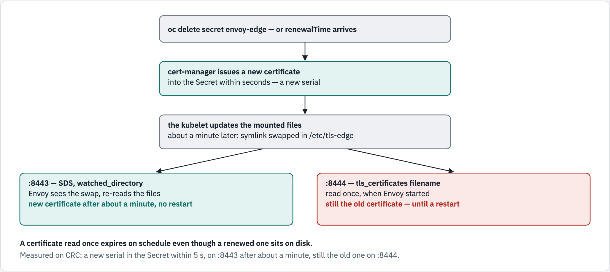

# 09 — gRPC end to end: TLS in, mutual TLS out, and certificate rotation

Module 07 put REST in front of a gRPC service over plain connections. Module 08
put a certificate on Envoy. This module joins them into what production looks
like: **gRPC over TLS** from the client to Envoy, **mutual TLS** from Envoy to the
service — where both sides prove who they are — and the problem that only shows
up after weeks: what happens when cert-manager **renews** a certificate Envoy is
already using.

## What you'll learn

- how Envoy terminates a client's TLS with one certificate and opens **mutual TLS**
  to the service with another — and how the service learns who called
- why a gRPC listener offers `h2` through ALPN, and what the failures look like
- how to load certificates so a **renewal** is picked up without a restart — and
  what happens when they are not

## Before you start

- Modules [07](../07-modernising-grpc/README.md) and
  [08](../08-tls-on-envoy/README.md) — this one builds on both.
- [`00-prerequisites`](../00-prerequisites/README.md) reports cert-manager, and the
  cluster can reach PyPI (the service installs `grpcio` at start).
- Work from this folder: `cd 09-grpc-end-to-end`.
- This module uses the namespace **`envoy-09`** and takes about 30 minutes.

## Two TLS connections, two certificates on Envoy

<!-- markdownlint-disable MD033 -->
<picture>
  <source media="(prefers-color-scheme: dark)" srcset="../docs/diagrams/09-grpc-end-to-end/end-to-end.dark.png">
  <source media="(prefers-color-scheme: light)" srcset="../docs/diagrams/09-grpc-end-to-end/end-to-end.light.png">
  
</picture>
<!-- markdownlint-enable MD033 -->

## Walkthrough

### Step 1 — three certificates

[`manifests/10-certificates.yaml`](manifests/10-certificates.yaml) asks for three,
all signed by `enterprise-ca`:

```console
$ oc create namespace envoy-09
namespace/envoy-09 created
$ oc apply -n envoy-09 -f manifests/10-certificates.yaml
certificate.cert-manager.io/envoy-edge created
certificate.cert-manager.io/catalog-tls created
certificate.cert-manager.io/envoy-client created
$ oc wait -n envoy-09 --for=condition=Ready certificate --all --timeout=120s
certificate.cert-manager.io/catalog-tls condition met
certificate.cert-manager.io/envoy-client condition met
certificate.cert-manager.io/envoy-edge condition met
$ for s in envoy-edge catalog-tls envoy-client; do printf '%-13s' "$s"; oc get secret "$s" -n envoy-09 -o jsonpath='{.data.tls\.crt}' | base64 -d | openssl x509 -noout -text | grep -E 'DNS:|URI:|TLS Web' | tr -s ' ' | tr '\n' ' '; echo; done
envoy-edge    TLS Web Server Authentication  DNS:grpc.apps-crc.testing, DNS:envoy.envoy-09.svc 
catalog-tls   TLS Web Server Authentication  DNS:catalog.envoy-09.svc 
envoy-client  TLS Web Client Authentication  URI:spiffe://envoy-tutorial/ns/envoy-09/envoy 
```

**What just happened:**

- **`envoy-edge`** — a **server** certificate for Envoy, for the names clients dial.
- **`catalog-tls`** — a **server** certificate for the service, for the name
  Envoy dials.
- **`envoy-client`** — a **client** certificate for Envoy (`TLS Web Client
  Authentication`). It names no host: it carries an **identity**, a URI SAN in
  the SPIFFE format. This is what Envoy shows the service to prove who it is.

### Step 2 — the clients, the code, and the CA

```console
$ oc apply -n envoy-09 -f ../_shared/client.yaml -f manifests/60-grpc-client.yaml
pod/client created
pod/grpc-client created
$ oc create configmap catalog-proto -n envoy-09 --from-file=proto/catalog.proto
configmap/catalog-proto created
$ oc create configmap catalog-app -n envoy-09 --from-file=app/server.py
configmap/catalog-app created
$ oc wait -n envoy-09 --for=condition=Ready pod/client pod/grpc-client --timeout=120s
pod/client condition met
pod/grpc-client condition met
$ oc get secret envoy-edge -n envoy-09 -o jsonpath='{.data.ca\.crt}' | base64 -d > ca.crt
$ for p in client grpc-client; do oc exec -i -n envoy-09 "$p" -- sh -c 'cat > /tmp/ca.crt' < ca.crt; done
```

**What just happened:** the same `.proto` as module 07, and a
[`server.py`](app/server.py) that now serves TLS and **requires a client
certificate** (`require_client_auth=True`). Both client pods got the CA, and
trust nothing else.

### Step 3 — start the service

```console
$ oc apply -n envoy-09 -f manifests/20-catalog.yaml
service/catalog created
deployment.apps/catalog created
$ oc rollout status -n envoy-09 deploy/catalog --timeout=300s
Waiting for deployment "catalog" rollout to finish: 0 of 1 updated replicas are available...
deployment "catalog" successfully rolled out
$ oc logs -n envoy-09 deploy/catalog -c catalog
catalog (gRPC over mutual TLS) listening on :50051 as catalog-7f576b9874-zwc2n
```

### Step 4 — the service refuses strangers

`grpcurl` trusts the CA, so it can check the **service's** certificate — but it
has no certificate of its own to show:

<!-- walkthrough: expect-exit 1 -->
```console
$ oc exec -n envoy-09 grpc-client -- grpcurl -cacert /tmp/ca.crt -connect-timeout 5 catalog.envoy-09.svc:50051 list
Failed to dial target host "catalog.envoy-09.svc:50051": context deadline exceeded
command terminated with exit code 1
```

The same with `curl`, which shows the TLS layer more directly:

<!-- walkthrough: expect-exit 56 -->
```console
$ oc exec -n envoy-09 client -- curl -sS --cacert /tmp/ca.crt https://catalog.envoy-09.svc:50051/
curl: (56) OpenSSL SSL_read: SSL_ERROR_SYSCALL, errno 0
command terminated with exit code 56
```

**What just happened:** the service asked for a client certificate, got none, and
dropped the connection. Note how **vague** the errors are — `Failed to dial …
context deadline exceeded`, `SSL_ERROR_SYSCALL`. Neither says "you need a client
certificate"; step 6 shows where the real reason is logged.

### Step 5 — start Envoy

```console
$ oc apply -n envoy-09 -f manifests/30-envoy-config.yaml -f manifests/35-sds.yaml -f manifests/40-envoy.yaml
configmap/envoy-config created
configmap/envoy-sds created
service/envoy created
deployment.apps/envoy created
$ oc rollout status -n envoy-09 deploy/envoy --timeout=180s
Waiting for deployment "envoy" rollout to finish: 0 of 1 updated replicas are available...
deployment "envoy" successfully rolled out
```

**What just happened:** Envoy mounted all three pieces as directories:
`envoy-edge` (what clients see), `envoy-client` (what the service sees), and
`envoy-sds` — two small **SDS** files that tell Envoy where those certificates
are, and which directory to watch for changes. Step 9 shows why that watch
matters. Read [`30-envoy-config.yaml`](manifests/30-envoy-config.yaml): the
`listeners` have Envoy's server side, the `clusters` its client side.

### Step 6 — gRPC over TLS, through Envoy

```console
$ oc exec -n envoy-09 grpc-client -- grpcurl -cacert /tmp/ca.crt envoy.envoy-09.svc:8443 list
grpc.reflection.v1alpha.ServerReflection
tutorial.catalog.v1.Catalog
$ oc exec -n envoy-09 grpc-client -- grpcurl -cacert /tmp/ca.crt -d '{"sku":"widget"}' envoy.envoy-09.svc:8443 tutorial.catalog.v1.Catalog/GetItem
{
  "sku": "widget",
  "name": "Widget",
  "on_hand": 10
}
$ oc logs -n envoy-09 deploy/catalog -c catalog --tail=2
I0926 05:23:16.392609       6 ssl_transport_security.cc:2530] Handshake failed with error SSL_ERROR_SSL: error:100000c0:SSL routines:OPENSSL_internal:PEER_DID_NOT_RETURN_A_CERTIFICATE: Invalid certificate verification context
catalog-7f576b9874-zwc2n GetItem sku=widget caller=spiffe://envoy-tutorial/ns/envoy-09/envoy
```

**What just happened:** two TLS connections. `grpcurl` checked **Envoy's**
certificate against the CA. Envoy then connected to the service, showed its
**client** certificate, and checked the **service's**. The service's log names
the caller — `spiffe://envoy-tutorial/ns/envoy-09/envoy` — read from Envoy's
certificate. That identity, not an IP address, is what the service can base
decisions on — but only as far as the issuer vouches for it. `enterprise-ca` is
a `ClusterIssuer` and signs whatever URI a `Certificate` asks for: measured, a
`Certificate` in another namespace was issued this namespace's SPIFFE ID, and
the service accepted it. Before authorising on the ID, limit who can obtain it:
have the service trust a CA that only this namespace's own `Issuer` signs with,
or restrict what the `ClusterIssuer` will sign (cert-manager's approver-policy).

The other log line is the service's record of step 4: `Handshake failed …
PEER_DID_NOT_RETURN_A_CERTIFICATE`. The precise reason the clients never got is
in the **server's** log — look there when a mutual-TLS connection is refused.

### Step 7 — Envoy's side of the upstream handshake

```console
$ oc exec -n envoy-09 client -- curl -s 'http://envoy:9901/stats?filter=^cluster\.catalog\.ssl\.(handshake|connection_error|fail_verify_san)$'
cluster.catalog.ssl.connection_error: 0
cluster.catalog.ssl.fail_verify_san: 0
cluster.catalog.ssl.handshake: 2
```

**What just happened:** `handshake` counts successful TLS connections to the
service. The other two count the failures you would otherwise only see as a
vague `Unavailable`: a connection error, and **`fail_verify_san`** — the
service's certificate is signed by the CA but does not name
`catalog.envoy-09.svc`. The "Try this" at the end makes that one happen.

### Step 8 — through the Route, the way outside clients come in

A passthrough Route (`manifests/50-route.yaml`), so the TLS — and the ALPN `h2`
that tells a gRPC client the server speaks HTTP/2 — reach Envoy untouched. The
call still runs in the `grpc-client` pod, but it dials the Route's hostname, so it
reaches Envoy through the router, as a client outside the cluster would:

```console
$ oc apply -n envoy-09 -f manifests/50-route.yaml
route.route.openshift.io/grpc created
$ sleep 5; oc exec -n envoy-09 grpc-client -- grpcurl -cacert /tmp/ca.crt grpc.apps-crc.testing:443 list
grpc.reflection.v1alpha.ServerReflection
tutorial.catalog.v1.Catalog
```

**Why `h2` in ALPN:** over TLS, client and server agree on HTTP/2 during the
handshake, through ALPN. The listener offers `["h2", "http/1.1"]`. Measured with
`h2` taken out: the Python gRPC client refused to connect — *"Cannot check peer:
missing selected ALPN property"* — while `grpcurl` 1.9.3 happened not to care.
Offer `h2`; do not rely on the client being lenient.

### Step 9 — cert-manager renews a certificate Envoy is using

<!-- markdownlint-disable MD033 -->
<picture>
  <source media="(prefers-color-scheme: dark)" srcset="../docs/diagrams/09-grpc-end-to-end/rotation.dark.png">
  <source media="(prefers-color-scheme: light)" srcset="../docs/diagrams/09-grpc-end-to-end/rotation.light.png">
  
</picture>
<!-- markdownlint-enable MD033 -->

Two listeners serve **the same** certificate, loaded two ways: `:8443` through
SDS with a watched directory, `:8444` as plain filenames in the listener. The
serial number each one presents:

```console
$ oc exec -n envoy-09 client -- curl -sk -o /dev/null -w '%{certs}' https://envoy.envoy-09.svc:8443/ | grep -m1 -i serial
Serial Number:378120e1d38bd4b1d28b9e5565772fa02a5b9dbd
$ oc exec -n envoy-09 client -- curl -sk -o /dev/null -w '%{certs}' https://envoy.envoy-09.svc:8444/ | grep -m1 -i serial
Serial Number:378120e1d38bd4b1d28b9e5565772fa02a5b9dbd
```

Delete the Secret — cert-manager issues a new certificate at once, just as it
does when `renewalTime` arrives — and wait for `:8443` to change:

```console
$ oc delete secret envoy-edge -n envoy-09
secret "envoy-edge" deleted from envoy-09 namespace
$ old=$(oc exec -n envoy-09 client -- curl -sk -o /dev/null -w '%{certs}' https://envoy.envoy-09.svc:8444/ | grep -m1 -i serial); start=$SECONDS; for i in $(seq 1 60); do new=$(oc exec -n envoy-09 client -- curl -sk -o /dev/null -w '%{certs}' https://envoy.envoy-09.svc:8443/ | grep -m1 -i serial); [ -n "$new" ] && [ "$new" != "$old" ] && break; sleep 3; done; echo ":8443 changed after about $((SECONDS - start)) s"
:8443 changed after about 74 s
$ oc exec -n envoy-09 client -- curl -sk -o /dev/null -w '%{certs}' https://envoy.envoy-09.svc:8443/ | grep -m1 -i serial
Serial Number:3f99f5f6549bd34c568cdf61d06f28cd737a9081
$ oc exec -n envoy-09 client -- curl -sk -o /dev/null -w '%{certs}' https://envoy.envoy-09.svc:8444/ | grep -m1 -i serial
Serial Number:378120e1d38bd4b1d28b9e5565772fa02a5b9dbd
```

**What just happened:** cert-manager put a new certificate in the Secret within
seconds; the kubelet updated the files in the Envoy pod about a minute later, by
swapping a symlink in `/etc/tls-edge`. `:8443` loads its certificate through
**SDS**, and Envoy watches the directory of an SDS certificate's files: it saw
the swap, re-read the files and switched with no restart. (`watched_directory`
in the SDS file names that directory explicitly; without it Envoy watches the
files' own directory — here the same one — and, measured, switches just the
same.) `:8444` read its files once, when Envoy started, and **is still
presenting the old certificate**, although the new one is on disk.

That is the rotation hazard. With 90-day certificates renewed a month early, the
old one is still valid for weeks — so nothing breaks, until the day it expires
and every client is rejected by a certificate that was renewed long ago. A
restart hides it:

```console
$ oc rollout restart -n envoy-09 deploy/envoy
deployment.apps/envoy restarted
$ oc rollout status -n envoy-09 deploy/envoy --timeout=180s
Waiting for deployment "envoy" rollout to finish: 1 old replicas are pending termination...
Waiting for deployment "envoy" rollout to finish: 1 old replicas are pending termination...
deployment "envoy" successfully rolled out
$ oc exec -n envoy-09 client -- curl -sk -o /dev/null -w '%{certs}' https://envoy.envoy-09.svc:8444/ | grep -m1 -i serial
Serial Number:3f99f5f6549bd34c568cdf61d06f28cd737a9081
```

— and the next renewal starts the clock again. Envoy's **client** certificate for
the service is loaded through SDS too, for the same reason.

### Step 10 — check yourself

`verify` repeats the rotation, so it takes a couple of minutes:

```console
$ ./run.sh verify

1. three certificates from cert-manager
  ✓ certificate/envoy-edge is Ready
  ✓ certificate/catalog-tls is Ready
  ✓ certificate/envoy-client is Ready
  ✓ envoy-client is a CLIENT certificate

2. gRPC over TLS, through Envoy
  ✓ grpcurl, trusting only the enterprise CA
  ✓ GetItem

3. mutual TLS between Envoy and the service
  ✓ the service logged Envoy's identity
  ✓ without a client certificate, the service refuses
  ✓ Envoy's upstream handshakes succeeded

4. from outside, through the passthrough Route
  ✓ grpc.apps-crc.testing:443

5. rotation: cert-manager replaces envoy-edge while Envoy runs
  ✓ SDS listener :8443 now presents the new certificate
  ✓ static listener :8444 still presents the old one

all checks passed
```

**Try this — the wrong name.** In `manifests/30-envoy-config.yaml`, change the
upstream matcher `exact: catalog.envoy-09.svc` to `exact: wrong.envoy-09.svc`,
apply, and restart Envoy:

```bash
oc apply -n envoy-09 -f manifests/30-envoy-config.yaml
oc rollout restart -n envoy-09 deploy/envoy
oc rollout status -n envoy-09 deploy/envoy
oc exec -n envoy-09 grpc-client -- grpcurl -cacert /tmp/ca.crt -d '{"sku":"gadget"}' envoy.envoy-09.svc:8443 tutorial.catalog.v1.Catalog/GetItem
oc exec -n envoy-09 client -- curl -s 'http://envoy:9901/stats?filter=^cluster\.catalog\.ssl\.'
```

Measured on CRC: the caller got `Unavailable … upstream connect error or
disconnect/reset before headers. reset reason: remote connection failure` —
nothing about certificates — while Envoy counted `ssl.fail_verify_san: 3` and
`ssl.handshake: 0`. The stats say what the error does not. Put the name back
when you are done.

## The options

**Envoy's server side — `DownstreamTlsContext`**

| Field | Here | What it does |
|---|---|---|
| `common_tls_context.alpn_protocols` | `["h2", "http/1.1"]` | protocols offered in the handshake; gRPC needs `h2` |
| `common_tls_context.tls_certificate_sds_secret_configs` | `edge`, from `/etc/sds/edge.yaml` | the certificate, through SDS — can change while Envoy runs |
| `common_tls_context.tls_certificates` | on `:8444` only | the certificate as files, read once |

**Envoy's client side — `UpstreamTlsContext` on the cluster**

| Field | Here | What it does |
|---|---|---|
| `sni` | `catalog.envoy-09.svc` | the name Envoy asks for in the handshake — it does not check it; the matcher below does |
| `common_tls_context.tls_certificate_sds_secret_configs` | `client` | Envoy's own client certificate, for mutual TLS |
| `validation_context.trusted_ca` | the enterprise CA | which CA may have signed the service's certificate |
| `validation_context.match_typed_subject_alt_names` | `DNS: catalog.envoy-09.svc` | which name the service's certificate must carry |

**The SDS file — a `Secret` resource**

| Field | What it does |
|---|---|
| `tls_certificate.certificate_chain` / `private_key` | where the files are |
| `tls_certificate.watched_directory` | re-read them when this directory changes; without it Envoy watches the files' own directory — here the same one. SDS itself is the fix for the rotation hazard |

**The certificates** (cert-manager)

| Field | Server certificates | Client certificate |
|---|---|---|
| `usages` | `server auth` | `client auth` |
| names | `dnsNames` — the hosts clients dial | `uris` — the caller's identity |

## Troubleshooting

| You see | Why | Fix |
|---|---|---|
| `Failed to dial … context deadline exceeded` / `SSL_ERROR_SYSCALL`, straight to the service | the service requires a client certificate you did not present | go through Envoy, or present a client certificate |
| `Unavailable … remote connection failure` through Envoy | the upstream handshake failed | check `cluster.catalog.ssl.*` — `fail_verify_san` means the name did not match |
| `missing selected ALPN property` | the listener does not offer `h2` | add `h2` to `alpn_protocols` |
| a renewed certificate never shows up | loaded with `tls_certificates` filenames, or mounted with `subPath` | load it through SDS (`tls_certificate_sds_secret_configs`), with the Secret mounted as a directory |
| the pod is stuck in `Init` | the service's init container could not reach PyPI | `oc logs -n envoy-09 <pod> -c codegen` |

## Clean up

```console
$ oc delete namespace envoy-09 --wait=false
namespace "envoy-09" deleted
$ rm -f ca.crt
```

## The shortcut

`./run.sh deploy` does steps 1–3, 5 and 8; `./run.sh verify` is step 10, rotation
included; `./run.sh clean` removes the namespace and `ca.crt`.

## References

- [Envoy — TLS: `DownstreamTlsContext`, `UpstreamTlsContext`](https://www.envoyproxy.io/docs/envoy/latest/api-v3/extensions/transport_sockets/tls/v3/tls.proto)
- [Envoy — Secret discovery service (SDS)](https://www.envoyproxy.io/docs/envoy/latest/configuration/security/secret)
- [Envoy — TLS statistics](https://www.envoyproxy.io/docs/envoy/latest/configuration/upstream/cluster_manager/cluster_stats#tls-statistics)
- [cert-manager — `usages`, `uris`](https://cert-manager.io/docs/usage/certificate/)
- [gRPC — authentication (TLS)](https://grpc.io/docs/guides/auth/)
- [SPIFFE IDs](https://spiffe.io/docs/latest/spiffe-about/spiffe-concepts/#spiffe-id)

## Diagram sources

The figures are rendered from [`docs/diagrams/09-grpc-end-to-end/source.html`](../docs/diagrams/09-grpc-end-to-end/source.html)
(inline SVG, light and dark). Change the page and re-render the PNGs together,
with the `/visual` skill's `render.py`.
