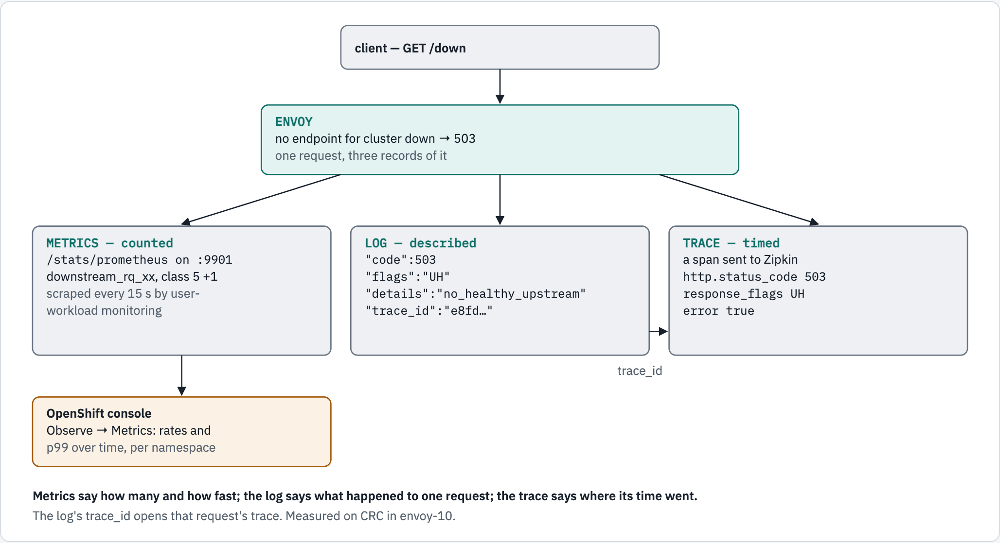

# 10 — observability: metrics, access logs and traces

Envoy sees every request, so it can tell you about every request — in three
different ways, each answering a different question:

| Signal | Answers | Where it comes from here |
|---|---|---|
| **metrics** | how many, how fast, how often it fails | `/stats/prometheus` on the admin port, scraped by OpenShift |
| **access log** | what happened to *this* request | one JSON line per request on Envoy's stdout |
| **trace** | where *this* request's time went | a span per request, sent to Zipkin |

## What you'll learn

- how to read Envoy's **response flags** — its own verdict on a failed request —
  in the access log, for the four failures you will meet most
- how to get Envoy's metrics into **OpenShift's monitoring** with a
  `ServiceMonitor`, and query them with PromQL
- how a log line's `trace_id` leads to that request's **trace**

## Before you start

- [`00-prerequisites`](../00-prerequisites/README.md) reports **Prometheus Operator
  CRDs** and, on OpenShift, **user-workload monitoring**.
- Work from this folder: `cd 10-observability`.
- This module uses the namespace **`envoy-10`** and takes about 25 minutes.

## One request, three records

<!-- markdownlint-disable MD033 -->
<picture>
  <source media="(prefers-color-scheme: dark)" srcset="../docs/diagrams/10-observability/three-records.dark.png">
  <source media="(prefers-color-scheme: light)" srcset="../docs/diagrams/10-observability/three-records.light.png">
  
</picture>
<!-- markdownlint-enable MD033 -->

## Walkthrough

### Step 1 — the backends and a tracer

Echo; the slow app from module 04; a Service with **no pods**; and Zipkin, to
collect traces. Start them first, so they are ready before Envoy looks them up:

```console
$ oc create namespace envoy-10
namespace/envoy-10 created
$ oc apply -n envoy-10 -f ../_shared/client.yaml -f ../_shared/echo-app.yaml
pod/client created
configmap/echo-src created
service/echo created
deployment.apps/echo created
$ oc apply -n envoy-10 -f manifests/30-slow-app.yaml -f manifests/35-down.yaml -f manifests/40-zipkin.yaml
configmap/slow-src created
service/slow created
deployment.apps/slow created
service/down created
deployment.apps/down created
service/zipkin created
deployment.apps/zipkin created
$ oc wait -n envoy-10 --for=condition=Ready pod/client --timeout=120s
pod/client condition met
$ for d in echo slow zipkin; do oc rollout status -n envoy-10 deploy/$d --timeout=240s; done
Waiting for deployment "echo" rollout to finish: 0 of 2 updated replicas are available...
Waiting for deployment "echo" rollout to finish: 1 of 2 updated replicas are available...
deployment "echo" successfully rolled out
deployment "slow" successfully rolled out
Waiting for deployment "zipkin" rollout to finish: 0 of 1 updated replicas are available...
deployment "zipkin" successfully rolled out
```

### Step 2 — start Envoy

```console
$ oc apply -n envoy-10 -f manifests/10-envoy-config.yaml -f manifests/20-envoy.yaml
configmap/envoy-config created
service/envoy created
deployment.apps/envoy created
$ oc rollout status -n envoy-10 deploy/envoy --timeout=240s
Waiting for deployment "envoy" rollout to finish: 0 of 1 updated replicas are available...
deployment "envoy" successfully rolled out
```

**What just happened:** Envoy has four routes and, on purpose, no catch-all, so
the five paths in step 3 each end differently — read the comment at the top of
[`manifests/10-envoy-config.yaml`](manifests/10-envoy-config.yaml). It logs each
request as JSON, traces every request to Zipkin, and serves its metrics on
`:9901`. The backends started first on purpose: an Envoy that starts before an
app is ready finds no endpoint for it and answers `503 UH` until its next DNS
refresh — measured on a first draft of this step, where `/slow` did exactly that.

### Step 3 — five requests, five outcomes

```console
$ for p in / /slow /down /refused /nowhere; do printf '%-10s' "$p"; oc exec -n envoy-10 client -- curl -s -o /dev/null -w '%{http_code}\n' "http://envoy:8080$p"; done
/         200
/slow     504
/down     503
/refused  503
/nowhere  404
```

**What just happened:** a `200`, then three different `5xx`s and a `404`. From the
status codes alone, `/down` and `/refused` look identical — both `503`. The access
log tells them apart.

### Step 4 — the access log names each failure

Envoy writes its log in batches, so wait a moment first:

```console
$ sleep 10; for p in / /slow /down /refused /nowhere; do oc logs -n envoy-10 deploy/envoy --tail=50 | grep -F "\"path\":\"$p\"" | tail -1; done
{"cluster":"echo","code":200,"details":"via_upstream","duration":1,"flags":"-","path":"/","trace_id":"17614cf7541f1b98","upstream":"10.217.0.132:8080"}
{"cluster":"slow","code":504,"details":"response_timeout","duration":258,"flags":"UT","path":"/slow","trace_id":"5c9aaad3641ccc60","upstream":"10.217.0.134:8080"}
{"cluster":"down","code":503,"details":"no_healthy_upstream","duration":0,"flags":"UH","path":"/down","trace_id":"3ccc1819a704de75","upstream":null}
{"cluster":"refused","code":503,"details":"upstream_reset_before_response_started{remote_connection_failure|delayed_connect_error:_Connection_refused}","duration":0,"flags":"UF","path":"/refused","trace_id":"45f5405736640eb1","upstream":"10.217.0.132:9999"}
{"cluster":null,"code":404,"details":"route_not_found","duration":0,"flags":"NR","path":"/nowhere","trace_id":"66bf409709bec217","upstream":null}
```

**What just happened:** each line carries `flags` — Envoy's own verdict — and
`details`, the reason in words:

| Path | `code` | `flags` | Means | Look at |
|---|---|---|---|---|
| `/` | 200 | `-` | nothing went wrong | — |
| `/slow` | 504 | **`UT`** | **u**pstream request **t**imeout — the route's 250 ms ran out | the app's latency, or the route `timeout` |
| `/down` | 503 | **`UH`** | no **h**ealthy **u**pstream — the cluster has no endpoints | pods, readiness, the Service selector |
| `/refused` | 503 | **`UF`** | **u**pstream connection **f**ailure — here, connection refused | the port, the app listening, network policy |
| `/nowhere` | 404 | **`NR`** | **n**o **r**oute matched | the route table (module 04) |

`/down` and `/refused` returned the same `503`, but for different reasons with
different fixes. The flag is the first thing to read when a request fails —
which is why every access log in this tutorial records it.

### Step 5 — Envoy's metrics

The admin port serves every counter in Prometheus's text format:

```console
$ oc exec -n envoy-10 client -- curl -s http://envoy:9901/stats/prometheus | grep -E '^envoy_http_downstream_rq_xx\{.*prefix="ingress"'
envoy_http_downstream_rq_xx{envoy_response_code_class="1",envoy_http_conn_manager_prefix="ingress"} 0
envoy_http_downstream_rq_xx{envoy_response_code_class="2",envoy_http_conn_manager_prefix="ingress"} 1
envoy_http_downstream_rq_xx{envoy_response_code_class="3",envoy_http_conn_manager_prefix="ingress"} 0
envoy_http_downstream_rq_xx{envoy_response_code_class="4",envoy_http_conn_manager_prefix="ingress"} 1
envoy_http_downstream_rq_xx{envoy_response_code_class="5",envoy_http_conn_manager_prefix="ingress"} 3
$ oc exec -n envoy-10 client -- curl -s http://envoy:9901/stats/prometheus | grep -E '^envoy_cluster_upstream_rq_time_bucket\{envoy_cluster_name="echo",le="(1|5|25|250)"\}'
envoy_cluster_upstream_rq_time_bucket{envoy_cluster_name="echo",le="1"} 1
envoy_cluster_upstream_rq_time_bucket{envoy_cluster_name="echo",le="5"} 1
envoy_cluster_upstream_rq_time_bucket{envoy_cluster_name="echo",le="25"} 1
envoy_cluster_upstream_rq_time_bucket{envoy_cluster_name="echo",le="250"} 1
```

**What just happened:**

- `envoy_http_downstream_rq_xx` counts responses by **class** — `2`xx, `4`xx,
  `5`xx — for the listener whose `stat_prefix` is `ingress`. (The admin port has
  its own, `prefix="admin"`; leave it out of dashboards.)
- `envoy_cluster_upstream_rq_time_bucket` is a **histogram** of how long the
  upstream took, per cluster: each `le` bucket counts requests that took at most
  that many milliseconds. From it, Prometheus can compute any percentile.

### Step 6 — let OpenShift collect them

A `ServiceMonitor` asks OpenShift's user-workload monitoring to scrape Envoy's
admin port every 15 seconds. The `traffic` Deployment sends a steady mix of
requests so there is something to see:

```console
$ oc apply -n envoy-10 -f manifests/50-servicemonitor.yaml -f manifests/60-traffic.yaml
servicemonitor.monitoring.coreos.com/envoy created
deployment.apps/traffic created
$ oc rollout status -n envoy-10 deploy/traffic --timeout=120s
Waiting for deployment "traffic" rollout to finish: 0 of 1 updated replicas are available...
deployment "traffic" successfully rolled out
```

Prometheus reads a new `ServiceMonitor` only when it reloads its configuration,
and user-workload monitoring checks for a new one every three minutes — measured
while reviewing this step, the target took 125 to 208 s to appear. Give it a
minute and a half, then wait until it is up and see how much longer it took (if
it says `no`, run the loop again: the next check is at most three minutes away):

```console
$ sleep 90
$ start=$SECONDS; got=no; while [ $((SECONDS - start)) -lt 225 ]; do if oc whoami -t | sed 's/^/Authorization: Bearer /' | oc exec -i -n envoy-10 client -- curl -s --cacert /var/run/secrets/kubernetes.io/serviceaccount/service-ca.crt -H @- -G --data-urlencode namespace=envoy-10 --data-urlencode 'query=up{job="envoy"} == 1' https://thanos-querier.openshift-monitoring.svc:9092/api/v1/query | grep -q '"value"'; then got=yes; break; fi; sleep 5; done; echo "target up: $got, after about $((SECONDS - start)) s more"; [ "$got" = yes ]
target up: yes, after about 92 s more
```

Then ask which pod answered:

```console
$ oc whoami -t | sed 's/^/Authorization: Bearer /' | oc exec -i -n envoy-10 client -- curl -s --cacert /var/run/secrets/kubernetes.io/serviceaccount/service-ca.crt -H @- -G --data-urlencode namespace=envoy-10 --data-urlencode 'query=up{job="envoy"}' https://thanos-querier.openshift-monitoring.svc:9092/api/v1/query | python3 -c 'import json,sys; [print(r["metric"]["pod"], "up" if r["value"][1] == "1" else "DOWN") for r in json.load(sys.stdin)["data"]["result"]]'
envoy-756977ffbf-jm8b7 up
$ oc get pods -n envoy-10 -l app=envoy -o name
pod/envoy-756977ffbf-jm8b7
```

**What just happened:** `up` is `1` for the Envoy pod you started — compare the
name with `oc get pods`. A pod that goes away — a rollout, or a rerun of this
module — usually drops out of `up` about half a minute later: Prometheus marks
its series stale after two missed scrapes. When Prometheus drops the whole job
first instead — at its next reload after the `ServiceMonitor` is deleted too —
nothing marks the series stale, and the last sample answers for five minutes.
Queries over a window, like step 7's `rate(…[2m])`, count a gone pod's samples
until they age out of the window.

The query asked **Thanos** — OpenShift's query front end for Prometheus —
through its per-namespace port (`9092`), with *your* token (`oc whoami -t`). It
answers only for a namespace in which you may `get pods.metrics.k8s.io` — the
`view` role is enough — and only with that namespace's series. The token reaches
`curl` on its standard input (`-H @-`), not its command line: `oc exec` sends the
command line to the API server inside the request URL, which the audit log
records. The `--cacert` is the cluster's service CA, which OpenShift mounts into
every pod, so no `-k` is needed.

### Step 7 — ask questions in PromQL

A rate over `[2m]` divides by the whole two minutes, so it reads true only once
two minutes of samples exist — measured while reviewing this step, 26 s after
the first scrape `rate(…[2m])` read 1.62 req/s where the samples rose at 5.87.
Wait until Prometheus holds eight samples of the target — two minutes, at one
every 15 s:

```console
$ start=$SECONDS; got=no; while [ $((SECONDS - start)) -lt 225 ]; do if oc whoami -t | sed 's/^/Authorization: Bearer /' | oc exec -i -n envoy-10 client -- curl -s --cacert /var/run/secrets/kubernetes.io/serviceaccount/service-ca.crt -H @- -G --data-urlencode namespace=envoy-10 --data-urlencode 'query=count_over_time(up{job="envoy"}[2m]) >= 8' https://thanos-querier.openshift-monitoring.svc:9092/api/v1/query | grep -q '"value"'; then got=yes; break; fi; sleep 5; done; echo "two minutes of samples: $got, after about $((SECONDS - start)) s"; [ "$got" = yes ]
two minutes of samples: yes, after about 102 s
```

Then requests per second, by response class, over the last two minutes:

```console
$ oc whoami -t | sed 's/^/Authorization: Bearer /' | oc exec -i -n envoy-10 client -- curl -s --cacert /var/run/secrets/kubernetes.io/serviceaccount/service-ca.crt -H @- -G --data-urlencode namespace=envoy-10 --data-urlencode 'query=sum by (envoy_response_code_class) (rate(envoy_http_downstream_rq_xx{envoy_http_conn_manager_prefix="ingress"}[2m]))' https://thanos-querier.openshift-monitoring.svc:9092/api/v1/query | python3 -c 'import json,sys; [print("%sxx  %.2f req/s" % (r["metric"]["envoy_response_code_class"], float(r["value"][1]))) for r in json.load(sys.stdin)["data"]["result"]]'
1xx  0.00 req/s
2xx  6.02 req/s
3xx  0.00 req/s
4xx  0.76 req/s
5xx  2.29 req/s
```

The 99th-percentile upstream time per cluster, in milliseconds:

```console
$ oc whoami -t | sed 's/^/Authorization: Bearer /' | oc exec -i -n envoy-10 client -- curl -s --cacert /var/run/secrets/kubernetes.io/serviceaccount/service-ca.crt -H @- -G --data-urlencode namespace=envoy-10 --data-urlencode 'query=histogram_quantile(0.99, sum by (le, envoy_cluster_name) (rate(envoy_cluster_upstream_rq_time_bucket[2m])))' https://thanos-querier.openshift-monitoring.svc:9092/api/v1/query | python3 -c 'import json,sys; [print("%-6s p99 %s ms" % (r["metric"]["envoy_cluster_name"], r["value"][1])) for r in json.load(sys.stdin)["data"]["result"]]'
echo   p99 0.49578446909667195 ms
zipkin p99 4.470769230769228 ms
```

And the requests that timed out, per second, per cluster:

```console
$ oc whoami -t | sed 's/^/Authorization: Bearer /' | oc exec -i -n envoy-10 client -- curl -s --cacert /var/run/secrets/kubernetes.io/serviceaccount/service-ca.crt -H @- -G --data-urlencode namespace=envoy-10 --data-urlencode 'query=sum by (envoy_cluster_name) (rate(envoy_cluster_upstream_rq_timeout[2m])) > 0' https://thanos-querier.openshift-monitoring.svc:9092/api/v1/query | python3 -c 'import json,sys; [print("%-6s %.2f timeouts/s" % (r["metric"]["envoy_cluster_name"], float(r["value"][1]))) for r in json.load(sys.stdin)["data"]["result"]]'
slow   0.76 timeouts/s
```

**What just happened:** the traffic generator sends eight `200`s, one `404` and
three `5xx`s per round, and the rates come out in that 8 : 1 : 3 ratio.

The `zipkin` line in the p99 is Envoy's own traffic: it sends its spans to
Zipkin as upstream requests too, a few spans to each. The p99 query has **no line for `slow`** — and
that is the lesson. The
upstream-time histogram only records responses that came back; every `/slow`
request timed out, so there was nothing to record. Measured while writing this,
on the running proxy: `slow` had 179 requests and 179 `upstream_rq_timeout`s, and no histogram
at all. A latency dashboard built only on the histogram would show `slow` as
missing, not as broken — always graph the timeout and `5xx` counters beside it.

The same queries work in the console under **Observe → Metrics**, where they
draw as graphs.

### Step 8 — from a log line to its trace

Take the `trace_id` from a `/down` log line and ask Zipkin for that trace:

```console
$ oc exec -n envoy-10 client -- curl -s "http://zipkin:9411/api/v2/trace/$(oc logs -n envoy-10 deploy/envoy --tail=100 | grep -F '"path":"/down"' | tail -1 | sed 's/.*"trace_id":"\([0-9a-f]*\)".*/\1/')" | python3 -c 'import json,sys; [print(s["kind"], s["name"], "duration=%sus" % s["duration"], {k: v for k, v in s["tags"].items() if k in ("http.url", "http.status_code", "response_flags", "error")}) for s in json.load(sys.stdin)]'
SERVER envoy:8080 duration=38us {'error': 'true', 'http.status_code': '503', 'http.url': 'http://envoy:8080/down', 'response_flags': 'UH'}
```

**What just happened:** the log line and the trace are the same request, joined by
`trace_id` (logged with `%TRACE_ID%`). The span repeats the verdict —
`response_flags: UH`, `error: true` — and adds timing. With several services each
adding spans, the trace shows which hop the time went to; here there is only one.

### Step 9 — check yourself

```console
$ ./run.sh verify

1. Envoy's own counters, from the admin port
  ✓ Prometheus format on /stats/prometheus
  ✓ a latency histogram for the echo cluster

2. every outcome, named in the access log
  ✓ / -> 200
  ✓ / -> flag -
  ✓ /slow -> 504
  ✓ /slow -> flag UT
  ✓ /down -> 503
  ✓ /down -> flag UH
  ✓ /refused -> 503
  ✓ /refused -> flag UF
  ✓ /nowhere -> 404
  ✓ /nowhere -> flag NR

3. a log line leads to its trace
  ✓ the trace for a /down request is in Zipkin, flagged UH

4. OpenShift's monitoring scrapes it
  ✓ the envoy target is up
  ✓ request rates by response class are queryable

all checks passed
```

## The options

**Access log** — [`%…%` command operators](https://www.envoyproxy.io/docs/envoy/latest/configuration/observability/access_log/usage#command-operators) used here

| Operator | Gives |
|---|---|
| `%RESPONSE_CODE%` | the status code sent to the client |
| `%RESPONSE_FLAGS%` | Envoy's verdict — `UT`, `UH`, `UF`, `NR`, … |
| `%RESPONSE_CODE_DETAILS%` | the reason, in words |
| `%UPSTREAM_HOST%` / `%UPSTREAM_CLUSTER%` | which pod and cluster, if any |
| `%DURATION%` | total milliseconds |
| `%TRACE_ID%` | the request's trace id — present even when nothing was forwarded upstream |

**Tracing** — on the HTTP connection manager

| Field | Here | What it does |
|---|---|---|
| `tracing.provider` | `envoy.tracers.zipkin` | where spans go — `collector_cluster: zipkin`, `/api/v2/spans` |
| `tracing.random_sampling` | 100% | fraction of requests traced — far lower in production |
| `node.cluster` | `envoy-10` | the service name this Envoy's spans carry |

**Metrics**

| Where | Setting | What it does |
|---|---|---|
| Envoy admin | `/stats/prometheus` | every counter, gauge and histogram in Prometheus format |
| `ServiceMonitor` | `port: admin`, `path: /stats/prometheus`, `interval: 15s` | tells user-workload monitoring what to scrape |
| PromQL | filter `envoy_http_conn_manager_prefix="ingress"` | leave the admin port's own traffic out |

## Troubleshooting

| You see | Why | Fix |
|---|---|---|
| a `trace_id` of `null` | logged with `%REQ(X-B3-TRACEID)%`, which is only set on requests forwarded upstream | use `%TRACE_ID%` |
| `up{job="envoy"}` returns nothing | Prometheus has not reloaded yet — a new `ServiceMonitor` waits for the next check, every three minutes — or the `ServiceMonitor` port name does not match the Service | wait; check `port: admin` exists on the `envoy` Service |
| a `rate(…)` query returns nothing, or too little | fewer than two samples in the window, or a window not yet full — `rate` divides by all of it | run step 7's first loop until it says yes |
| the console asks for a namespace | Observe → Metrics is namespaced for non-admin users | pick `envoy-10` |

## Clean up

```console
$ oc delete namespace envoy-10 --wait=false
namespace "envoy-10" deleted
```

## The shortcut

`./run.sh deploy` does steps 1, 2 and 6; `./run.sh verify` is step 9;
`./run.sh clean` removes the namespace.

## References

- [Envoy — access log format and command operators](https://www.envoyproxy.io/docs/envoy/latest/configuration/observability/access_log/usage)
- [Envoy — response flags](https://www.envoyproxy.io/docs/envoy/latest/configuration/observability/access_log/usage#config-access-log-format-response-flags)
- [Envoy — tracing](https://www.envoyproxy.io/docs/envoy/latest/intro/arch_overview/observability/tracing)
- [Envoy — statistics](https://www.envoyproxy.io/docs/envoy/latest/intro/arch_overview/observability/statistics)
- [OpenShift — configuring user workload monitoring](https://docs.redhat.com/en/documentation/monitoring_stack_for_red_hat_openshift/4.22/html/configuring_user_workload_monitoring/index)
- [Prometheus — `histogram_quantile`](https://prometheus.io/docs/prometheus/latest/querying/functions/#histogram_quantile)
- [Zipkin — API](https://zipkin.io/zipkin-api/)

## Diagram sources

The figure is rendered from [`docs/diagrams/10-observability/source.html`](../docs/diagrams/10-observability/source.html)
(inline SVG, light and dark). Change the page and re-render the PNGs together,
with the `/visual` skill's `render.py`.
