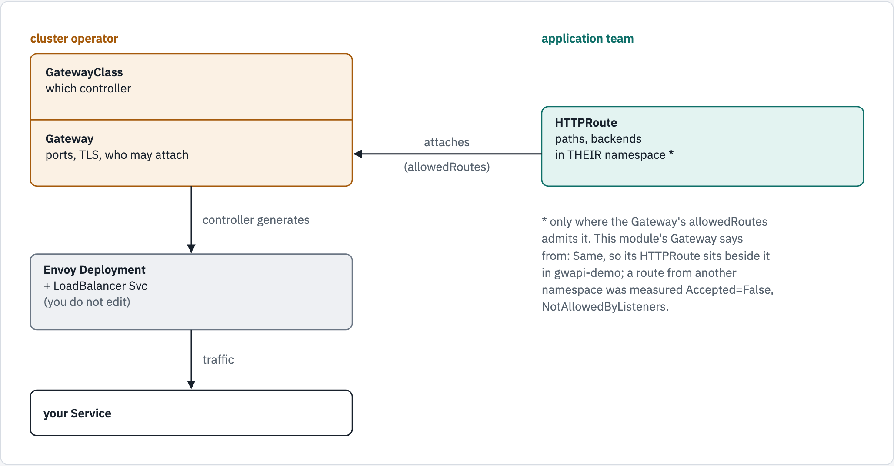

# 12 — the Gateway API

Everything so far configured Envoy by handing it a config file. This module uses
the **Gateway API**: you declare *intent* as Kubernetes resources, and a
controller — here **Envoy Gateway** — writes the Envoy config for you.

Verified on OpenShift 4.22.7 (CRC) with Envoy Gateway v1.9.1, which runs Envoy
v1.39.1 — the same Envoy as modules 01–11.

## The shift

| | Static config (modules 01–11) | Gateway API |
|---|---|---|
| You write | `envoy.yaml` — listeners, routes, clusters | `Gateway`, `HTTPRoute` |
| Envoy config comes from | a ConfigMap you maintain | a controller, generated |
| Changing a route | edit YAML, restart Envoy | apply an `HTTPRoute` — step 9 shows it |
| Who owns what | one team owns the whole file | cluster team owns the `Gateway`; app teams own their `HTTPRoute`s |

That last row is the point. A single `envoy.yaml` is a contention point — every
team that wants a route edits the same file. The Gateway API splits it along
the line the org already has.

<!-- markdownlint-disable MD033 -->
<picture>
  <source media="(prefers-color-scheme: dark)" srcset="../docs/diagrams/12-gateway-api/ownership.dark.png">
  <source media="(prefers-color-scheme: light)" srcset="../docs/diagrams/12-gateway-api/ownership.light.png">
  
</picture>
<!-- markdownlint-enable MD033 -->

## What you'll learn

- how a `GatewayClass`, a `Gateway` and an `HTTPRoute` become a running Envoy
- the two OpenShift traps that leave a Gateway `Programmed=False` while the
  controller looks healthy — and their fixes
- how to read the Envoy config the controller generated, and map it back to
  modules 02–05: listener, route, cluster, endpoints
- that changing a route is a Kubernetes `apply`, with no Envoy restart

## Before you start

- [`00-prerequisites`](../00-prerequisites/README.md) reports **Gateway API CRDs**
  and **MetalLB**.
- **Envoy Gateway is installed.** Installing it differs between Kubernetes and
  OpenShift 4.19+, and the difference is not about Envoy — it is about who owns
  the Gateway API CRDs. Follow [`setup/`](setup/README.md) first:
  - [`setup/README.md`](setup/README.md) — the two CRD groups, and what **not** to
    do on OpenShift
  - [`setup/kubernetes.md`](setup/kubernetes.md) — vanilla Kubernetes
  - [`setup/openshift.md`](setup/openshift.md) — OpenShift 4.19+, with every error
    hit on the way and its fix
- Work from this folder: `cd 12-gateway-api`.
- This module uses the namespace **`gwapi-demo`** and takes about 20 minutes.

## Walkthrough

### Step 1 — what is installed

The controller, and two groups of CRDs:

```console
$ oc get pods -n envoy-gateway-system -l control-plane=envoy-gateway
NAME                             READY   STATUS    RESTARTS   AGE
envoy-gateway-7df8d8b4d9-tp6pr   1/1     Running   0          32h
$ oc get crd -o name | grep -c 'gateway.networking.k8s.io'
6
$ oc get crd -o name | grep -c 'gateway.envoyproxy.io'
8
```

**What just happened:** one controller pod, `envoy-gateway`. The
`gateway.networking.k8s.io` CRDs are the **Gateway API** itself — on OpenShift
4.19+ the platform installs and owns them. The `gateway.envoyproxy.io` CRDs are
Envoy Gateway's own extensions, such as `EnvoyProxy`, which this module uses.

### Step 2 — find your address pool

The Gateway will get a `LoadBalancer` Service, and on this cluster MetalLB hands
out the address:

```console
$ oc get ipaddresspool -A -o custom-columns=NAME:.metadata.name,AUTO-ASSIGN:.spec.autoAssign,ADDRESSES:.spec.addresses
NAME          AUTO-ASSIGN   ADDRESSES
mongot-pool   false         [192.168.127.100-192.168.127.120]
```

**What just happened:** a pool with **`autoAssign: false`**: it never hands an
address to a Service that does not ask for it by name. So
[`manifests/20-envoyproxy.yaml`](manifests/20-envoyproxy.yaml) names it, in the
annotation `metallb.universe.tf/address-pool: mongot-pool`. **If your pool has a
different name, change that line now.** (A pool with `autoAssign: true` needs no
annotation.)

### Step 3 — the GatewayClass: which controller, which proxy settings

The cluster operator's half. The `GatewayClass` names the controller that should
serve it; its `parametersRef` points at an `EnvoyProxy`, which shapes the Envoy
pods the controller will create:

```console
$ oc apply -f manifests/20-envoyproxy.yaml -f manifests/10-gatewayclass.yaml
envoyproxy.gateway.envoyproxy.io/openshift-scc created
gatewayclass.gateway.networking.k8s.io/eg created
$ oc wait gatewayclass/eg --for=condition=Accepted --timeout=60s
gatewayclass.gateway.networking.k8s.io/eg condition met
```

**What just happened:** Envoy Gateway recognised its own name in
`controllerName: gateway.envoyproxy.io/gatewayclass-controller` and accepted the
class. OpenShift's built-in controller answers to a different name, so it
ignores this class — the two coexist.

### Step 4 — the Gateway, and the first trap

A `Gateway` asks for a listener — here, HTTP on port 80:

```console
$ oc apply -f manifests/30-gateway.yaml
namespace/gwapi-demo created
gateway.gateway.networking.k8s.io/eg created
$ sleep 15; oc get deploy,svc -n envoy-gateway-system -l gateway.envoyproxy.io/owning-gateway-name=eg,gateway.envoyproxy.io/owning-gateway-namespace=gwapi-demo
NAME                                           READY   UP-TO-DATE   AVAILABLE   AGE
deployment.apps/envoy-gwapi-demo-eg-8fbae7fe   0/1     0            0           15s

NAME                                   TYPE           CLUSTER-IP     EXTERNAL-IP       PORT(S)        AGE
service/envoy-gwapi-demo-eg-8fbae7fe   LoadBalancer   10.217.4.244   192.168.127.101   80:32540/TCP   15s
$ oc get gateway eg -n gwapi-demo
NAME   CLASS   ADDRESS           PROGRAMMED   AGE
eg     eg      192.168.127.101   False        15s
```

**What just happened:** the controller answered the Gateway by generating a
**Deployment** and a **Service** of its own, in `envoy-gateway-system` — you do not
write those. The Service got an address from MetalLB, yet the Gateway is **not
programmed**: the Deployment has no pod. Ask why:

```console
$ oc get events -n envoy-gateway-system --field-selector reason=FailedCreate -o jsonpath='{.items[-1:].message}' | grep -o 'restricted-v2: .containers\[[0-9]\].runAsUser: Invalid value: [0-9]*' | sort -u
restricted-v2: .containers[0].runAsUser: Invalid value: 65532
restricted-v2: .containers[1].runAsUser: Invalid value: 65532
```

The generated pod asks to run as UID `65532`, and OpenShift's default
`restricted-v2` SCC refuses any UID outside the namespace's range. Envoy Gateway
puts that UID on both containers, `envoy` and `shutdown-manager`, and since
v1.9.1 it merges an `EnvoyProxy`'s container `securityContext` over its own
default instead of replacing it
([v1.9.1 release notes](https://gateway.envoyproxy.io/news/releases/notes/v1.9.1/)) —
so the `EnvoyProxy` here, which sets no `runAsUser`, leaves `65532` in place.
The fix is to let the proxy's ServiceAccount use **`nonroot-v2`**: any UID except
root. (Not `anyuid`, which allows root.) Each Gateway's Envoy has its own
ServiceAccount, so the grant is per Gateway:

```console
$ oc adm policy add-scc-to-user nonroot-v2 -n envoy-gateway-system -z "$(oc get deploy -n envoy-gateway-system -l gateway.envoyproxy.io/owning-gateway-name=eg,gateway.envoyproxy.io/owning-gateway-namespace=gwapi-demo -o jsonpath='{.items[0].spec.template.spec.serviceAccountName}')"
clusterrole.rbac.authorization.k8s.io/system:openshift:scc:nonroot-v2 added: "envoy-gwapi-demo-eg-8fbae7fe"
$ oc rollout restart deploy -n envoy-gateway-system -l gateway.envoyproxy.io/owning-gateway-name=eg,gateway.envoyproxy.io/owning-gateway-namespace=gwapi-demo
deployment.apps/envoy-gwapi-demo-eg-8fbae7fe restarted
$ oc rollout status deploy -n envoy-gateway-system -l gateway.envoyproxy.io/owning-gateway-name=eg,gateway.envoyproxy.io/owning-gateway-namespace=gwapi-demo --timeout=240s
Waiting for deployment "envoy-gwapi-demo-eg-8fbae7fe" rollout to finish: 0 of 1 updated replicas are available...
Waiting for deployment "envoy-gwapi-demo-eg-8fbae7fe" rollout to finish: 0 of 1 updated replicas are available...
Waiting for deployment "envoy-gwapi-demo-eg-8fbae7fe" rollout to finish: 1 old replicas are pending termination...
Waiting for deployment "envoy-gwapi-demo-eg-8fbae7fe" rollout to finish: 1 old replicas are pending termination...
Waiting for deployment "envoy-gwapi-demo-eg-8fbae7fe" rollout to finish: 1 old replicas are pending termination...
deployment "envoy-gwapi-demo-eg-8fbae7fe" successfully rolled out
$ oc get pods -n envoy-gateway-system -l gateway.envoyproxy.io/owning-gateway-name=eg,gateway.envoyproxy.io/owning-gateway-namespace=gwapi-demo -o 'custom-columns=NAME:.metadata.name,SCC:.metadata.annotations.openshift\.io/scc,UID:.spec.containers[0].securityContext.runAsUser,IMAGE:.spec.containers[0].image,DELETING:.metadata.deletionTimestamp'
NAME                                            SCC          UID     IMAGE                                                                                                                   DELETING
envoy-gwapi-demo-eg-8fbae7fe-576b56ffdc-5c66w   nonroot-v2   65532   docker.io/envoyproxy/envoy:distroless-v1.39.1@sha256:eb2c01c13125d1629637cb4e4cce7207009fb7cc2c8027f9742758549d15b6f4   <none>
envoy-gwapi-demo-eg-8fbae7fe-5fdcbd88cd-j9ldc   nonroot-v2   65532   docker.io/envoyproxy/envoy:distroless-v1.39.1@sha256:eb2c01c13125d1629637cb4e4cce7207009fb7cc2c8027f9742758549d15b6f4   2026-09-26T07:02:57Z
$ oc wait gateway/eg -n gwapi-demo --for=condition=Programmed --timeout=120s
gateway.gateway.networking.k8s.io/eg condition met
```

**What just happened:** the proxy was admitted under `nonroot-v2`, as UID 65532,
and runs Envoy 1.39.1. With a running proxy, the Gateway is **programmed**.

You may see two pods, as here. The restart created the new one at once. The old
ReplicaSet was still retrying its refused pod on a back-off schedule, and its
next retry — here about five seconds later — now succeeded: that is the second
pod. When the new pod turned Ready, the Deployment scaled the old ReplicaSet to
zero, and its pod drains for at least 10 seconds before it goes (Envoy
Gateway's `minDrainDuration`). `DELETING` is when it will be killed at the
latest: the deletion plus the pod's 360-second grace period.

Why restart at all, then? Because the ReplicaSet's retries back off: Kubernetes
doubles the delay after every failed attempt, from 5 ms up to 1000 s. Measured
without the restart, a grant made 30 seconds after the Gateway waited 11
seconds for the next retry, and one made after 60 seconds waited 22; one made
after 120 seconds waited 126, because an extra failed attempt had doubled the
delay again. The restart creates a pod now.

The second trap was avoided in step 2: with the pool not named, MetalLB reports
*"no available IPs"* on a pool with free addresses. Read that message as *"no
pool volunteered"*. [`setup/openshift.md`](setup/openshift.md) has both traps
with their full error output.

### Step 5 — the HTTPRoute: the app team's half

The echo app, and an `HTTPRoute` that sends every path to it:

```console
$ oc apply -n gwapi-demo -f ../_shared/client.yaml -f ../_shared/echo-app.yaml
pod/client created
configmap/echo-src created
service/echo created
deployment.apps/echo created
$ oc apply -f manifests/40-httproute.yaml
httproute.gateway.networking.k8s.io/echo created
$ oc rollout status -n gwapi-demo deploy/echo --timeout=240s
Waiting for deployment "echo" rollout to finish: 0 of 2 updated replicas are available...
Waiting for deployment "echo" rollout to finish: 1 of 2 updated replicas are available...
deployment "echo" successfully rolled out
$ oc wait -n gwapi-demo --for=condition=Ready pod/client --timeout=120s
pod/client condition met
$ oc get httproute echo -n gwapi-demo -o jsonpath='{range .status.parents[0].conditions[*]}{.type}={.status}{"\n"}{end}'
Accepted=True
ResolvedRefs=True
```

**What just happened:** the route's status is written by the controller, per
parent Gateway: **`Accepted`** — the Gateway let it attach (its listener allows
routes from this namespace) — and **`ResolvedRefs`** — the backend Service
`echo` exists. When a route does not work, read these first.

### Step 6 — traffic

Through the Gateway's address, from inside the cluster:

```console
$ oc exec -n gwapi-demo client -- curl -s "http://$(oc get gateway eg -n gwapi-demo -o jsonpath='{.status.addresses[0].value}')/hello"
{
  "served_by": "echo-f8fc6d5c9-bbdpv",
  "method": "GET",
  "path": "/hello",
  "headers": {
    "host": "192.168.127.101",
    "user-agent": "curl/8.11.1",
    "accept": "*/*",
    "x-forwarded-for": "10.217.0.103",
    "x-forwarded-proto": "http",
    "x-envoy-external-address": "10.217.0.103",
    "x-request-id": "ad2cf5ac-55e5-4513-ba92-cd3a6bd8b748"
  }
}
```

**What just happened:** the echo app answered, and the headers it received name
the proxy: `x-envoy-external-address` and `x-request-id` were added by Envoy — the
app never sets them.

From your laptop, that address does not answer — on CRC it lives on the virtual
machine's network, which the laptop does not route to:

```console
$ curl -s -m 5 -o /dev/null -w '%{http_code}\n' "http://$(oc get gateway eg -n gwapi-demo -o jsonpath='{.status.addresses[0].value}')/hello"; echo "curl exit code $?"
000
curl exit code 28
```

`000` and exit code `28`: a timeout. The way in from outside is OpenShift's router.
Expose the generated Service with a Route:

```console
$ oc expose -n envoy-gateway-system "$(oc get svc -n envoy-gateway-system -l gateway.envoyproxy.io/owning-gateway-name=eg,gateway.envoyproxy.io/owning-gateway-namespace=gwapi-demo -o name)" --name=gwapi-demo --hostname=gwapi-demo.apps-crc.testing
route.route.openshift.io/gwapi-demo exposed
$ sleep 5; curl -s http://gwapi-demo.apps-crc.testing/hello | grep -E '"(served_by|x-forwarded-for|x-request-id)"'
  "served_by": "echo-f8fc6d5c9-bbdpv",
    "x-forwarded-for": "192.168.127.1,10.217.0.2",
    "x-request-id": "5f11ede6-5199-4802-b32d-4c79d79c5be2"
```

**What just happened:** laptop → router → the Gateway's Envoy → echo. The
`x-forwarded-for` now lists two hops: your laptop as the router saw it, then the
router.

### Step 7 — read the Envoy config the controller wrote

The generated Envoy is an ordinary Envoy, with an admin API — reachable only
from inside its pod. [`admin.sh`](admin.sh) forwards a local port to it for one
request. Its listeners:

```console
$ ./admin.sh 'config_dump?resource=dynamic_listeners' | python3 -c 'import json,sys; [print(l["name"], "port", l["active_state"]["listener"]["address"]["socket_address"]["port_value"]) for l in json.load(sys.stdin)["configs"]]'
envoy-gateway-proxy-ready-0.0.0.0-19003 port 19003
gwapi-demo/eg/http port 10080
```

Its routes:

```console
$ ./admin.sh 'config_dump?resource=dynamic_route_configs' | python3 -c 'import json,sys; [print(rc["route_config"]["name"], "|", r["match"], "->", r["route"]["cluster"]) for rc in json.load(sys.stdin)["configs"] for vh in rc["route_config"]["virtual_hosts"] for r in vh["routes"]]'
gwapi-demo/eg/http | {'prefix': '/'} -> httproute/gwapi-demo/echo/rule/0
```

Its clusters, with their type and load-balancing policy:

```console
$ ./admin.sh 'config_dump?resource=dynamic_active_clusters' | python3 -c 'import json,sys; [print(c["name"], c["type"], c.get("lb_policy", "-"), [p["typed_extension_config"]["name"] for p in c.get("load_balancing_policy", {}).get("policies", [])]) for c in (x["cluster"] for x in json.load(sys.stdin)["configs"])]'
httproute/gwapi-demo/echo/rule/0 EDS - ['envoy.load_balancing_policies.least_request']
```

And the endpoints it holds, next to the echo pods:

```console
$ ./admin.sh clusters | grep -E '^(httproute|xds_cluster)[^ ]*::health_flags::'
xds_cluster::10.217.4.147:18000::health_flags::healthy
httproute/gwapi-demo/echo/rule/0::10.217.0.104:8080::health_flags::healthy
httproute/gwapi-demo/echo/rule/0::10.217.0.105:8080::health_flags::healthy
$ oc get pods -n gwapi-demo -l app=echo -o custom-columns=NAME:.metadata.name,IP:.status.podIP
NAME                   IP
echo-f8fc6d5c9-bbdpv   10.217.0.104
echo-f8fc6d5c9-x5tbk   10.217.0.105
```

**What just happened:** every Gateway API object became something from modules
02–05:

| You wrote | Envoy got | Module |
|---|---|---|
| `Gateway` listener `http`, port 80 | listener `gwapi-demo/eg/http` on port **10080** — the Service maps 80 to it, so Envoy needs no privileged port | 02 |
| `HTTPRoute` rule, `PathPrefix /` | a route, `prefix: /`, to cluster `httproute/gwapi-demo/echo/rule/0` | 04 |
| `backendRef` Service `echo` | an **EDS** cluster whose endpoints are the **pod IPs** — not the Service's virtual IP | 05 |
| nothing | load balancing **`least_request`** — Envoy Gateway's default | 05 |

<!-- markdownlint-disable MD033 -->
<picture>
  <source media="(prefers-color-scheme: dark)" srcset="../docs/diagrams/12-gateway-api/generated.dark.png">
  <source media="(prefers-color-scheme: light)" srcset="../docs/diagrams/12-gateway-api/generated.light.png">
  
</picture>
<!-- markdownlint-enable MD033 -->

Three details. The load-balancing policy is not in the old `lb_policy` field
(`-`) but in the newer `load_balancing_policy`, as an extension. The extra
listener on port 19003 is Envoy Gateway's own readiness check. And
**`xds_cluster`** is the controller itself — the `envoy-gateway` Service on port
18000 (`oc get svc -n envoy-gateway-system`): this Envoy's whole config arrives
over that connection, which step 9 relies on.

### Step 8 — how it balances

Sixty requests over the two echo pods:

```console
$ oc exec -n gwapi-demo client -- sh -c "for i in \$(seq 1 60); do curl -s http://$(oc get gateway eg -n gwapi-demo -o jsonpath='{.status.addresses[0].value}')/ | grep -o 'echo-[a-z0-9]*-[a-z0-9]*'; done" | sort | uniq -c
  31 echo-f8fc6d5c9-bbdpv
  29 echo-f8fc6d5c9-x5tbk
```

**What just happened:** not an exact 30 / 30. `least_request` picks two endpoints
at random and sends to the one with fewer requests in flight; one request at a
time, they are always tied, so it behaves like random — module 05, step 8,
measures the same. It earns its keep when requests overlap and take different
times.

### Step 9 — change a route, with no restart

[`manifests/50-httproute-header.yaml`](manifests/50-httproute-header.yaml) is the
same `HTTPRoute` plus one filter, which adds a header on the way to the backend.
Note the Envoy pod, apply the change, and ask straight away:

```console
$ oc get pods -n envoy-gateway-system -l gateway.envoyproxy.io/owning-gateway-name=eg,gateway.envoyproxy.io/owning-gateway-namespace=gwapi-demo -o 'custom-columns=NAME:.metadata.name,RESTARTS:.status.containerStatuses[0].restartCount'
NAME                                            RESTARTS
envoy-gwapi-demo-eg-8fbae7fe-576b56ffdc-5c66w   0
$ oc apply -f manifests/50-httproute-header.yaml
httproute.gateway.networking.k8s.io/echo configured
$ oc exec -n gwapi-demo client -- curl -s "http://$(oc get gateway eg -n gwapi-demo -o jsonpath='{.status.addresses[0].value}')/" | grep x-tutorial
    "x-tutorial": "from-the-httproute"
$ oc get pods -n envoy-gateway-system -l gateway.envoyproxy.io/owning-gateway-name=eg,gateway.envoyproxy.io/owning-gateway-namespace=gwapi-demo -o 'custom-columns=NAME:.metadata.name,RESTARTS:.status.containerStatuses[0].restartCount'
NAME                                            RESTARTS
envoy-gwapi-demo-eg-8fbae7fe-576b56ffdc-5c66w   0
```

**What just happened:** the first request after the `apply` already carried the
header, and the Envoy pod is the same one, with no restarts. The controller
turned the new `HTTPRoute` into Envoy config and pushed it over **xDS** — the
same API module 05's EDS cluster read from a file — while Envoy kept serving.
Measured over 20 applies, the change reached Envoy at most 0.08 s after
`oc apply` returned; on a slower cluster the first `curl` can still beat it, so
if the header is missing, ask again.

### Step 10 — check yourself

```console
$ ./run.sh verify

1. the Gateway API objects
  ✓ GatewayClass accepted
  ✓ Gateway programmed
  ✓ HTTPRoute accepted by the Gateway
  ✓ HTTPRoute backends resolved

2. traffic through the Gateway's address, 192.168.127.101
  ✓ the backend answered
  ✓ the path reached it
  ✓ Envoy is in the path
  ✓ a request id was injected

3. the Envoy config the controller generated
  ✓ the backend cluster load-balances with least_request
  ✓ its endpoints are the echo pods

4. from this machine, through the OpenShift Route
  ✓ http://gwapi-demo.apps-crc.testing/ reaches the backend

all checks passed
```

## Two traps this module exists to teach

**The controller running is not a Gateway working.** Both of these left the
Gateway `Programmed=False` on a cluster where the controller was healthy:

1. The generated **proxy pod** is refused by `restricted-v2` (step 4). Both of
   its containers run as UID `65532`, and an `EnvoyProxy` that leaves
   `runAsUser` out does not remove it: Envoy Gateway v1.9.1 merges the
   container `securityContext` over its default. Fixed with an SCC grant of
   `nonroot-v2`, which allows a non-root UID without allowing root.
2. MetalLB reported **"no available IPs"** on a pool with 20 free (step 2). The
   pool had `autoAssign: false`, so it never volunteers; a Service must name it.

## The resources

| File | Owner | What |
|---|---|---|
| [`manifests/10-gatewayclass.yaml`](manifests/10-gatewayclass.yaml) | cluster operator | which controller serves the class, and the `EnvoyProxy` it uses |
| [`manifests/20-envoyproxy.yaml`](manifests/20-envoyproxy.yaml) | cluster operator | the proxy's pod spec and Service — its security settings (the SCC grant of step 4 is separate) and the MetalLB pool |
| [`manifests/30-gateway.yaml`](manifests/30-gateway.yaml) | cluster operator | the listener: HTTP on port 80, routes from this namespace only |
| [`manifests/40-httproute.yaml`](manifests/40-httproute.yaml) | app team | every path to the `echo` Service |
| [`manifests/50-httproute-header.yaml`](manifests/50-httproute-header.yaml) | app team | the same, plus a request header (step 9) |
| [`admin.sh`](admin.sh) | — | one admin-API request to the generated Envoy |

## Troubleshooting

| You see | Why | Fix |
|---|---|---|
| `GatewayClass` never `Accepted` | `controllerName` is not exactly Envoy Gateway's | `gateway.envoyproxy.io/gatewayclass-controller` |
| Gateway `Programmed=False`, the generated Deployment `0/1` | the pod was refused by `restricted-v2` (step 4) | grant `nonroot-v2` to the proxy's ServiceAccount, then `oc rollout restart` |
| Gateway has no address; the Service event says `no available IPs` | the pool has `autoAssign: false` and the Service does not name it | set `metallb.universe.tf/address-pool` in `20-envoyproxy.yaml` (step 2) |
| `curl` to the Gateway's address hangs from the laptop | on CRC, MetalLB addresses are on the VM's network | test from the `client` pod, or through the Route (step 6) |
| `HTTPRoute` `Accepted=False` | the Gateway's `allowedRoutes` does not admit the route's namespace | put the route in `gwapi-demo`, or widen `allowedRoutes` |
| `HTTPRoute` `ResolvedRefs=False` | the `backendRef` Service or port does not exist | check `oc get svc -n gwapi-demo` |
| `./admin.sh` says no Envoy Deployment | the Gateway is not deployed, or has another name | `oc get deploy -n envoy-gateway-system -l gateway.envoyproxy.io/owning-gateway-name=eg,gateway.envoyproxy.io/owning-gateway-namespace=gwapi-demo` |

## Clean up

The Route and the SCC grant live in `envoy-gateway-system`, so remove them
explicitly; deleting `30-gateway.yaml` removes the namespace `gwapi-demo` with
everything in it:

```console
$ oc delete route gwapi-demo -n envoy-gateway-system
route.route.openshift.io "gwapi-demo" deleted from envoy-gateway-system namespace
$ oc adm policy remove-scc-from-user nonroot-v2 -n envoy-gateway-system -z "$(oc get deploy -n envoy-gateway-system -l gateway.envoyproxy.io/owning-gateway-name=eg,gateway.envoyproxy.io/owning-gateway-namespace=gwapi-demo -o jsonpath='{.items[0].spec.template.spec.serviceAccountName}')"
clusterrole.rbac.authorization.k8s.io/system:openshift:scc:nonroot-v2 removed: "envoy-gwapi-demo-eg-8fbae7fe"
$ oc delete -f manifests/30-gateway.yaml --wait=false
namespace "gwapi-demo" deleted
gateway.gateway.networking.k8s.io "eg" deleted from gwapi-demo namespace
$ if [ -z "$(oc get gateway -A -o jsonpath='{.items[?(@.spec.gatewayClassName=="eg")].metadata.name}')" ]; then oc delete -f manifests/10-gatewayclass.yaml -f manifests/20-envoyproxy.yaml; else echo "GatewayClass eg is still used by another Gateway - left in place"; fi
GatewayClass eg is still used by another Gateway - left in place
```

The last command deletes the `GatewayClass` and its `EnvoyProxy` only when no
Gateway uses the class any more: later modules create Gateways of class `eg`
too. Deleting it under them would take their `EnvoyProxy` at once, and the
class itself would wait — with your `oc delete` — for their Gateways to go,
because Envoy Gateway holds a finalizer on a class that has Gateways.

Envoy Gateway itself stays installed — [`setup/`](setup/README.md) has the
uninstall.

## The shortcut

`./run.sh deploy` does steps 3 to 6; `./run.sh verify` is step 10;
`./run.sh clean` is the clean-up.

## References

- [Gateway API](https://gateway-api.sigs.k8s.io/)
- [Envoy Gateway](https://gateway.envoyproxy.io/)
- [Envoy Gateway — load balancing](https://gateway.envoyproxy.io/docs/tasks/traffic/load-balancing/)
- [`EnvoyProxy` API](https://gateway.envoyproxy.io/docs/api/extension_types/#envoyproxy)
- [Gateway API — `HTTPRoute` filters](https://gateway-api.sigs.k8s.io/reference/api-spec/1.4/spec/#httproutefilter)
- [MetalLB — IPAddressPool](https://metallb.universe.tf/configuration/)

## Diagram sources

The figures are rendered from [`docs/diagrams/12-gateway-api/source.html`](../docs/diagrams/12-gateway-api/source.html)
(inline SVG, light and dark). Change the page and re-render the PNGs together,
with the `/visual` skill's `render.py`.
