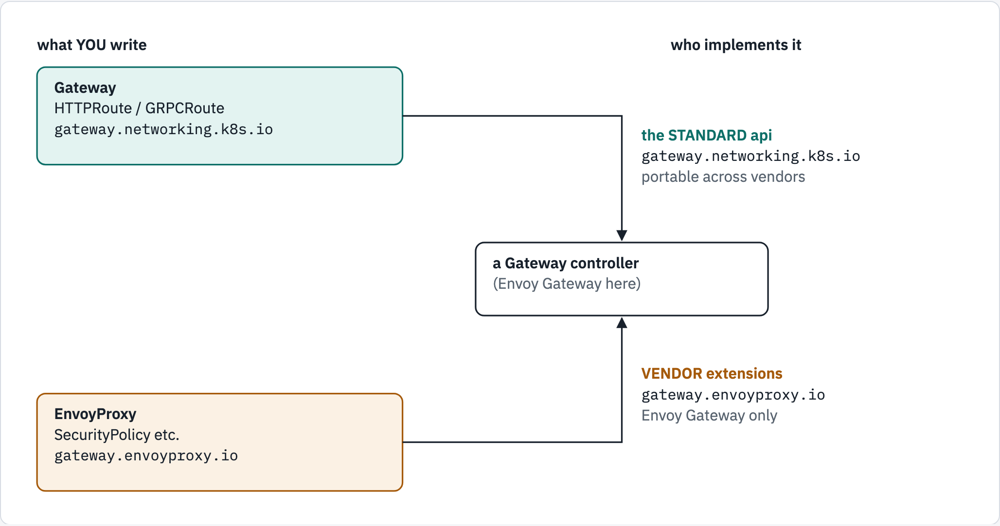

# Installing Envoy Gateway — the difference between Kubernetes and OpenShift

There are two installation guides here because the two platforms genuinely
differ, and the difference is **not** about Envoy Gateway. It is about **who owns
the Gateway API CRDs**.

- [`kubernetes.md`](kubernetes.md) — vanilla Kubernetes (kind, EKS, GKE, AKS,
  k3s, and OpenShift **4.18 or older**)
- [`openshift.md`](openshift.md) — OpenShift **4.19 and later**

Read this page first. It is short, and it is the part people get wrong.

---

## Two different sets of CRDs

The single most common confusion. "Gateway API CRDs" and "Envoy Gateway CRDs"
are not the same thing, and only one of them is contested.

| | API group | Examples | Who defines them |
|---|---|---|---|
| **The standard API** | `gateway.networking.k8s.io` | `GatewayClass`, `Gateway`, `HTTPRoute`, `GRPCRoute`, `ReferenceGrant`, `BackendTLSPolicy` | the Kubernetes **SIG-Network** project — vendor-neutral |
| **Envoy Gateway's extensions** | `gateway.envoyproxy.io` | `EnvoyProxy`, `ClientTrafficPolicy`, `BackendTrafficPolicy`, `SecurityPolicy`, `EnvoyPatchPolicy`, `Backend` | the **Envoy Gateway** project only |

The standard API is the portable part: an `HTTPRoute` means the same thing
whether Envoy Gateway, Istio, NGINX or Cilium implements it. The
`gateway.envoyproxy.io` group is where Envoy Gateway exposes things the standard
API has no vocabulary for — retry budgets, the proxy's own pod spec, WASM
extensions.

<!-- markdownlint-disable MD033 -->
<picture>
  <source media="(prefers-color-scheme: dark)" srcset="../../docs/diagrams/12-gateway-api/api-groups.dark.png">
  <source media="(prefers-color-scheme: light)" srcset="../../docs/diagrams/12-gateway-api/api-groups.light.png">
  
</picture>
<!-- markdownlint-enable MD033 -->

```text
       what YOU write                      who implements it
  ┌──────────────────────────┐
  │ Gateway                  │ ─────────┐
  │ HTTPRoute  /  GRPCRoute  │          │   the STANDARD api
  │ gateway.networking.k8s.io│          │   gateway.networking.k8s.io
  └──────────────────────────┘          │   portable across vendors
                                        ▼
                             ┌─────────────────────────┐
                             │  a Gateway controller   │
                             │  (Envoy Gateway here)   │
                             └─────────────────────────┘
                                        ▲
  ┌──────────────────────────┐          │   VENDOR extensions
  │ EnvoyProxy               │ ─────────┘   gateway.envoyproxy.io
  │ SecurityPolicy   etc.    │              Envoy Gateway only
  │ gateway.envoyproxy.io    │
  └──────────────────────────┘
```

## Why the platforms differ

**On vanilla Kubernetes nobody owns the standard CRDs.** They are not part of
Kubernetes itself. Somebody has to install them, and by default Envoy Gateway's
Helm chart does it for you. That is why the vanilla install is one command.

**On OpenShift 4.19+ the platform owns them.** The Ingress Operator installs and
version-manages the Gateway API CRDs, and a `ValidatingAdmissionPolicy` enforces
it. So Envoy Gateway must be told **not** to install them — it uses the ones
already there.

## The one-line summary

| | Kubernetes | OpenShift 4.19+ |
|---|---|---|
| Who installs `gateway.networking.k8s.io` CRDs | **you** (the Helm chart) | **the platform** (Ingress Operator) |
| Who installs `gateway.envoyproxy.io` CRDs | you | you |
| `gateway-helm` `crds.enabled` | `true` (default) — installs both CRD sets | **`false`** |
| `gateway-crds-helm` `crds.gatewayAPI.enabled` | not used by the one-command install | `false` (also its default) |
| `gateway-crds-helm` `crds.envoyGateway.enabled` | not used by the one-command install | **`true`** (default `false`) |
| Extra work for pod security | none | an `EnvoyProxy` resource for the SCC |

## What you must NOT do on OpenShift 4.19+

This is the list the guide exists for.

**Do not install the Gateway API CRDs.** Not from Envoy Gateway's chart, not
from the upstream `kubectl apply` one-liner, not from any other controller's
bundle. The platform already did it. Attempting it fails:

```text
Error from server (Forbidden): customresourcedefinitions.apiextensions.k8s.io
"gateways.gateway.networking.k8s.io" is forbidden: ValidatingAdmissionPolicy
'openshift-ingress-operator-gatewayapi-crd-admission' denied request:
Gateway API Custom Resource Definitions are managed by the Ingress Operator
and may not be modified
```

That refusal stands even for `cluster-admin`. It is a policy, not an RBAC rule.

**Do not run the plain `helm install` from the quickstart.** The default chart
applies the standard CRDs and will hit the error above.

**Do not try to upgrade or downgrade the Gateway API version.** The Ingress
Operator pins a version and channel and reconciles them back. Check what you
have and build against it:

```bash
oc get crd gateways.gateway.networking.k8s.io \
  -o jsonpath='{.metadata.annotations.gateway\.networking\.k8s\.io/bundle-version}{"\n"}'
```

**Do not delete the CRDs to "start clean."** Same policy blocks it, and other
things on the cluster may be using them.

**Do not assume the default pod security works.** Envoy Gateway's proxy runs as
UID 65532 by default; `restricted-v2` refuses it. See `openshift.md`.

## What is the same on both

Everything after installation. The `GatewayClass`, `Gateway`, `HTTPRoute` and
`GRPCRoute` you write are identical, because that is the entire point of a
standard API. Only the install differs.

```yaml
apiVersion: gateway.networking.k8s.io/v1
kind: GatewayClass
metadata:
  name: eg
spec:
  controllerName: gateway.envoyproxy.io/gatewayclass-controller
```

## A note on OpenShift's own implementation

OpenShift 4.19+ also ships its *own* Gateway API implementation. Give a
GatewayClass `controllerName: openshift.io/gateway-controller/v1` and the Ingress
Operator installs a lightweight OpenShift Service Mesh (Istio) to serve it.

Both can coexist. A Gateway controller only acts on GatewayClasses that name it,
so OpenShift's controller ignores ours and vice versa.

This tutorial uses **Envoy Gateway** because the subject is Envoy, and Envoy
Gateway is configured in Envoy's own vocabulary. Worth knowing that Istio's data
plane is also Envoy — you are running the same proxy either way, under a
different control plane.

## References

- [Envoy Gateway — Install with Helm](https://gateway.envoyproxy.io/docs/install/install-helm/)
- [Envoy Gateway — CRDs Helm chart](https://gateway.envoyproxy.io/docs/install/gateway-crds-helm-api/)
- [Gateway API — API specification](https://gateway-api.sigs.k8s.io/reference/spec/)
- [OpenShift 4.22 — Configuring Gateway API](https://docs.redhat.com/en/documentation/openshift_container_platform/4.22/html/ingress_and_load_balancing/configuring-gateway-api)
- [OpenShift — Managing security context constraints](https://docs.redhat.com/en/documentation/openshift_container_platform/4.22/html/authentication_and_authorization/managing-pod-security-policies)

## Diagram sources

The figures are rendered from [`docs/diagrams/12-gateway-api/source.html`](../../docs/diagrams/12-gateway-api/source.html)
(inline SVG, light and dark). The picture, its text twin and the page change
together; re-render with the `/visual` skill's `render.py`.
