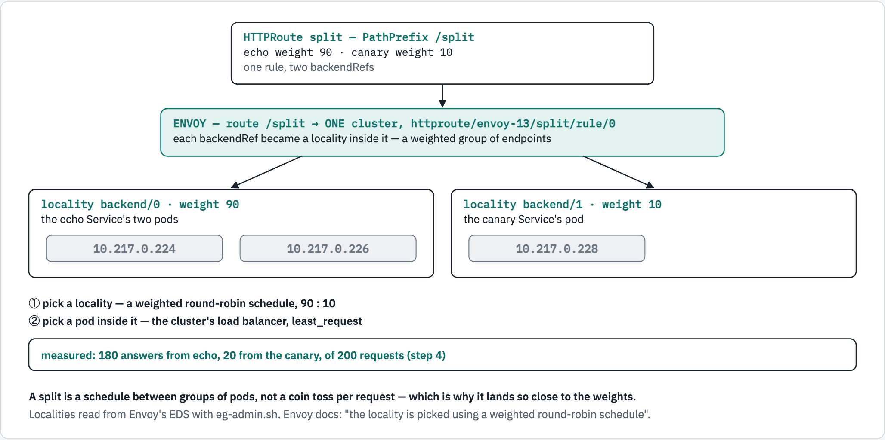

# 13 — HTTPRoute: matching, splitting, rewriting, mirroring

Module 12 sent every request to one Service. Real traffic management is about
*which* requests go *where*: a new version that gets one request in ten, a
header that lets testers reach it, an old URL that moves, a copy of live traffic
for a version nobody sees yet. This module does all of it with one resource —
the **`HTTPRoute`** — and the standard Gateway API only, so every file here
works beyond Envoy Gateway too: the Core features on every conforming
implementation, the Extended ones wherever they are offered (the table at the
end).

Each step then asks the generated Envoy what it was given, because the most
useful thing to learn is how these declarations become the routes and clusters
of modules 04 and 05.

## What you'll learn

- how the Gateway API decides **which rule wins** — not the order you wrote them,
  unlike Envoy's own first-match (module 04)
- a **header match**, a **weighted split**, a **rewrite**, a **redirect**, a
  **mirror** and a **timeout**, each measured
- how Envoy Gateway builds a weighted split: not two clusters, but two
  **localities** in one

## Before you start

- Module [`12`](../12-gateway-api/README.md) — at least its setup: Envoy Gateway
  installed, and the two OpenShift traps understood. This module reuses its
  `GatewayClass` and applies the same fix without re-explaining it.
- Work from this folder: `cd 13-httproute-traffic`.
- This module uses the namespace **`envoy-13`** and takes about 20 minutes.

## Walkthrough

### Step 1 — a Gateway, two versions, a slow app

Module 12's `GatewayClass` (applying it again changes nothing if it is already
there), then this module's `Gateway`, and — as in module 12, step 4 — let its
Envoy run on OpenShift:

```console
$ oc apply -f ../12-gateway-api/manifests/20-envoyproxy.yaml -f ../12-gateway-api/manifests/10-gatewayclass.yaml
envoyproxy.gateway.envoyproxy.io/openshift-scc unchanged
gatewayclass.gateway.networking.k8s.io/eg unchanged
$ oc apply -f manifests/10-gateway.yaml
namespace/envoy-13 created
gateway.gateway.networking.k8s.io/eg created
$ sleep 10; oc adm policy add-scc-to-user nonroot-v2 -n envoy-gateway-system -z "$(oc get deploy -n envoy-gateway-system -l gateway.envoyproxy.io/owning-gateway-namespace=envoy-13 -o jsonpath='{.items[0].spec.template.spec.serviceAccountName}')"
clusterrole.rbac.authorization.k8s.io/system:openshift:scc:nonroot-v2 added: "envoy-envoy-13-eg-307e9a70"
$ oc rollout restart deploy -n envoy-gateway-system -l gateway.envoyproxy.io/owning-gateway-namespace=envoy-13
deployment.apps/envoy-envoy-13-eg-307e9a70 restarted
$ oc rollout status deploy -n envoy-gateway-system -l gateway.envoyproxy.io/owning-gateway-namespace=envoy-13 --timeout=240s
Waiting for deployment "envoy-envoy-13-eg-307e9a70" rollout to finish: 0 of 1 updated replicas are available...
Waiting for deployment "envoy-envoy-13-eg-307e9a70" rollout to finish: 0 of 1 updated replicas are available...
Waiting for deployment "envoy-envoy-13-eg-307e9a70" rollout to finish: 1 old replicas are pending termination...
Waiting for deployment "envoy-envoy-13-eg-307e9a70" rollout to finish: 1 old replicas are pending termination...
Waiting for deployment "envoy-envoy-13-eg-307e9a70" rollout to finish: 1 old replicas are pending termination...
deployment "envoy-envoy-13-eg-307e9a70" successfully rolled out
$ oc wait gateway/eg -n envoy-13 --for=condition=Programmed --timeout=120s
gateway.gateway.networking.k8s.io/eg condition met
```

The backends: the stable **`echo`** (two pods), a **`canary`** — the same app
under another name, so every answer says which version served it — and the
**`slow`** app, which takes one second per request:

```console
$ oc apply -n envoy-13 -f ../_shared/client.yaml -f ../_shared/echo-app.yaml -f manifests/20-canary.yaml -f manifests/30-slow-app.yaml
pod/client created
configmap/echo-src created
service/echo created
deployment.apps/echo created
service/canary created
deployment.apps/canary created
configmap/slow-src created
service/slow created
deployment.apps/slow created
$ for d in echo canary slow; do oc rollout status -n envoy-13 deploy/$d --timeout=240s; done
Waiting for deployment "echo" rollout to finish: 0 of 2 updated replicas are available...
Waiting for deployment "echo" rollout to finish: 1 of 2 updated replicas are available...
deployment "echo" successfully rolled out
deployment "canary" successfully rolled out
deployment "slow" successfully rolled out
$ oc wait -n envoy-13 --for=condition=Ready pod/client --timeout=120s
pod/client condition met
```

Every request below goes from the `client` pod to the Gateway's address:

```console
$ oc get gateway eg -n envoy-13 -o jsonpath='{.status.addresses[0].value}{"\n"}'
192.168.127.102
```

### Step 2 — which rule wins

[`manifests/40-route-main.yaml`](manifests/40-route-main.yaml) has three rules,
and the first is a catch-all: `PathPrefix /` to `echo`. In an `envoy.yaml`, a
catch-all first would swallow every request — Envoy takes the **first** route
that matches (module 04). Apply it and try:

```console
$ oc apply -f manifests/40-route-main.yaml
httproute.gateway.networking.k8s.io/main created
$ sleep 3; for p in / /canary/x /canaryfoo; do printf '%-11s' "$p"; oc exec -n envoy-13 client -- curl -s "http://$(oc get gateway eg -n envoy-13 -o jsonpath='{.status.addresses[0].value}')$p" | grep -o '"served_by": "[a-z0-9-]*"'; done
/          "served_by": "echo-f8fc6d5c9-bqw6x"
/canary/x  "served_by": "canary-5964fbdc9b-8mv2b"
/canaryfoo "served_by": "echo-f8fc6d5c9-bqw6x"
```

**What just happened:** `/canary/x` reached the canary although the catch-all
comes first. The Gateway API does not use rule order. It ranks matches by how
**specific** they are — an `Exact` path first, then the **longest** prefix, then a
method match, then the most header matches, then the most query-parameter matches
— and only on a full tie falls back to the older route, then the route whose
`<namespace>/<name>` sorts first, then rule order. Envoy Gateway follows it,
with differences at the edges — one measured here: it counts a method match as
one more header match (`:method`), so a rule with two header matches beats a
rule with a method match. And
`/canaryfoo` went to `echo`: a `PathPrefix` matches **whole path segments**, so
`/canary` matches `/canary` and `/canary/x`, never `/canaryfoo`.

Envoy still takes the first match — so the controller hands it the routes
**already sorted**. Ask the generated Envoy
([`../_shared/eg-admin.sh`](../_shared/eg-admin.sh) is module 12's `admin.sh`, for
any Gateway):

```console
$ ../_shared/eg-admin.sh envoy-13/eg 'config_dump?resource=dynamic_route_configs' | python3 -c 'import json,sys; [print(i, r["match"], "->", r["route"]["cluster"]) for rc in json.load(sys.stdin)["configs"] for vh in rc["route_config"]["virtual_hosts"] for i, r in enumerate(vh["routes"])]'
0 {'path_separated_prefix': '/canary'} -> httproute/envoy-13/main/rule/1
1 {'prefix': '/', 'headers': [{'name': 'x-canary', 'string_match': {'exact': 'yes'}}]} -> httproute/envoy-13/main/rule/2
2 {'prefix': '/'} -> httproute/envoy-13/main/rule/0
```

Rule 1 (`/canary`) is first, the catch-all rule 0 is **last**, and `/canary`
became **`path_separated_prefix`** — Envoy's segment-wise prefix match.

<!-- markdownlint-disable MD033 -->

<!-- markdownlint-enable MD033 -->

### Step 3 — a header match

The third rule matches `PathPrefix /` **and** the header `x-canary: yes`. Same
path as the catch-all, one header match more: more specific, so it wins for
requests that carry the header — the route order above shows it second, ahead of
the catch-all:

```console
$ for h in 'x-canary: yes' 'x-canary: no'; do printf '%-15s' "$h"; oc exec -n envoy-13 client -- curl -s -H "$h" "http://$(oc get gateway eg -n envoy-13 -o jsonpath='{.status.addresses[0].value}')/anything" | grep -o '"served_by": "[a-z0-9-]*"'; done
x-canary: yes  "served_by": "canary-5964fbdc9b-8mv2b"
x-canary: no   "served_by": "echo-f8fc6d5c9-bqw6x"
```

**What just happened:** `yes` reached the canary, `no` the stable version. A
header is how testers — or one internal client — reach a new version before
anyone else does.

### Step 4 — a weighted split

[`manifests/50-route-split.yaml`](manifests/50-route-split.yaml): one rule, two
backends, `weight: 90` and `weight: 10`. Send 200 requests:

```console
$ oc apply -f manifests/50-route-split.yaml
httproute.gateway.networking.k8s.io/split created
$ sleep 3; oc exec -n envoy-13 client -- sh -c "for i in \$(seq 1 200); do curl -s http://$(oc get gateway eg -n envoy-13 -o jsonpath='{.status.addresses[0].value}')/split | grep -o '\"served_by\": \"[a-z]*'; done" | sort | uniq -c
  20 "served_by": "canary
 180 "served_by": "echo
```

About 180 to 20. How did Envoy do it? Not with two clusters — look at the
endpoints of the **one** cluster the route uses:

```console
$ ../_shared/eg-admin.sh envoy-13/eg 'config_dump?include_eds' | python3 -c 'import json,sys; [print(l["locality"]["region"], "weight", l["load_balancing_weight"], [e["endpoint"]["address"]["socket_address"]["address"] for e in l["lb_endpoints"]]) for c in json.load(sys.stdin)["configs"] for d in c.get("dynamic_endpoint_configs", []) if "/split/" in d["endpoint_config"]["cluster_name"] for l in d["endpoint_config"]["endpoints"]]'
httproute/envoy-13/split/rule/0/backend/0 weight 90 ['10.217.0.226', '10.217.0.224']
httproute/envoy-13/split/rule/0/backend/1 weight 10 ['10.217.0.228']
$ oc get pods -n envoy-13 -l 'app in (echo,canary)' -o custom-columns=NAME:.metadata.name,IP:.status.podIP
NAME                      IP
canary-5964fbdc9b-8mv2b   10.217.0.228
echo-f8fc6d5c9-4252z      10.217.0.224
echo-f8fc6d5c9-bqw6x      10.217.0.226
```

**What just happened:** each `backendRef` became a **locality** — a group of
endpoints — in a single cluster: `backend/0`, the two `echo` pods, with weight
90; `backend/1`, the canary, with weight 10. Envoy picks the locality with a
**weighted round-robin schedule**, then a pod inside it with the cluster's load
balancer (least request, module 12). A schedule, not a coin toss — which is why
the split lands so close to 90 / 10. There is one schedule per worker thread,
as for module 05's round robin (step 9): on one kept-alive connection — one
worker — the canary answered every tenth request, 20 of 200; over new
connections, spread across Envoy's worker threads (10 here), 20 runs of the loop
above gave the canary 18 to 23, where a coin toss would spread from about 12 to
29. To move more traffic to the canary, change the weights and apply; nothing
restarts.

<!-- markdownlint-disable MD033 -->

<!-- markdownlint-enable MD033 -->

### Step 5 — rewrite and redirect

[`manifests/60-route-rewrite-redirect.yaml`](manifests/60-route-rewrite-redirect.yaml)
changes where a request goes in two different ways:

```console
$ oc apply -f manifests/60-route-rewrite-redirect.yaml
httproute.gateway.networking.k8s.io/rewrite-redirect created
$ sleep 3; oc exec -n envoy-13 client -- curl -s "http://$(oc get gateway eg -n envoy-13 -o jsonpath='{.status.addresses[0].value}')/v2/hello?x=1" | grep -E '"(served_by|path)"'
  "served_by": "canary-5964fbdc9b-8mv2b",
  "path": "/hello?x=1",
$ oc exec -n envoy-13 client -- curl -s -o /dev/null -D - "http://$(oc get gateway eg -n envoy-13 -o jsonpath='{.status.addresses[0].value}')/old/page?x=1" | grep -iE '^(HTTP|location)'
HTTP/1.1 301 Moved Permanently
location: http://192.168.127.102/new/page?x=1
```

**What just happened:**

- **`URLRewrite`** — `/v2/hello?x=1` reached the **canary** as `/hello?x=1`. The
  proxy edited the request on the way in; the client never knew.
- **`RequestRedirect`** — `/old/page?x=1` was answered by the **proxy itself**:
  `301`, `location: …/new/page?x=1`. No backend was asked — the rule has none.
  A browser follows the `location` with a new request; `curl` does only with
  `-L`.

### Step 6 — mirror live traffic

[`manifests/70-route-mirror.yaml`](manifests/70-route-mirror.yaml) answers
`/mirror` from the stable version and sends a **copy** of each request to the
canary, whose answer is thrown away:

```console
$ oc apply -f manifests/70-route-mirror.yaml
httproute.gateway.networking.k8s.io/mirror created
$ sleep 3; oc exec -n envoy-13 client -- curl -s "http://$(oc get gateway eg -n envoy-13 -o jsonpath='{.status.addresses[0].value}')/mirror/order-42" | grep -o '"served_by": "[a-z0-9-]*"'
"served_by": "echo-f8fc6d5c9-4252z"
$ sleep 2; oc logs -n envoy-13 deploy/canary --tail=20 | grep mirror
GET /mirror/order-42
```

**What just happened:** the client got its answer from `echo`, and the canary's
log shows it received `/mirror/order-42` too. That is module 04's shadowing: test
a new version with real requests while no user ever sees its reply. Mirror only
what is safe to run twice — a copied `POST` is a second order.

### Step 7 — a timeout

[`manifests/80-route-timeout.yaml`](manifests/80-route-timeout.yaml) gives
`/slow` — an app that takes one second — `timeouts.request: 500ms`:

```console
$ oc apply -f manifests/80-route-timeout.yaml
httproute.gateway.networking.k8s.io/slow created
$ sleep 3; oc exec -n envoy-13 client -- curl -s -w '\n%{http_code} after %{time_total}s\n' "http://$(oc get gateway eg -n envoy-13 -o jsonpath='{.status.addresses[0].value}')/slow"
upstream request timeout
504 after 0.501028s
```

**What just happened:** after half a second the proxy gave up and answered
**`504`**, `upstream request timeout` — Envoy's own words, as in module 04's
route timeout. `timeouts.request` covers the whole request; `timeouts.backendRequest`
would limit each attempt to the backend instead.

Every rule of every route is now in one generated route table:

```console
$ ../_shared/eg-admin.sh envoy-13/eg 'config_dump?resource=dynamic_route_configs' | python3 -c 'import json,sys; [print(r["match"], "->", r["route"]["cluster"] if "route" in r else r["redirect"]) for rc in json.load(sys.stdin)["configs"] for vh in rc["route_config"]["virtual_hosts"] for r in vh["routes"]]'
{'path_separated_prefix': '/canary'} -> httproute/envoy-13/main/rule/1
{'path_separated_prefix': '/mirror'} -> httproute/envoy-13/mirror/rule/0
{'path_separated_prefix': '/split'} -> httproute/envoy-13/split/rule/0
{'path_separated_prefix': '/slow'} -> httproute/envoy-13/slow/rule/0
{'path_separated_prefix': '/old'} -> {'prefix_rewrite': '/new'}
{'path_separated_prefix': '/v2'} -> httproute/envoy-13/rewrite-redirect/rule/0
{'prefix': '/', 'headers': [{'name': 'x-canary', 'string_match': {'exact': 'yes'}}]} -> httproute/envoy-13/main/rule/2
{'prefix': '/'} -> httproute/envoy-13/main/rule/0
```

**What just happened:** five `HTTPRoute`s, one Envoy route table, ranked by the
rule from step 2 — the longest prefix first: `/canary` and `/mirror` (seven
characters each; the older route, `main`, breaks the tie), then `/split`,
`/slow`, `/old`, `/v2`, then the header rule, and the catch-all last. `/old` has
no cluster at all: it is a `redirect`, which Envoy answers itself.

### Step 8 — check yourself

```console
$ ./run.sh verify

1. the Gateway API objects
  ✓ Gateway programmed
  ✓ HTTPRoute main accepted
  ✓ HTTPRoute split accepted
  ✓ HTTPRoute rewrite-redirect accepted
  ✓ HTTPRoute mirror accepted
  ✓ HTTPRoute slow accepted

2. precedence: the most specific match wins, whatever the rule order
  ✓ / -> echo
  ✓ /canary/x -> canary
  ✓ /canaryfoo -> echo (whole path segments only)
  ✓ x-canary: yes -> canary
  ✓ the catch-all is the LAST route Envoy gets

3. a weighted split, 90/10
  canary answered 20 of 200
  ✓ the canary got about 10 % (5 to 40 of 200)

4. rewrite and redirect
  ✓ /v2/hello reaches the canary as /hello
  ✓ /old/page -> 301
  ✓ ...pointing at /new/page

5. mirror: the canary gets a copy, the client gets the stable answer
  ✓ the client's answer came from echo
  ✓ the canary logged the copy

6. a route timeout
  /slow answered 504 after 0.503069s
  ✓ /slow -> 504
  ✓ ...after the 500 ms timeout, not the app's 1 s

all checks passed
```

## The options, and how portable they are

Every feature here is part of the standard `HTTPRoute`. Its **support level**
says how far that goes: **Core** — every conforming implementation must support
it; **Extended** — optional, but specified, so it behaves the same where it
exists.

| Feature | Field | Support | Envoy got |
|---|---|---|---|
| path match | `matches.path` (`PathPrefix`, `Exact`) | Core | `path_separated_prefix`, `path` |
| header match | `matches.headers` (`Exact`) | Core | `headers` on the route |
| weighted split | `backendRefs[].weight` | Core | one cluster, one weighted locality per backend |
| redirect | `filters: RequestRedirect` | Core | a `redirect` route, no cluster |
| rewrite | `filters: URLRewrite` | Extended | a path rewrite on the route |
| mirror | `filters: RequestMirror` | Extended | `request_mirror_policies` |
| timeout | `timeouts.request` | Extended | the route `timeout` |

What the standard `HTTPRoute` on this cluster does **not** have is retries — they
are in the Gateway API's *experimental* channel, and OpenShift installs the
*standard* one. Module 14 does retries, and more, with Envoy Gateway's own
policies.

## Troubleshooting

| You see | Why | Fix |
|---|---|---|
| a route's `Accepted` is `False` | the Gateway's listener does not admit it — here, only routes in `envoy-13` | `oc get httproute <name> -n envoy-13 -o yaml`, read `status.parents` |
| a more specific rule still loses | it is not more specific by the Gateway API's ranking — for example a header match with a *shorter* path — or, with Envoy Gateway, a method match against two header matches | compare with the ranking in step 2; read the generated order |
| `/canaryfoo` does not match `/canary` | `PathPrefix` matches whole segments | expected; use a `RegularExpression` match (implementation-specific) for raw prefixes |
| a split far from its weights | few requests, or pods missing from a locality | send more; check the localities (step 4) |
| `oc apply` refuses a route: `May specify either httpRouteFilterRequestRedirect or httpRouteFilterRequestRewrite, but not both` | a rule has both filters — the API server rejects it | one or the other per rule |
| `oc apply` refuses a route: `RequestRedirect filter must not be used together with backendRefs` | a redirect rule also names a backend | drop the `backendRefs` — the proxy answers a redirect itself |

## Clean up

```console
$ oc adm policy remove-scc-from-user nonroot-v2 -n envoy-gateway-system -z "$(oc get deploy -n envoy-gateway-system -l gateway.envoyproxy.io/owning-gateway-namespace=envoy-13 -o jsonpath='{.items[0].spec.template.spec.serviceAccountName}')"
clusterrole.rbac.authorization.k8s.io/system:openshift:scc:nonroot-v2 removed: "envoy-envoy-13-eg-307e9a70"
$ oc delete -f manifests/10-gateway.yaml --wait=false
namespace "envoy-13" deleted
gateway.gateway.networking.k8s.io "eg" deleted from envoy-13 namespace
```

Module 12's `GatewayClass` stays — other modules use it; module 12's clean-up
removes it.

## The shortcut

`./run.sh deploy` does steps 1 to 7; `./run.sh verify` is step 8;
`./run.sh clean` is the clean-up.

## References

- [Gateway API — `HTTPRoute`](https://gateway-api.sigs.k8s.io/api-types/httproute/)
- [Gateway API — traffic splitting](https://gateway-api.sigs.k8s.io/guides/traffic-splitting/)
- [Gateway API — HTTP redirects and rewrites](https://gateway-api.sigs.k8s.io/guides/http-redirect-rewrite/)
- [Gateway API — request mirroring](https://gateway-api.sigs.k8s.io/guides/http-request-mirroring/)
- [Gateway API — conformance and support levels](https://gateway-api.sigs.k8s.io/concepts/conformance/)
- [Envoy — locality weighted load balancing](https://www.envoyproxy.io/docs/envoy/latest/intro/arch_overview/upstream/load_balancing/locality_weight)

## Diagram sources

The figures are rendered from [`docs/diagrams/13-httproute-traffic/source.html`](../docs/diagrams/13-httproute-traffic/source.html)
(inline SVG, light and dark). Change the page and re-render the PNGs together,
with the `/visual` skill's `render.py`.
